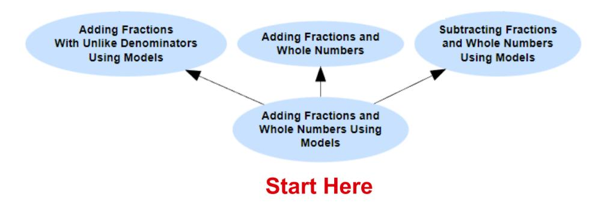
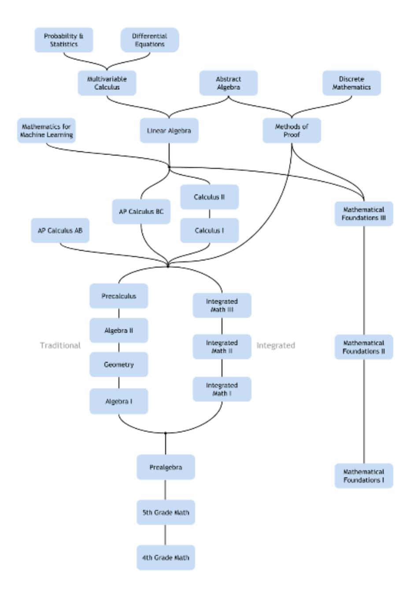
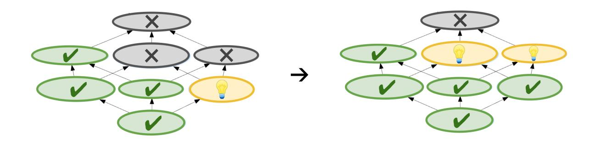
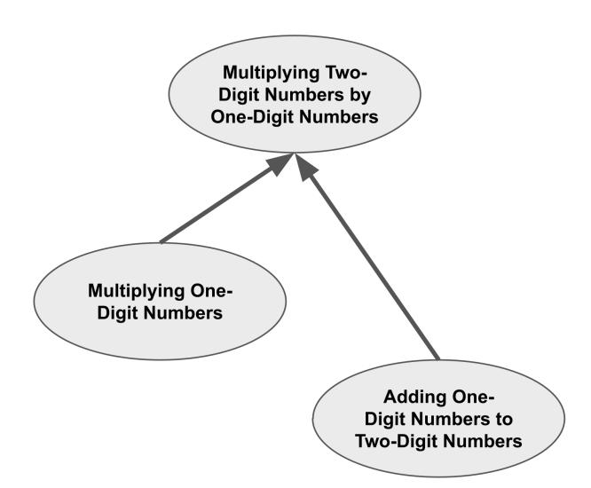
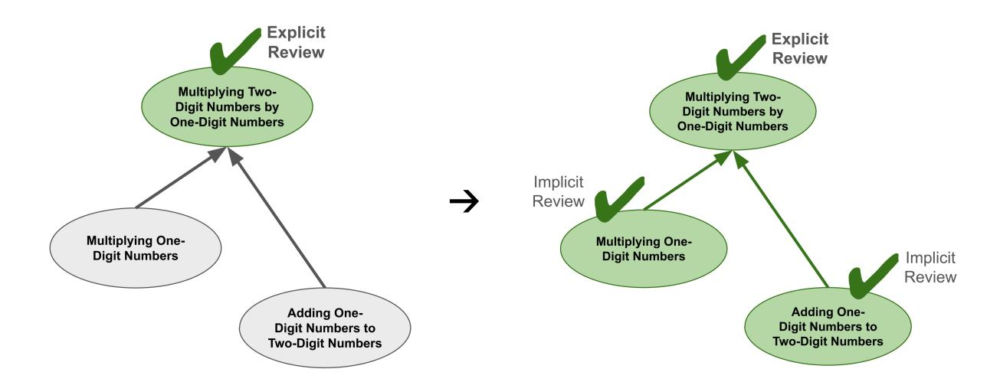

## Chapter 4. Core Technology: the Knowledge Graph

Summary: Math Academy utilizes a knowledge graph, an interconnected structure of thousands of topics from 4th grade through university-level mathematics, to organize its curriculum and facilitate algorithmic decision-making. The knowledge graph allows Math Academy to place each student at the edge of their individual "knowledge frontier," fill in any gaps in foundational knowledge, leverage mastery learning to efficiently extend student knowledge, provide spaced reviews and remedial reviews when necessary, and capitalize on "encompassing" relationships to achieve turbo-boosted learning speed.

## Understanding the Knowledge Graph

#### | Linking Topics and Prerequisites

To understand how Math Academy leverages specific cognitive learning strategies, it is helpful to have high-level understanding of our knowledge graph, which organizes our curriculum in a way that enables algorithmic decision-making.

Here, the word "graph" is a term that readers may be unfamiliar with. Usually, the word "graph" refers to a chart illustrating the relationship between two variables, such as a bar chart or a line chart. But in our context, the word "graph" refers to a diagram consisting of objects and arrows between them. This terminology is common in the mathematical field of graph theory.

Our knowledge graph contains multiple thousands of interlinked topics. Each linkage between topics indicates a relationship between them, such as one topic being a prerequisite for another topic. (There are lots of different kinds of relationships, but for now, we'll just focus on prerequisites.)

For instance, below is a simple example of a knowledge graph that shows a topic Adding Fractions and Whole Numbers Using Models (bottom) that is the prerequisite for three other topics (top). After a student learns the topic on the bottom, they will be ready to learn any topic that it points to. In other words, the arrows point along potential "learning paths" that the student can follow.

However, if multiple arrows point to a higher topic, then that means the higher topic has multiple prerequisites that the student needs to learn beforehand.

To illustrate, the topic Adding Fractions With Unlike Denominators has been added to the top of the knowledge graph. As indicated by the arrows pointing to it, it has two prerequisites that the student needs to learn beforehand:

- 1. Adding Fractions With Unlike Denominators Using Models
- 2. Adding Fractions and Whole Numbers

### Zooming Out

Zooming out more, we see that knowledge graphs can encode a lot of complicated information that would otherwise be hard to describe and reason about.

Zooming out even more, below is the knowledge graph for an entire course consisting of about 300 topics.

Fully zoomed out, Math Academy's entire curriculum consists of multiple thousands of topics spanning 4th Grade through university-level math. All these topics are connected up together in the knowledge graph. In this view, a course is simply a section of our knowledge graph. (In the visualization below, different colors represent different courses.)

The knowledge graph above contains the following courses: 4th Grade Math, 5th Grade Math, Pre-Algebra, Algebra I, Geometry, Algebra II, Pre-Calculus, Calculus I, Calculus II, Linear Algebra, Multivariable Calculus, \*Differential Equations, \*Probability & Statistics, \*Discrete Mathematics, \*Abstract Algebra. (As of October 2023, this accounts for most, but not all, of the content in our system – courses not listed have large overlap with the preceding list. Asterisks indicate that a course is still under development.)

## | Course Graph

On school and university websites, it is common to see courses arranged into a **course graph**, which can be interpreted as a highly-compressed version of a knowledge graph where a single entity represents hundreds of topics. Math Academy's course graph (as of October 2023) is shown below:

However, it is important to realize that each course is ultimately just a set of topics in the knowledge graph. The knowledge graph is the ultimate source of truth; a course graph simply summarizes and communicates information about the high-level structure of a knowledge graph so that humans can understand it.

## Using the Knowledge Graph

### | Scaffolded Mastery Learning

Math Academy's knowledge graph enables us to implement **mastery learning**, in which students demonstrate proficiency on **prerequisites** before moving on to more advanced topics.

Each topic involves a **lesson** that is broken down into several key pieces of learning called **knowledge points**. Each knowledge point contains a **worked example** and asks **questions** similar to the worked example.

Knowledge points build on each other to help **scaffold** students through the lesson: the first knowledge point covers the most basic idea or skill of the lesson, and later knowledge points gently introduce more advanced cases.

To demonstrate mastery of a topic, a student must answer sufficiently many questions correctly in each successive knowledge point in the lesson. Once this is accomplished, more advanced topics become available for the student to work on.

## | Additional Linkages

#### > Key Prerequisites Enable Targeted Remediation

Each knowledge point is linked to one or more key prerequisite topics that represent the prerequisite knowledge that is most directly being used in that knowledge point. If a student ever fails a lesson twice at the same knowledge point, we automatically provide remedial reviews on the key prerequisites. This helps the student strengthen their foundations in the areas where they are most in need of additional practice, so that they are better prepared to pass the lesson the next time around.

As a concrete example, suppose that while re-attempting the lesson *Exponents with Rational Bases*, a student

- manages to pass Part 1: Expressing a Product Using an Exponent, e.g. expressing  $4 \times 4 \times 4$  as  $4^3$ , but
- gets stuck again at Part 2: Evaluating an Exponential Expression, e.g. computing  $(-4)^3 = (-4) \times (-4) \times (-4)$ .

In this situation, the student has demonstrated that they understand the concept of an exponent, but they are struggling to use multiplication to compute the result.

Although multiplication occurs several steps back in the sequence of prerequisites, we have linked *Part 2: Evaluating an Exponential Expression* to the key prerequisite topic *Multiplying Negative Numbers*, which allows us to automatically trigger a targeted remedial review on *Multiplying Negative Numbers*.

#### > Encompassings Enable Turbo-Boosted Learning Speed

Our knowledge graph also stores encompassing relationships between topics. Advanced mathematical problems implicitly practice or "encompass" many simpler skills. Using sophisticated algorithms that capitalize on these encompassings, Math Academy enables students to spend most of their time learning new material while simultaneously making sure they keep getting practice on things they've previously learned. This results in turbo-boosted learning speed.

How does this work? The main idea is that whenever a student is due to review some previously-learned material, we serve them the smallest possible set of learning tasks that encompasses all the due review. The student receives all the review they need, in the most concentrated form possible.

To illustrate, consider the following multiplication problem, in which we multiply the two-digit number 39 by the one-digit number 6:

In order to perform the multiplication above, we have to multiply one-digit numbers and add a one-digit number to a two-digit number:

- First, we multiply  $6 \times 9 = 54$ . We carry the 5 and write the 4 at the bottom.
- Then, we multiply  $6 \times 3 = 18$  and add 18 + 5 = 23. We write 23 at the bottom.

In other words, Multiplying a Two-Digit Number by a One-Digit Number **encompasses** Multiplying One-Digit Numbers and Adding a One-Digit Number to a Two-Digit Number.

We can visualize this using an **encompassing graph** as shown below. The encompassing graph is similar to a prerequisite graph, except the arrows indicate that a simpler topic is encompassed by a more advanced topic. (Encompassed topics are usually prerequisites, but prerequisites are often not fully encompassed.)

Now, suppose that a student is due for reviews on all three of these topics. Because of the encompassings, the only review that they will actually have to do is *Multiplying a Two-Digit* 

Number by a One-Digit Number. When they complete this review, it will implicitly provide repetitions on the topics that it encompasses because the student has effectively practiced those skills as well.

#### Diagnostic Exams

When a student joins Math Academy, they take an adaptive diagnostic exam that leverages the knowledge graph to quickly identify their knowledge frontier. The knowledge frontier is the boundary between what they know and what they don't know, and it indicates what topics they are ready to learn. Following the diagnostic, whenever a student is served new lessons, those lessons always cover topics that are on the student's knowledge frontier.

In addition to assessing knowledge of course content, our diagnostic exams also assess knowledge of lower-grade foundations that students need to know in order to succeed in the course (i.e. they are prerequisites for the course). It is common for incoming students to be excited about a course but lack some foundational knowledge - and our knowledge graph enables us to identify and fill in any missing foundational knowledge while simultaneously allowing students to learn course topics that don't rely on that missing foundational knowledge.

