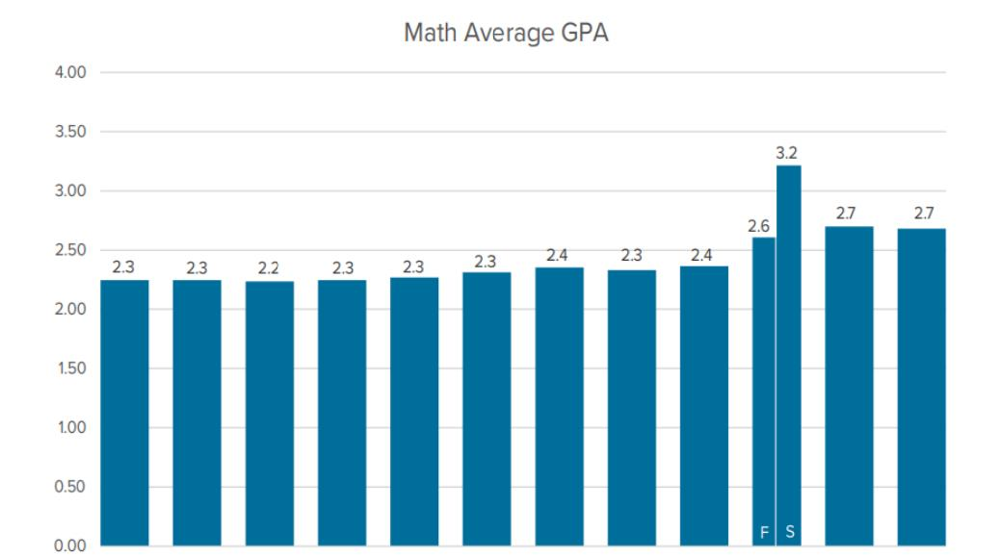

## Chapter 5. Accountability and Incentives

Summary: Students and teachers are often not aligned with the goal of maximizing learning, which means that in the absence of accountability and incentives, classrooms are pulled towards a state of mediocrity. Accountability and incentives are typically absent in education, which leads to a "tragedy of the commons" situation where students pass courses (often with high grades) despite severely lacking knowledge of the content. However, Math Academy is properly held accountable and incentivized to maximize student learning.

Accountability and Incentives are Necessary but Absent in Education

According to K. Anders Ericsson (1993, with Krampe & Tesch-Romer), one of the most influential researchers in the field of human expertise and performance:

....[D]eliberate practice requires effort and is not inherently enjoyable. Individuals are motivated to practice because practice improves performance."

In other words, maximal learning does not happen naturally as a result of maximizing other things like enjoyment, comfort, convenience, and ease of practice. In fact, maximal learning is at odds with some of these things. Sacrifices must be made.

At the risk of stating the obvious: if you want to maximize learning, then you should not make decisions on the basis of anything other than how those decisions affect measurable learning. However, what may not be so obvious is that students and teachers are often not aligned with the goal of maximizing learning.

Students often just want to get a good enough grade to avoid angering their parents, or to get into college (or get a scholarship to college) - and in college, they often just want to do well enough to get their degree and either get a job or be accepted to graduate school. From the perspective of such students, the goal is to earn grades that are good enough to keep moving along their desired career path, while minimizing the amount of extra effort. Earning sufficient grades with minimal effort is totally different from maximizing learning.

Likewise, while teachers generally want their students to learn, they also receive substantial pressure from parents and administrators to make the learning process feel comfortable and enjoyable, and check boxes on people's intuitions (however mistaken) about learning, while simultaneously ensuring that students don't fall behind on any standardized tests. A teacher's goal is often for their students to perform well enough not to raise eyebrows from parents and administrators, while minimizing the amount of griping from students (and parents) about how much effort is required.

These forces pull classrooms towards a state of mediocrity: students need to learn some baseline amount that is deemed "enough" for their grade level, but there is no need to learn more than that, even if it is possible (and extremely advantageous) to learn much more in the same amount of time.

The pull towards mediocrity is not unique to education. However, other industries do a better job of counteracting it by leveraging accountability mechanisms and incentives to motivate people to maximize performance. For instance, in professional athletics, coaches are held accountable for winning (their continued employment depends on it) and they are often incentivized with massive financial bonuses for achievements like qualifying for tournaments and winning championships. The same is true for players. Along the chain of command from team owners to coaches to players, there is also a chain of accountability and incentives.

While it's true that college rankings can be viewed as some kind of incentive structure, it's important to realize that learning is not the basis of such rankings. The rankings may incentivize other things, but not learning. As MIT researchers elaborate (Subirana, Bagiati, & Sarma, 2017):

"Taking a look at major University ranking methodologies one can easily observe they consistently lack any objective measure of what content knowledge and skills students retain from college education in the long term.

In general, college academics taught in the classroom don't seem to be recognized explicitly by public market indicators. As an example, MIT was ranked number one in the world by US News Report in the latest ranking available, however taking a closer look at the ranking methodology one can see it does not include any metric of what students retained from the classroom. In fact, all major market ranking methodologies consistently lack any objective measure of student college academic retention ([MIT office of the provost 2012])."

Likewise, while it's true that teacher credentialing can be viewed as some sort of accountability mechanism, it's important to realize that accountability for learning in particular is lacking. As discussed in chapter 2, most teacher credentialing programs do not cover, much less assess,

prospective teachers on their knowledge of the science of learning and ability to leverage effective practice techniques to maximize student learning.

It's also worth noting that university professors generally aren't required to earn teaching credentials, and they're not even incentivized to teach as their primary concern - they are primarily measured in terms of research output, not teaching. Yet, they are also given more autonomy in designing their courses, and as a result, college courses tend to be more instructor-centered than student-centered (as compared to K-12 courses). A typical university professor gives some lectures, assigns weekly problem sets, and then gives a mid-term and a final exam that are curved so that no matter how much learning did or did not occur, the result is always a normal distribution and a shrug.

We re-emphasize some quotes from chapter 2:

"A recent textbook analysis (Pomerance, Greenberg, & Walsh, 2016) took the six key learning strategies from this report by Pashler and colleagues, and found that very few teacher-training textbooks cover any of these six principles - and none cover them all, suggesting that these strategies are not systematically making their way into the classroom." - Weinstein, Madan, & Sumeracki (2018)

"The preparation of virtually every college teacher consists of in-depth study in an academic discipline: chemistry professors study advanced chemistry, historians study historical methods and periods, and so on. Very little, if any, of our formal training addresses topics like adult learning, memory, or transfer of learning. ... [I]ronically (and embarrassingly), it would be difficult to design an educational model that is more at odds with the findings of current research about human cognition than the one being used today at most colleges and universities." - Halpern & Hakel (2003)

## What Happens in the Absence of Accountability and Incentives

### Tragedy of the Commons

As discussed in chapter 1, Bloom & Sosniak (1981) noted that teachers typically focus on a "cross section" of many students covering a small subset of curriculum over a short period of time.

"Although the curriculum in a particular subject may extend over a period of ten or more years, each teacher has the child only for a term, year, or course. And the teacher is responsible only for what happens during that period of time."

As a result, maintenance and improvement of students' mathematical knowledge is a responsibility shared by a group of many teachers.

However, it is widely known that in the absence of accountability and incentives that promote collective interests, people will focus on behaviors that benefit themselves as individuals, and pay less attention to how their actions affect the group as a whole. As a result, when a group is given responsibility for the maintenance and improvement of a shared resource, the resource will typically deteriorate. While some individuals may care for the resource properly, they are typically unable or unwilling to pick up the slack of those who do not. This kind of deterioration of a shared or "common" resource is known as the tragedy of the commons.

A concrete example of the tragedy of the commons is littering. In the absence of accountability and incentives, public spaces will become filled with trash. Even people who dispose of their trash properly will generally not be motivated to pick up the trash of others. To prevent a public space from becoming filled with trash, it is necessary to create accountability mechanisms, such as fines for littering, and incentives, such as paid jobs to incentivize some people to periodically clean the space. But if the accountability and incentives are not implemented properly (e.g. the fine for littering is too low or unenforceable, or the paid jobs do not hire enough people or do not hold them accountable for actually cleaning the entire space), then the space will still become filled with trash.

The tragedy of the commons takes place in education in a similar way. Instead of "littering," the tragic action is allowing students to pass courses despite severely lacking knowledge of the content. A teacher who "picks up other people's trash" is a teacher who holds students accountable for learning the material in their course, including any prerequisite material that they are missing.

When there is a lot of "trash," i.e. students are severely lacking prerequisite knowledge, a teacher who "picks up other people's trash" puts forth a ton of effort supporting students through remedial assignments/assessments and help sessions, while simultaneously holding the line on expectations and enduring griping from students who experience a rude awakening about how much extra work they have to put in to shore up their missing foundations. Few teachers do this, just as few people pick up other people's trash. Instead, when faced with a situation like this, the typical teacher will just run the class as usual, curve (or otherwise inflate) the grades, and leave the problem for the next year's teacher to deal with (or not deal with).

While littering fines and paid janitorial jobs often provide the necessary accountability and incentives to keep spaces clean, teachers typically do not face penalties for allowing students to pass courses despite severely lacking knowledge of the content, and teachers are given no financial incentive for working hard to remedy these kinds of problematic situations that are created by other teachers. As a result, it is common for students to pass courses despite severely lacking knowledge of the content.

#### | Grades Can't Be Trusted

#### > Evidence for Grade Inflation

One of the most obvious examples of students passing courses (often with high grades) despite severely lacking knowledge of the content is the co-occurrence of extreme learning loss and extreme grade inflation during the COVID-19 pandemic.

Researchers have found that the learning loss experienced by students during COVID-19 was even more extreme than that experienced by evacuees during Hurricane Katrina, one of the deadliest hurricanes to hit the United States (Kuhfeld, Soland, & Lewis, 2022):

"Using test scores from 5.4 million U.S. students in grades 3-8, we tracked changes in math and reading achievement across the first two years of the pandemic. Average fall 2021 math test scores in grades 3-8 were .20-27 standard deviations (SDs) lower relative to same-grade peers in fall 2019 ... These drops are significantly larger than estimated impacts from other large school disruptions, such as after Hurricane Katrina (Sacerdote [2012] when reported math scores dropped .17 SDs in one year for New Orleans evacuees)."

Based on the magnitude of this learning loss, one would reasonably expect that student grades would have dropped during the pandemic. But instead, the opposite happened: grades skyrocketed and remained elevated even after most schools returned to normal in-person instruction after the pandemic. As researchers at the CALDER Center (Center for Analysis of Longitudinal Data in Education Research) discovered when analyzing educational data from the state of Washington (Goldhaber & Young, 2023):

....[A]lmost no students received an F grade in the spring of 2020. The share of F grades dropped... from ... 9.3% to 1.4% in math courses ... between the fall and spring semesters of 2020. The distribution of grades higher than F mostly increased for A grades, with the share of A's jumping from 32.9% to 56.3% in math ... The average GPA in math jumped from 2.6 to 3.2 ... The figures also suggest that English and science grades largely returned to pre-pandemic levels by 2021-22, but math grades did not. Indeed, the math GPA in 2021-22 was 2.7, 0.4 points higher than it was in 2018-19."

Figures reproduced from Goldhaber & Young (2023) with permission.

However, standardized test scores have not increased commensurately:

"To better understand what these shifts in grading might mean, we perform some simple regressions to descriptively assess the extent to which the relationship between grades and test scores has changed over time. ... [A] student who got an 'A' in Algebra 1 was predicted to be in the 73rd percentile of the test distribution in 2015-16, the 68th percentile in 2018-19, and the 58th percentile in 2021-22."

This phenomenon is not limited to the United States. It is widespread. For instance, a similar situation is described in an analysis of student grades in Italy (Doz, 2021):

....[T]he results showed a statistically significant difference in pre- and post-COVID-19 quarantine grades. End-of-year grades were higher than those before the COVID-19 confinement. Furthermore, the results indicated that more than half of the students in the sample achieved a higher grade at the end of the school year. ... The findings suggest that greater caution should be paid in interpreting students' grades pre- and post-COVID-19 confinement, since it cannot be excluded that such students' achievements are inflated. Excessively high students' grades that do not represent their actual knowledge and competencies could give educators and legislators misleading and even false information about the quality of distance learning and students' knowledge."

Indeed, grade inflation has been happening for a while, that is, COVID-19 amplified an existing trend. As researchers from ACT, Inc. describe, high school grade point averages (HSGPA) have increased while standardized test scores - not just aptitude-oriented tests like the SAT, but also achievement-oriented tests like the ACT, the NAEP, and even end-of-course exams - have not (Sanchez & Moore, 2022).

"...[A] mismatch between HSGPA and test scores suggests grade inflation is most likely present. HSGPA across time has been compared to ACT® (Bejar & Blew, 1981; Bellott, 1981) and SAT scores (Godfrey, 2011), NAEP data (U.S. Department of Education, National Assessment of Educational Progress [NAEP], Long-Term Trend Reading Assessments, 2020), and end-of-course exams (Gershenson, 2018). Consistently, analyses have shown that HSGPA has steadily increased over the last several decades, but standardized assessment scores have remained stagnant or have fallen (Bejar & Blew, 1981; Gershenson, 2020)."

#### As elaborated by Gershenson (2018):

....[R]ising high school grade point averages (GPAs) have been accompanied by stagnant SAT, ACT, and NAEP scores, strongly suggesting lowered classroom standards. And in higher education, As are now the most common grade awarded, despite constituting just 15 percent of grades in the early 1960s."

"While many students are awarded good grades, few earn top marks on the statewide end-of-course exams for those classes. ... In fact, more than one-third of the students who received Bs from their teachers in Algebra 1 failed to score 'proficient' on the EOC exam."

....[E]arning a good grade in a course is no guarantee that a student has learned what the state... expects her to have learned in that course. Results show that even students who earn the best grades often fail to demonstrate mastery of key skills and knowledge when measured on the state test. Recall that just 21 percent of A students and 3 percent of B students attain the 'superior' designation on the EOC, and more than one-third of B students don't reach proficiency at all."

#### > Why Grade Inflation is a Problem

Gershenson (2018) mentions that grade inflation can create a "vicious cycle" of students being set up for failure in future courses:

"That's clearly a problem since receiving an A or B in a course signals academic success to most students and their families. When students earn passing grades despite not mastering the academic material, a vicious cycle can follow, whereby they're set up for failure via unmerited promotion to the next course or grade level."

....[G]rade inflation results in promoting students to subsequent grades and later accepting them to postsecondary institutions for which they are academically ill-prepared. Consequently, they struggle and risk dropping out.

[G]rade inflation may have the political consequence of encouraging families to believe everything is going well at school, even when a school is troubled and needs reform. It is easy for parents to ignore systemic mediocrity when their children's grades seem strong."

This concern is echoed by the Goldhaber & Young (2023):

"Public opinion surveys point to a discrepancy between what parents believe about their student's level of achievement, i.e., that students have recovered academically, and what test results like NAEP suggest about their achievement (Esquivel, 2022; Kane & Reardon, 2023; Vázquez Tonnes, 2023).

Algebra 1 – the course for which we noted the greatest weakening in the relationship between test scores and grades - is seen as a gateway to more advanced math concepts (Snipes & Finkelstein, 2015). ... Schools use grades in classes such as Algebra 1 to determine whether students need extra support, remediation, or even if they must repeat a course before moving on. If this signal is no longer accurately conveying a student's level of achievement, school systems risk under-supporting students who need help.

Likewise, families and students use grades as a signal of how a student is doing in school; the expectation is that if a student is having academic trouble, that trouble will show up in their grades. Decisions such as whether to enroll a child in after school tutoring or summer school may rest on a belief that the grades on a report card accurately reflect a student's levels of achievement. As we noted above, many parents are under the impression that their children are not suffering from learning loss due to the pandemic; however, test scores indicate otherwise. It is possible that without a grade that signals trouble, parents may not choose to get needed extra academic support."

In short, parents typically think that an "A" indicates mastery of grade-level standards, but it often doesn't. If a student's school says that they're doing fine in math, then it does not automatically follow that the student is keeping college and career doors open that depend on mathematical proficiency. Different schools sometimes have their own interpretations of what it means for their students to be doing fine in math, and that doesn't always match up with grade-level standards, much less what is expected by colleges and careers.

This is a problem because it sets students up for failure later in life when it matters most. Every year, countless first-year college students decide to major in aerospace engineering or astrophysics or some other math-heavy subject, only to have that dream crushed when they realize they can't even pass an entry-level math course like Calc II (not even with the help of a tutor). These problems can be remedied when students are young, before their knowledge deficits grow too large - but problems can only be fixed after they are detected, and grades are no longer a reliable tool for detecting these problems. Inflated grades signal to students and parents that all career doors remain open, when in fact, many are in the process of being locked shut.

#### | Resistance to Objective Measurement

> Radical Constructivism Rejects the Idea of Measuring Learning Objectively

As discussed above, there is overwhelming evidence that grades have increased while standardized test scores have not. However, because remedying grade inflation and its downstream effects requires lots of extra effort from all parties involved (including teachers, students, parents, administrators), there is opposing pressure to reject the idea that grade inflation is occurring. Given the evidence, the only way to argue against the existence of grade inflation is to argue against the very idea of measuring learning objectively.

As prominent psychologists John Anderson, Lynne Reder, and Herbert Simon describe (1998), this is indeed a tenet of an educational philosophy known as radical constructivism:

"The denial of the possibility of objective evaluation is perhaps the most radical and far-reaching of the constructivist claims. ... D. Charney documents that empiricism has become a four-letter word in deconstructionist writings. D. H. Jonassen describes the issue from the perspective of a radical constructivist:

'If you believe, as radical constructivists do, that no objective reality is uniformly interpretable by all learners, then assessing the acquisition of such a reality is not possible."

Take it from Ernst von Glasersfeld (1984) himself, who is widely regarded as the philosopher who first formulated radical constructivism:

"Radical constructivism, thus, is radical because it breaks with convention and develops a theory of knowledge in which knowledge does not reflect an 'objective' ontological reality, but exclusively an ordering and organization of a world constituted by our experience."

To concretely understand the radical constructivist position in the context of grade inflation, recall that in the absence of accountability and incentives, public spaces will become filled with trash. Logically, the existence of excessive trash in a public space provides an argument for increasing accountability and incentives surrounding littering and janitorial work. However, a radical constructivist will resist this conclusion on the grounds that "one person's trash is another person's treasure" and therefore it is impossible to objectively measure the amount of trash on the ground.

Clearly, this counterargument is ridiculous and nobody would actually espouse it in the context of trash. People who enter a space can see, and agree, about how much trash is on the ground. However, the counterargument persists in the context of education because "seeing the trash for oneself" often requires a combination of expertise in the subject matter – which most people do

not have, especially in the context of mathematics. And even those who do see the trash often turn a blind eye to it out of convenience because they don't want to put in the extra effort to fix the situation, especially when their efforts will be met with griping from others who do not see the trash.

As Anderson, Reder, and Simon (1998) elaborate, the radical constructivists' rejection of objective reality leads to other problematic conclusions:

"Another sign of the radical constructivists' discomfort with evaluation manifests itself in the motto that the teacher is the novice and the student the expert. The idea is that every student gathers equal value from every learning experience. The teacher's task is to come to understand and value what the student has learned. As J. Confrey writes:

'Seldom are students' responses careless or capricious. We must seek out their systematic qualities which are typically grounded in the conceptions of the student. ... [F]requently when students' responses deviate from our expectations, they possess the seeds of alternative approaches which can be compelling, historically supported and legitimate if we are willing to challenge our own assumptions.'

Or, as Cobb, Wood, and Yackel write:

'The approach respects that students are the best judges of what they find problematical and encourages them to construct solutions that they find acceptable given their current ways of knowing.'

If the student is supposed to move, in the course of the learning experiences, from a lower to a higher level of competence, why are the student's judgments of the acceptability of solutions considered valid? While the teacher is valued who can appreciate children's individuality, see their insights, and motivate them to do their best and to value learning, definite educational goals must be set. More generally, if the 'student as judge' attitude were to dominate education, when instruction had failed and when it had succeeded, when it was moving forward and when backward, would no longer be clear.

Understanding why the student, at a particular stage, is doing what he or she is doing is one thing. Helping the student understand how to move from processes that are 'satisfactory' in a limited range of tasks to processes that are more effective over a wider range is another matter. As L. B. Resnick argues, many concepts that children naturally come to (for example, that motion implies force) are not what the culture expects of education and in these cases 'education must follow a different path: still constructivist in the sense that simple telling will not work, but much less dependent on untutored discovery and exploration."

#### > Radical Constructivism is a Present Force in Education

Radical constructivism might seem so outlandish that it is hard to imagine anyone seriously supporting it. However, it is indeed a present force in education. For instance, one document that circulated among educators during the 2021-22 school year (the year that most schools

returned to in-person instruction after the COVID-19 pandemic) is Where Is Manuel? A Rejection of 'Learning Loss', which, in a refusal to accept the reality that some demographics were more affected by pandemic-induced learning losses than others, outright rejects the idea that learning loss occurred during the pandemic.

The document makes a number of outlandish claims, some of are factually incorrect, and others of which are so vague that they can neither be proven or falsified (which effectively renders them meaningless):

"It is important to note that we believe that learning takes place everywhere and always. ... Funding and attention to 'fix learning loss' disregards our essential and suggested actions [to move toward antiracist mathematics education for all students].

This farce embodies the assumption that learning didn't happen, or that it didn't happen enough. This assumption is an insult to educators and families alike. ... When teachers could not connect, students continued their learning and growing with and within their families and communities. Some of this learning was closely matched to traditional school standards, and some of this learning was not as aligned to school standards but went deeper and was more authentic than anything that could have been learned through a computer screen or even in a school building. This learning may be different, but it is not any less important and should not be treated as if it is wrong or insufficient.

Let's revisit Manuel. With persistence, the educators would have discovered that Manuel's days away from class were rich with learning experiences. Instead of attending class remotely, he went with his father to work and helped with his younger siblings and animals on the family farm. ... Manuel and his siblings did some work assigned by their teachers, but they were more motivated and engaged in the learning that was acquired outside of school. Manuel has not lost learning. The flexibility of remote learning has allowed him to supplement his studies from school with a rich mathematical understanding of the world.

Resist the thinking that students like Manuel are behind, and instead remind yourself that they are right where they should be after a pandemic. Resist deficit thinking and do not send deficit messages to the students like Manuel, and others who did attend daily, and instead look for what knowledge they gained and how they grew. ... Resist making the assumption that the learning students like Manuel experienced was not enough, and instead assume their experiences contributed to their present and future success in ways that are just as good, if not better, than what could have been learned through school."

The organization producing this document, TODOS: Mathematics for ALL, is not just a fringe group. Between 2020-23, its leadership has included members of the Riverside and Santa Clara County Offices of Education and as well as professors from numerous universities including UCLA, UT Austin, The Ohio State University, University of Arizona, San Francisco State University, University of Alberta, University of Missouri, Iowa State University, East Carolina University, University of New Mexico, Texas State University, and Utah Valley University. Furthermore, TODOS is a member of the Conference Board of the Mathematical Sciences (CBMS), which means that it is recognized by the International Mathematical Union (IMU) as

one of the 19 national mathematical societies for the United States. For reference, IMU awards some of the highest honors in the mathematical profession, including the Fields Medal, which is widely considered to be the mathematical equivalent of the Nobel Prize.

TODOS has released numerous other documents espousing similar viewpoints. For instance, in The Mo(ve)ment to Prioritize Antiracist Mathematics: Planning for This and Every School Year (2020), released shortly before Where is Manuel, TODOS stated the following:

"Following school closure due to COVID-19, we have noted a resurgence of deficit views of students when they are described as 'behind' or 'unable to catch up since they missed so much school.' We believe this description of students is harmful. It frames students as individually responsible for a loss of learning and detracts from the broader issues of students and families surviving through a pandemic. Mathematics learning is a messy web of interconnected concepts. So we assert that instead of being distracted by framing students as lacking skills, we use the fall to start anew from an asset-based perspective. We urge policymakers, school district administrators, teachers, curriculum developers, and software developers to avoid playing into the fear-inciting discourses of students falling behind and ranking them by perceived ability.

To take it a step further, in this moment we must rethink what counts as valid mathematical knowledge. ... [W]e must expand our understanding of what it means to be good at mathematics, make space for alternative ways of knowing and doing mathematics based in the community, and acknowledge the brilliance, both in mathematics and beyond, of BIPOC [Black, Indigenous, and People of Color] in our classrooms."

Likewise, in the joint position statement between TODOS and the National Council of Supervisors of Mathematics (NCSM) from 2016:

....[Deficit views of historically marginalized children can arise from] the continuous labeling of children's readiness to learn mathematics via standardized tests and other institutional tools that position and sanction specific forms of mathematics knowledge. ... A social justice priority in mathematics education is to openly challenge deficit thinking and the institutional tools and practices that perpetuate static views about children and their mathematics competencies.

Second, deficit thinking implies that students "lack" knowledge and experiences expected by the dominant group. Deficit thinking ignores, dismisses, or casts as barriers mathematical knowledge and experiences children engage with outside of school every day. A social justice approach to mathematics education assumes students bring knowledge and experiences from their homes and communities that can be leveraged as resources for mathematics teaching and learning (Civil, 2007; Gonzalez et al., 2005; Leonard & Martin, 2013; Turner et al., 2012).

Mathematics achievement, often measured by standardized tests, has been used as a gatekeeping tool to sort and rank students by race, class, and gender starting in elementary school (Davis & Martin, 2008; Ellis, 2008; Spielhagen, 2011)."

Note that while we have discussed radical constructivism at a high level in this chapter, our general critique cuts deeper and will continue in chapter 8, where we emphasize that effective practice requires direct instruction as opposed to unguided instruction.

## Math Academy is Held Accountable for Student Learning

Math Academy's existence depends on its ability to make students learn. If a student gets stuck and can't make progress in our system, then we're out of a job. If the learning on our system doesn't show up in students' grades and test scores outside of our system, then we're out of a job. We are properly incentivized to maximize student learning - real learning, not just the perception of it.

For this reason, we have no choice but to hold the line on what it means to truly learn something. When a student learns a topic on our system, they have to demonstrate that they really understand it. They have to solve real problems - successfully - and not just the simplest cases.

Perhaps surprisingly, this turns out to be one of our competitive advantages: we hold students accountable for learning, and they hold us accountable for providing material that is easy to learn from. More generally, we hold our users accountable for getting value out of our product, and our users hold us accountable for creating a valuable product.

This differentiates us from other free and ultra-low-cost online learning platforms whose dependence on a massive user base forces them to employ ineffective learning strategies that do not repel unserious students. Such platforms often cover only the simplest cases of each topic, and allow students to move on to more advanced topics despite poor performance on prerequisite topics. They are like teachers who go through the motions and check boxes, whereas Math Academy is like a tutor whose livelihood depends on the actual learning outcomes of its students.

It also differentiates us from typical university courses where the professor can dump a mountain of topics onto a syllabus, provide a few handwavy lectures along with a list of references to outside resources, and then grade on a curve. We have to actually construct a learning path that offers a high probability of success for anyone willing to run through the gates.

Granted, we do sometimes have to deliver unfortunate news to incoming students and their parents who mistakenly believe, on the basis of their good grades, that they are comprehensively proficient in the mathematical subjects that they have taken at school. We can't promise that students and parents will be happy with their diagnostic results. It's not uncommon for our

diagnostic test to expose that a student needs to relearn some things that they supposedly "already know" (but don't actually know) from school. But we can promise that, if our diagnostic test reveals any gaps in a student's knowledge, then we will automatically add those gaps to their learning plan to get them back on track.

## **Key Papers**

**Note:** "Importance" blurbs may include pieces of direct quotes referenced earlier in this chapter. If citing this chapter, cite from the body (above).

• Ericsson, K. A., Krampe, R. T., & Tesch-Römer, C. (1993). The role of deliberate practice in the acquisition of expert performance. Psychological review, 100(3), 363.

**Importance**: Deliberate practice requires effort and is not inherently enjoyable. Individuals are motivated to practice because practice improves performance. In other words, maximal learning does not happen naturally as a result of maximizing other things like enjoyment, comfort, convenience, and ease of practice. In fact, maximal learning is at odds with some of these things. Sacrifices must be made.

• Subirana, B., Bagiati, A., & Sarma, S. (2017). On the Forgetting of College Academics: at" Ebbinghaus Speed"?. Center for Brains, Minds and Machines (CBMM).

Importance: While it's true that college rankings can be viewed as some kind of incentive structure, it's learning is not the basis of such rankings. Major university ranking methodologies consistently lack any objective measure of what content knowledge and skills students retain from college education in the long term. The rankings may incentivize other things, but not learning.

• Kuhfeld, M., Soland, J., & Lewis, K. (2022). Test score patterns across three COVID-19-impacted school years. *Educational Researcher*, 51(7), 500-506.

Importance: The learning loss experienced by students during COVID-19 was even more extreme than that experienced by evacuees during Hurricane Katrina, one of the deadliest hurricanes to hit the United States.

• Goldhaber, D., & Young, M. G. (2023). Course Grades as a Signal of Student Achievement: Evidence on Grade Inflation Before and After COVID-19. CALDER Research Brief No. 35.

Doz, D. (2021). Students' mathematics achievements: A comparison between pre-and post-COVID-19 pandemic. Education and Self Development, 16(4), 36-47.

Importance: During the COVID-19 pandemic, grades skyrocketed and remained elevated even after most schools returned to normal in-person instruction after the pandemic. This is a widespread phenomenon occurring beyond the United States. Grade inflation prevents learning issues from being detected, and schools and families risk under-supporting students who need help.

• Sanchez, E. I., & Moore, R. (2022). Grade Inflation Continues to Grow in the Past Decade. Research Report. ACT, Inc.

Gershenson, S. (2018). Grade Inflation in High Schools (2005-2016). Thomas B. Fordham Institute.

Importance: Grade inflation has been happening for a while. High school grade point averages (HSGPA) have increased while standardized test scores – not just aptitude-oriented tests like the SAT, but also achievement-oriented tests like the ACT, the NAEP, and even end-of-course exams - have not. Grade inflation can create a "vicious cycle" of students being set up for failure in future courses.

 Anderson, J. R., Reder, L. M., Simon, H. A., Ericsson, K. A., & Glaser, R. (1998). Radical constructivism and cognitive psychology. Brookings papers on education volicy. (1). 227-278.

Von Glasersfeld, E. (1984). An introduction to radical constructivism. The invented reality, 1740, 28.

TODOS: Mathematics for All (2020). Where Is Manuel? A Rejection of 'Learning Loss'.

del Rosario Zavala, Maria, Ma Bernadette Andres-Salgarino, Zandra de Araujo, Amber G. Candela, Gladys Krause, and Erin Sylves (2020). The Mo(ve)ment to Prioritize Antiracist Mathematics: Planning for This and Every School Year. TODOS: Mathematics for All.

National Council of Supervisors of Mathematics and TODOS: Mathematics for ALL. (2016). Mathematics education through the lens of social justice: Acknowledgment, actions, and accountability. Joint Position Paper.

Importance: Given the evidence, the only way to argue against the existence of grade inflation is to argue against the very idea of measuring learning objectively. Indeed, this outlandish position is taken by proponents of the radical constructivist philosophy of education, such as TODOS: Mathematics for ALL.

| II. ADDRESSING CRITIC | AL MISCONCEPTIONS |
|-----------------------|-------------------|
|                       |                   |
|                       |                   |
|                       |                   |

The Math Academy Way - Working Draft | 99
