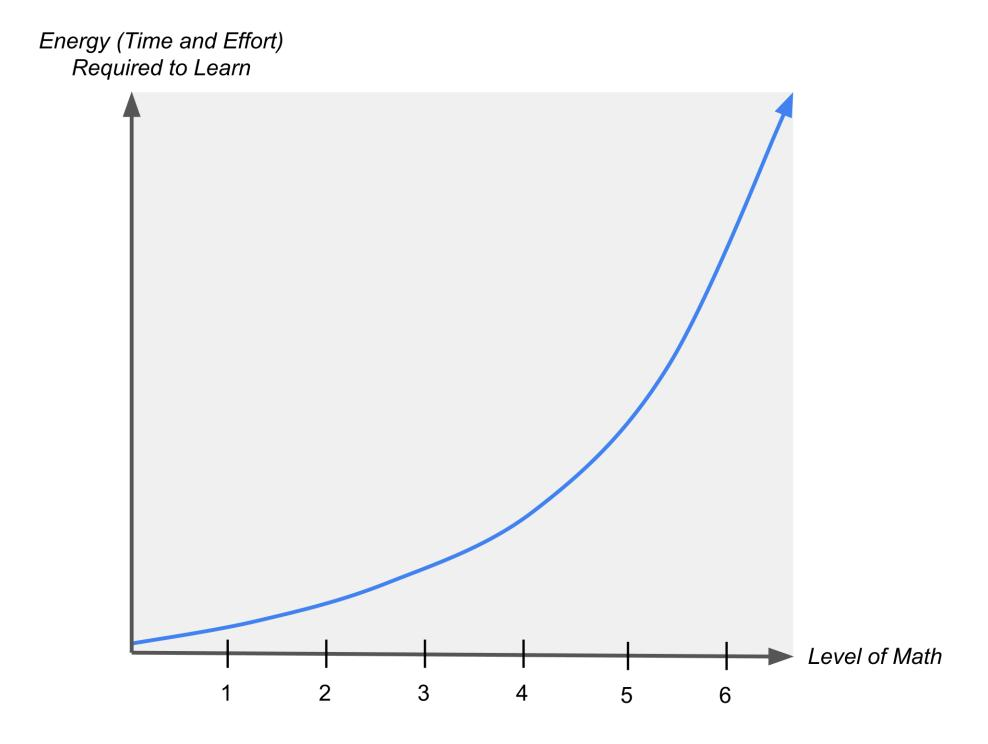
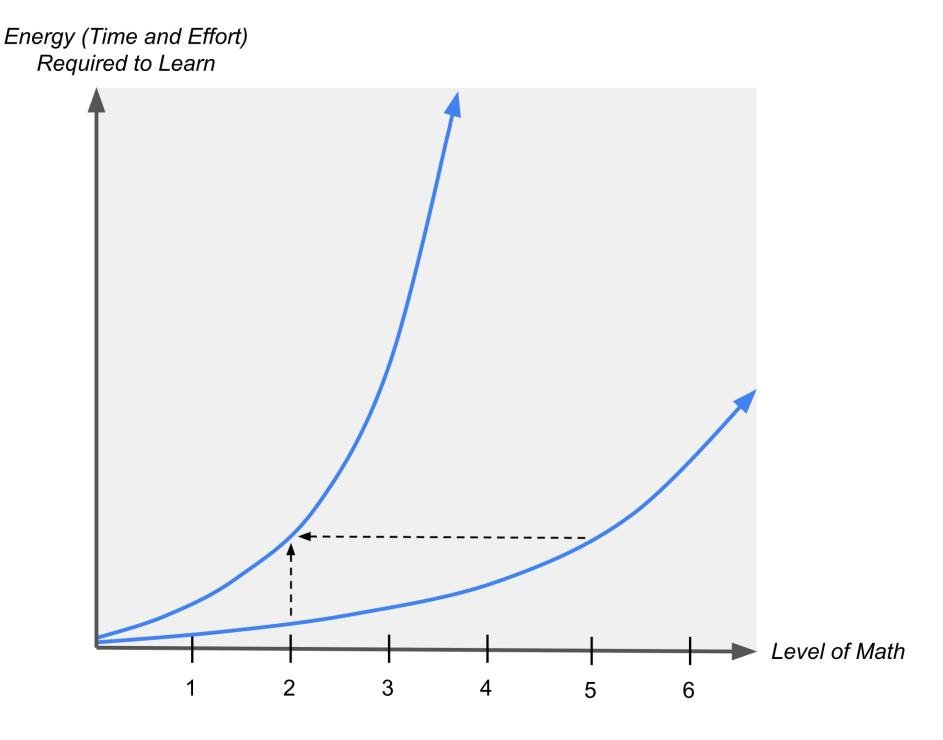

# Chapter 7. Myths & Realities about Individual Differences

Summary: Different people generally have different working memory capacities and learn at different rates, but people do not actually learn better in their preferred "learning style." Instead, different people need the same form of practice but in different amounts. Additionally, not everybody can learn every level of math, but most people can learn the basics. In practice, however, few people actually reach their full mathematical potential because they get knocked off course early on by factors such as missing foundations, ineffective practice habits, inability or unwillingness to engage in additional practice, or lack of motivation.

## People Differ in Learning Speed, Not Learning Style

Myth: Everybody has the same working memory capacity and learns at the same rate, but different people learn differently depending on their preferred learning style.

Reality: The exact opposite is true. Different people generally have different working memory capacities and learn at different rates. While people may have preferred learning "styles" (e.g. visual vs verbal), they do not actually learn better when given information in their preferred style. The myth is that different people need the same amount of practice but in different forms - whereas the reality is that different people need the same form of practice but in different amounts.

### Learning Style Preferences are Irrelevant

One of the most widespread - and most widely debunked - neuromyths is that people learn better when they receive information in their preferred "learning style." To quote the authors of one of the largest and most comprehensive studies on the persistence of neuromyths (Betts et al., 2019):

"Learning styles is one of the most widespread myths in education (Pashler, McDaniel, Rohrer & Bjork, 2008; Reiner & Willingham, 2010; Rohrer & Pashler, 2012). Despite repeated testing of hypotheses relating to learning styles, there is no evidence to date showing that individuals learn better when they receive information in their preferred learning styles (Newton & Miah, 2017; Newton & Miah, 2017).

In 2006, a learning styles challenge was put forth by a team of underwriters offering \$1,000 and then moving it up to \$5,000 to provide scientific evidence supporting this myth (Wallace, 2014). To date, there has not been a payout."

#### As Grospietsch & Lins (2021) elaborate:

"According to Grospietsch and Mayer (2021b), the kernel of truth behind this neuromyth is that people differ in the mode in which they prefer to receive information (visually or verbally; e.g., Höffler et al., 2017).

The first erroneous conclusion that can be drawn from this kernel of truth is that there are auditory, visual, haptic and intellectual learning styles, as Vester (1975) suggested in the German context.

The next erroneous conclusion drawn is that people learn better when they obtain information in accordance with their preferred learning style.

Finally, the third erroneous yet widely disseminated conclusion is that teachers must diagnose their students' learning styles and take them into account in instruction. ... [T]here is no empirical evidence confirming the effectiveness of considering students' learning styles in instruction (Willingham et al., 2015)."

#### As Kirschner & Hendrick sum it up (2024, pp.108):

"These so-called learning styles have been exposed as nonsense in research time after time. There are no 'image thinkers' or 'language thinkers'. Everyone thinks with both systems and everyone benefits from using both. The more often you use the two systems together, the stronger the trace in your memory and the better you will remember and thus learn."

### Working Memory Capacity (WMC) Differences are Relevant

However, one aspect of the brain that has been widely documented not only to vary between people, but also to affect people's general cognitive performance, is working memory capacity (WMC). As Conway et al. (2007) describe:

"A fundamental characteristic of WM [working memory] is that it has a limited capacity, which constrains cognitive performance, such that individuals with greater capacity typically perform better than individuals with lesser capacity on a range of cognitive tasks.

For example, older children have greater capacity than younger children, healthy adults have greater capacity than patients with frontal-lobe damage or disease, younger adults have greater capacity than elderly adults, and in all such cases, those individuals with greater WM capacity out-perform individuals with lesser capacity in several important cognitive domains, including complex learning, reading and listening comprehension, and reasoning.

In short, we know that variation in WM capacity exists and that this variation is important to everyday cognitive performance."

These differences in working memory capacity have been characterized not only at a psychological level, but also at the physical level of brain activity measures. Vogel & Machizawa (2004) have found that brain activity reaches a plateau when people attempt to perform tasks that meet or exceed their WMC, and people with high WMC reach this plateau much later than people with low WMC:

"Here, we provide electrophysiological evidence for lateralized activity in humans that reflects the encoding and maintenance of items in visual memory. The amplitude of this activity is strongly modulated by the number of objects being held in the memory at the time, but approaches a limit asymptotically for arrays that meet or exceed storage capacity.

Indeed, the precise limit is determined by each individual's memory capacity, such that the activity from low-capacity individuals reaches this plateau much sooner than that from high-capacity individuals. Consequently, this measure provides a strong neurophysiological predictor of an individual's capacity, allowing the demonstration of a direct relationship between neural activity and memory capacity.

That is, simply by measuring the amplitude increase across memory array sizes, we could accurately predict an individual's memory capacity."

Engström, Landtblom, & Karlsson (2013) have explained why this happens: the higher one's WMC, the less neural activity their brain requires to perform the task – in other words, the task is less taxing on their brain.

"Low- and high-capacity participants showed an increase in activity as a function of increasing demands but differed in that high-capacity participants started from a lower level."

#### WMC Impacts Perceived Effort

It comes as no surprise, then, that people with higher WMC will generally perceive a given task to be easier than people with lower WMC. Indeed, this has been demonstrated experimentally in a study that measured how difficult people found it to identify spoken words in the presence of background noise (Rudner et al., 2012):

"...[P]articipants were asked to rate effort at SNRs [signal-to-noise ratios, i.e. difficulty levels] individually adapted to their speech recognition performance. Thus, individual differences in speech recognition ability were taken into account in the ratings of perceived effort; even so WM capacity explained variance in perceived effort between conditions.

[T]he difference in perceived listening effort in modulated and steady state noise at relatively favorable SNRs is a function of WM capacity. ... [P]ersons with greater WM capacity find listening in noise less effortful than persons with lower WM capacity across all three levels and noise types.

[R]atings of listening effort may be an indicator of the relative degree of engagement of explicit processing resources in WM. Thus, a relation between WM and rated effort may indicate that persons with greater WM capacity are using fewer explicit processing resources"

#### WMC Impacts Abstraction Ability

Similarly, it has also been shown that high WMC facilitates abstraction, that is, seeing "the forest for the trees" by learning underlying rules as opposed to memorizing example-specific details (McDaniel et al., 2014). This is unsurprising, given that understanding large-scale patterns requires balancing many concepts simultaneously in WM.

....[A]fter training (on a function-learning task), participants either displayed an extrapolation... profile reflecting acquisition of the trained cue-criterion associations (exemplar learners) or abstraction of the function rule (rule learners; Studies 1a and 1b).

Studies 1c and 2 examined the persistence of these learning tendencies on several categorization tasks. Study 1c showed that rule learners were more likely than exemplar learners (indexed a priori by extrapolation profiles) to resist using idiosyncratic features (exemplar similarity) in generalization (transfer) of the trained category. Study 2 showed that the rule learners but not the exemplar learners performed well on a novel categorization task (transfer) after training on an abstract coherent category.

[W]orking memory capacity (as measured by Ospan following Wiley et al., 2011) was a significant and unique predictor of the tendency to rely on rule versus exemplar processes in the function learning task, such that higher working memory capacity was related to reliance on rule learning.

For a number of reasons, greater working memory capacity could facilitate abstracting the function rule during learning, including the ability to maintain and compare several stimuli concurrently (Craig & Lewandowsky, 2012), to partition the training stimuli into two linear segments and switch back and forth between them during learning (Erickson, 2008; Sewell & Lewandowsky, 2012), and to reject or ignore initial biases (e.g., a positive linear) in order to discern the given function (cf., Wiley et al., 2011).

Thus, learners enjoying greater working memory capacity might be more inclined to engage processes that would support rule learning (relating several training trials, partitioning training trials, ignoring initial biases) than would learners with more limited working memory capacity."

Abstracting underlying rules improves one's ability to extrapolate knowledge to new contexts, a skill that is widely assessed in academic settings. Indeed, individual differences in abstraction ability have been shown to impact educational outcomes (McDaniel et al., 2018):

"Students may do well answering exam questions that are similar to examples presented in class. Yet, some of these students perform poorly on exam questions that require applying instructed concepts to a new problem whereas others fare better on such questions.

Our hypothesis is that these performance differences reflect, in part, individual differences in learners' tendencies to focus on acquiring the particular exemplars and responses associated with the training exemplars (exemplar learners) versus attempting to abstract underlying regularities reflected in particular exemplars (abstraction learners). ... [W]e differentiated students on this dimension, and then tracked their final exam performances in introductory chemistry courses.

Abstraction learners demonstrated advantages over exemplar learners for transfer questions but not for retention questions. The results converge on the idea that individual differences displayed in how learners acquire and represent concepts persist from laboratory concept learning to learning complex concepts in science courses."

#### WMC Impacts Learning Speed

As one might infer from the impact of WMC on perceived effort and abstraction ability, WMC has also been shown to impact speed of learning, that is, the rate at which one's ability to perform a task improves over the course of exposure, instruction, and practice on the task (though the impact of WMC on task performance is diminished after the task is learned to a sufficient level of performance).

Multiple studies have linked individual differences in speed of learning and WMC in the context of categorization tasks (see McDaniel et al., 2014 for a summary):

....[A]cross several types of categorization tasks, Craig and Lewandowsky (2012) and Lewandowsky (2011) reported significant correlations between speed of learning and working memory capacity. In the present study, we found a similar general association between speed of learning in the function task and working memory capacity as indexed by Ospan alone.

Learning the function rule presumably requires maintaining and comparing stimuli across trials ("comparative hypothesizing", Klayman, 1988) and possibly partitioning the stimuli into subsets for the different slopes and switching back and forth across these partitioned segments during training (Lewandowsky et al., 2002; Sewall & Lewandowsky, 2012), and these processes require working memory capacity (both from a theoretical perspective, Craig & Lewandowsky, 2012; and based on empirical findings, Sewall & Lewandowsky, 2012). Consequently, for participants attempting to abstract the function rule, higher working memory capacity (as indexed by Ospan scores), would facilitate learning."

"The implication is that for the rule learners, those with higher working memory capacity were able to more effectively support the processing needed to determine the functional relation among the training points, thereby supporting faster learning."

Another study reported that reducing WMC slowed learning during a puzzle (Reber & Kotovsky, 1997):

"Participants solving the Balls and Boxes puzzle for the first time were slowed in proportion to the level of working memory (WM) reduction resulting from a concurrent secondary task. On a second and still challenging solution of the same puzzle, performance was greatly improved, and the same WM load did not impair problem-solving efficiency. Thus, the effect of WM capacity reduction was selective for the first solution of the puzzle, indicating that learning to solve the puzzle, a vital part of the first solution, is slowed by the secondary WM-loading task."

The impact of WMC on learning speed is not limited to puzzles in academic laboratories - it extends to real-life contexts of academics and professional expertise. For instance, in a study of piano players, WMC was a significant predictor of performance even for experts who had logged thousands of hours of practice - that is, high-WMC pianists attained the same level of performance with fewer hours of practice, or a greater level of performance with the same hours of practice, compared to low-WMC pianists (Meinz & Hambrick, 2010).

"In evaluating participants having a wide range of piano-playing skill (novice to expert), we found that deliberate practice accounted for nearly half of the total variance in piano sight-reading performance. However, there was an incremental positive effect of WMC, and there was no evidence that deliberate practice reduced this effect. Evidence indicates that WMC is highly general, stable, and heritable, and thus our results call into question the view that expert performance is solely a reflection of deliberate practice."

To be clear, the variation in ability was explained primarily by the amount of effective practice, but WMC was indeed a significant secondary factor. As Kulasegaram, Grierson, & Norman (2013) summarize:

"Although all studies support extensive DP [deliberate practice] as a factor in explaining expertise, much research suggests individual cognitive differences, such as WM capacity, predict expert performance after controlling for DP. The extent to which this occurs may be influenced by the nature of the task under study and the cognitive processes used by experts. The importance of WM capacity is greater for tasks that are non-routine or functionally complex."

At the other end of the spectrum, Swanson & Siegel (2011) found that students with learning disabilities generally have lower WMC:

"We argue that in the domain of reading and/or math, individuals with LD have smaller general working-memory capacity than their normal achieving counterparts and this capacity deficit is not entirely specific to their academic disability (i.e., reading or math). ... We find that in situations that place high demands on processing, individuals with LD have deficits related to controlled attentional processes (e.g., maintaining task relevant information in the face of distraction or interference) when compared to their chronological aged-matched counterparts.

One conclusion from the experimental literature is that individual differences in WM (of which executive processing is a component) are directly related to achievement (e.g., reading comprehension) in individuals with average or above average intelligence (e.g., Daneman & Carpenter, 1980). Thus, children or adults with normal IQs have difficulty (or efficiency varies) in executive processing and that such difficulties are not restricted to those with depressed intelligence

Our conclusions from approximately two decades of research are that WM deficits are fundamental problems of children and adults with LD. Further, these WM problems are related to difficulties in reading and mathematics, and perhaps writing. Although WM is obviously not the only skill that contributes to academic difficulties [e.g., vocabulary and syntactical skills are also important (Siegal and Ryan, 1988)], WM does play a significant role in accounting for individual differences in academic performance."

#### Lack of Evidence for WMC Training

While it is possible to train and improve on tasks that are typically used to measure WMC, evidence is currently lacking that these task-specific performance improvements actually represent an increase in WMC that can be transferred to more general contexts. As described by Redick et al. (2015):

"Despite the promising results of initial research studies, the current review of all of the available evidence of working memory training efficacy is less optimistic. Our conclusion is that working memory training produces limited benefits in terms of specific gains on short-term and working memory tasks that are very similar to the training programs, but no advantage for academic and achievement-based reading and arithmetic outcomes.

Previous work has shown that manipulations can increase a person's score on a working memory measure (e.g., re-taking a test, motivation, strategy instruction), but this improvement in the individual's working memory score may not reflect a true change in underlying working memory ability. For example, Ericsson et al. (1980) demonstrated a subject who, through mnemonic strategies, was able to increase his serial recall of digits to 79 in a row, though when tested on memory span measures that did not include digits, his scores were in the normal range (7  $\pm$  2).

The bulk of the evidence from studies with rigorous methodology provide little evidence for the efficacy of working memory training in improving academic and achievement outcomes such as reading, spelling, and math. The observation of positive near transfer to working memory and lack of academic or achievement test far transfer corresponds with previous meta-analyses (Melby-Lervåg & Hulme, 2013; Rapport et al., 2013), and indicates that contrary to popular belief, the evidence for the educational benefit of working memory training is lacking."

However, as Anderson (1987) points out, training domain-specific skills can effectively turn long-term memory into an extension of working memory:

"Chase and Ericsson (1982) showed that experience in a domain can increase capacity for that domain. Their analysis implied that what was happening is that storage of new information in long-term memory, became so reliable that long-term became an effective extension of short-term memory."

For emphasis, we quote Chase and Ericsson (1982) directly:

"The major theoretical point we wanted to make here is that one important component of skilled performance is the rapid access to a sizable set of knowledge structures that have been stored in directly retrievable locations in long-term memory. We have argued that these ingredients produce an effective increase in the working memory capacity for that knowledge base."

It comes as no surprise, then, that Redick et al. (2015) recommend that students focus on training subject-specific skills directly:

"We recommend that in contrast to unstructured, unguided, general interventions such as cognitive training and videogame training, more research should be focused on training specific skills and abilities that are likely to exhibit near transfer to very similar academically relevant outcomes – for example, training specific language skills in children with text comprehension difficulties (Clarke, Snowling, Truelove, & Hulme, 2010), or computer-assisted instruction of reading and math skills (Rabiner, Murray, Skinner, & Malone, 2010)."

These recommendations are echoed (Anderson et al., 1998) by K. Anders Ericsson, one of the most influential researchers in the field of human expertise and performance:

....[M]odern educators have trained many generalizable abilities such as creativity, general problem-solving methods, and critical thinking. However, decades of laboratory studies and theoretical analyses of the structure of human cognition have raised doubts on the possibility of training general skills and processes directly, independent of specific knowledge and tasks.

For example, research on thinking and problem solving show that successful performance depends on special knowledge and acquired skills, and studies of learning and skill acquisition show that improvements in performance are primarily limited to activities in the specific domain."

The recommendations are also echoed by researchers Amanda VanDerHeyden and Robin S. Codding (2020), who have extensive experience researching academic intervention in mathematics:

"The evidence summarized and analyzed in meta-analytic studies illustrates that (a) although cognitive measures correlate with mathematics achievement, these measures do not correlate with student responsiveness to intervention; (b) using cognitive assessment tools does not provide the information necessary to improve academic skill weaknesses; and (c) cognitive interventions do very little to improve academic performance outcomes (Burns, 2016).

[Jacob and Parkinson (2015)] concluded that there are very few rigorous intervention studies examining the causal link between executive function interventions and academic outcomes. ... [T]hese existing studies showed improvements on measures of executive function but no improvements on academic achievement. Thus, the notion that executive function training can bring about gains in mathematics proficiency is not consistent with existing evidence. The evidence serves as a reminder that the most effective way to address a math skill deficit is to directly remediate math skills rather than trying to improve working memory or executive functioning as a means to address math skill deficits."

#### Different Students Need Different Amounts of Practice

The takeaway from all of this is that an adaptive learning system should focus on subject-specific learning tasks and adapt to a student's observed learning speed, not their preferred learning style. Each student needs to be given enough practice to achieve mastery on each learning task – and that amount of practice may vary depending on the particular student and the particular learning task.

While this may seem like a disappointing truth for students who generally need more practice than others, we re-emphasize a study quoted earlier in this chapter, which showed that the impact of WMC on task performance was diminished after the task was learned to a sufficient level of performance (Reber & Kotovsky, 1997).

"Participants solving the Balls and Boxes puzzle for the first time were slowed in proportion to the level of working memory (WM) reduction resulting from a concurrent secondary task. On a second and still challenging solution of the same puzzle, performance was greatly improved, and the same WM load did not impair problem-solving efficiency. Thus, the effect of WM capacity reduction was selective for the first solution of the puzzle, indicating that learning to solve the puzzle, a vital part of the first solution, is slowed by the secondary WM-loading task."

More generally, as Unsworth & Engle (2005) explain:

....[I]ndividual differences in WM capacity occur in tasks requiring some form of control, with little difference appearing on tasks that required relatively automatic processing."

In this view, extra practice should not be viewed as limiting the progress of students who are slower to learn, but rather as empowering them to develop greater automaticity and lessen the impact of the cognitive difference responsible for their slower learning, thereby allowing continued learning on more advanced material.

We emphasize that this is fully compatible with, and in fact a necessary part of maintaining a growth mindset. Nobody's current level of knowledge is "fixed" or set in stone, and in order to support every student and maximize their learning, it's necessary to provide some students with more practice than others. The whole goal of adapting the amount of practice to individual differences in student learning speeds is to support maximum student growth. In fact, in the absence of such adaptivity student growth would certainly be stunted:

- If a student is catching on slowly, and you don't give them enough practice and instead move them on to the next thing before they are able to do the current thing, then you'll soon push them so far out of their depth that they'll just be struggling all the time and not actually learning anything, thereby stunting their growth.

- Likewise, if a student picks up on something really quickly and you make them practice it for way longer than they need to instead of allowing them to move onward to more advanced material, that's also stunting their growth.

To maximize each individual student's growth on each individual skill that they're learning, Math Academy gives each student enough practice to achieve mastery and allows them to move on to more advanced skills immediately after mastering the prerequisites.

## Your Mathematical Potential Has a Limit, but it's Likely Higher Than You Think

**Myth:** Everybody can learn every level of math.

**Reality:** Most people can learn basic math like arithmetic and some algebra – but beyond that, higher levels of math become increasingly abstract and technical, and fewer people have the cognitive resources to learn it quickly enough to make a career out of it, much less get to that point relatively early in their lives.

### Levels of Math

One problem with this myth is that most people do not understand just how deep the levels of mathematics can go, and how cognitively taxing it is to learn the deepest levels. Arithmetic is a completely different ballpark from graduate-level math (and beyond). Most people consider calculus to be "really advanced math," but calculus is not even halfway to the level at which expert mathematicians operate.

For reference, we offer a loose formulation of the levels of mathematics below:

- 1. Arithmetic seldom considered "hard math"
- 2. Algebra often considered "hard math" by people who disliked math in school

- 3. Calculus considered "hard math" by the general public
- 4. Real Analysis, Abstract Algebra, Partial Differential Equations, etc. considered "hard math" by most college students majoring in math
- 5. Algebraic Topology, Differential Geometry, etc. considered "hard math" by most graduate students doing PhDs in math
- 6. The math underlying normal research problems considered "hard math" by research professors in math
- 7. The math underlying solutions to the most famous problems in modern mathematics, e.g. Ricci Flow with Surgery which underlies the proof of Poincaré Conjecture - considered "hard math" by the world's top mathematicians

To put these levels in perspective, it can be helpful to draw an analogy to athletics:

- Learning arithmetic is like basic ambulatory movement: almost everyone can do it.
- Learning high school calculus is like being able to run ten miles without stopping: it takes time and effort to work up to it, but by training effectively and consistently, many people can accomplish it.
- Learning research-level mathematics is like qualifying for the 100-meter dash at the Olympics: it requires a certain biological predisposition coupled with the commitment of thousands of hours to the most grueling forms of training.

The reason why this is harder to accept in the context of mathematics than in the context of athletics is that we cannot observe the makeup and functioning of our brains as clearly as we can our bodies. But, as elaborated earlier in this chapter, individual differences in brains do exist (e.g. working memory capacity) and are relevant to key mathematical skills (e.g. abstraction ability).

### The Abstraction Ceiling

To help lend some concreteness to something as abstract as "abstraction ability," it may help to hear the famed Douglas Hofstadter (2012) recount his firsthand experience of running up against an "abstraction ceiling" in his own brain while pursuing a PhD in mathematics:

"I am a 'mathematical person', that's for sure, having grown up profoundly in love with math and having thought about things mathematical for essentially all of my life (all the way up to today), but in my early twenties there came a point where I suddenly realized that I simply was incapable of thinking clearly at a sufficiently abstract level to be able to make major contributions to contemporary mathematics.

I had never suspected for an instant that there was such a thing as an 'abstraction ceiling' in my head. I always took it for granted that my ability to absorb abstract ideas in math would continue to increase as I acquired more knowledge and more experience with math, just as it had in high school and in college.

I found out a couple of years later, when I was in math graduate school, that I simply was not able to absorb ideas that were crucial for becoming a high-quality professional mathematician. Or rather, if I was able to absorb them, it was only at a snail's pace, and even then, my understanding was always blurry and vague, and I constantly had to go back and review and refresh my feeble understandings. Things at that rarefied level of abstraction ... simply didn't stick in my head in the same way that the more concrete topics in undergraduate math had ... It was like being very high on a mountain where the atmosphere grows so thin that one suddenly is having trouble breathing and even walking any longer.

To put it in terms of another down-home analogy, I was like a kid who is a big baseball star in high school and who is consequently convinced beyond a shadow of a doubt that they are destined to go on and become a huge major-league star, but who, a few years down the pike, winds up instead being merely a reasonably good player on some minor league team in some random podunk town, and never even gets to play one single game in the majors. ... Sure, they have oodles of baseball talent compared to most other people – there's no doubt that they are highly gifted in baseball, maybe 1 in 1000 or even 1 in 10000 - but their gifts are still way, way below those of even an average major leaguer, not to mention major-league superstars!

On the other hand, I think that most people are probably capable of understanding such things as addition and multiplication of fractions, how to solve linear and quadratic equations, some Euclidean geometry, and maybe a tiny bit about functions and some inklings of what calculus is about."

As Hofstadter describes, the abstraction ceiling is not a "hard" threshold, a level at which one is suddenly incapable of learning math, but rather a "soft" threshold, a level at which the amount of time and effort required to learn math begins to skyrocket until learning more advanced math is effectively no longer a productive use of one's time. Unlike a "hard" threshold, there are no absolute instances of "you can never do X," because X can always be accomplished with a sufficient amount of practice in a sufficiently scaffolded training environment. But as the amount of necessary practice skyrockets, the marginal return on investment of continued practice wanes, eventually falling below the opportunity cost of training in alternative domains. That breaking point is different for everyone. For Hofstadter, it was graduate-level math; for another person, it might be earlier or later (but almost certainly earlier).

To clarify some common confusions:

**Confusion:** Couldn't Hofstadter have gone further with more effort? What specific topics would he be unable to comprehend even if he put forth infinite effort?

Clarification: Hofstadter almost certainly could have gone further with more effort, but that's not the point. The point is that as more and more effort is required, you eventually hit your personal breaking point. You stop training a particular thing when your ROI feels low compared to other things you could be doing/training. This creates a "soft" ceiling (where the amount of work increases until you hit your breaking point), not to be confused with a "hard" ceiling (where you can't make further progress no matter how much work you put in). In a soft ceiling there are no specific instances of "you can never do this" to point at, because it can always be accomplished with more effort.

**Confusion:** Doesn't the Math Academy approach eliminate soft ceilings?

Clarification: Most people's ceilings are severely and artificially lowered by fixable shortcomings (not working enough exercises, not mastering prerequisites, etc.). You can raise a soft ceiling by making training more efficient. Students can come much further with individualized, adaptive instruction up a finely scaffolded knowledge graph. That opens up all sorts of new opportunities for them that they wouldn't have otherwise. It doesn't eliminate the soft ceiling, but massively raises it.

**Confusion:** Having read Hofstadter's books, it seems hard to accept that his abstraction ceiling was grad-level math. Maybe he was used to math feeling easy, had super high expectations for being a top mathematician, and got discouraged when things started getting harder for him relative to his peers?

Clarification: In other words, he noticed that his personal ROI of climbing the math ladder (as determined by learning rate, interest, training efficiency, etc.) was getting low compared to other things he could be doing, such as writing said books.

### Learning Energy vs Level of Math

The central insight is that the further you go in math, the more energy it requires to learn the next level up. Whether they realize it or not, everybody who learns math is on an exponential curve of energy (time and effort) versus the level of math. (A key feature of exponential curves is that they can look fairly flat at the beginning, but appear to skyrocket later on, despite there being a constant "multiplier" to get from one point to the next.)

As we described earlier in this chapter, people with lower working memory capacities generally perceive cognitive skills to require more effort and more practice to master. It is as if there is a "multiplier" on the amount of energy required.

Another key feature of exponential curves is that vertical scaling is equivalent to horizontal translation. For instance, if we take the curve 2x and multiply it by 8 (representing a person who requires 8 times more energy to learn math), then we have the curve  $8 \cdot 2^x$  which is also equivalent to  $2^{3+x}$ , a horizontal shift 3 levels to the left.

At the beginning (at the left), the two graphs are not that different, but as we look further to the right (progressively more levels of math), they quickly separate, and one graph skyrockets much earlier than the other. Everybody is on this exponential curve of energy (time and effort required to learn) versus level of abstraction, but everyone's curve is shifted horizontally depending on their cognitive ability and degree of motivation/interest. For some people, math doesn't get hard until graduate-level Algebraic Topology; for others, it becomes hard as early as high school algebra.

These graphs demonstrate the importance of learning efficiency: by increasing learning efficiency, Math Academy is able to divide the energy required to learn, flattening the graphs above, which is the same as shifting them to the right. When students enjoy high-efficiency learning conditions, they not only make faster progress, but also reach higher levels of math than they would otherwise.

Students get off the math train and stop taking math classes once it begins to feel too inefficient. Once the progress-to-work ratio gets too low, they lose interest and focus on other endeavors where their progress-to-work ratio is higher. Efficiency keeps the progress-to-work ratio as high as possible, keeping students on the math learning train for as far as possible.

> Is Total Effort Versus Level of Achievement Really Exponential, Not Linear?

In our original school program, we worked with students longitudinally, progressing through grade levels at a radically accelerated pace.

- Typically, all students did very well in 6th grade (Prealgebra / Algebra I / most of Geometry) and were hard to tell apart in terms of performance. It was hard to predict who would still be crushing it in a couple years.
- However, by 7th grade (rest of geometry, Algebra II, Precalculus), clear separation in student performance would begin to emerge.
- By the time students reached 8th grade (AP Calculus BC), the separation was extremely clear: some students were still absolutely knocking it out of the park while other students were struggling.

By 8th grade, the separation was clear enough to recommend that individual students either continue with the program (which covered university math during high school) or take an "off ramp" into a less accelerated math sequence (that was still more accelerated than the typical honors/AP track).

The same story played out during high school. Even for the students who were absolutely knocking it out of the park throughout 6th-8th grade and were still hard to tell apart in terms of performance, we would see clear separation occur from 9th-12th grade.

This "initially hard to tell apart, followed by huge separation later on" phenomenon cannot be explained by a linear curve of total effort versus level of achievement. The curve must be concave up.

To address the natural follow-up question: note that in our program, this phenomenon could not be explained by differences in initial background knowledge.

We controlled for differences in initial background knowledge: students worked on our system, took a diagnostic test to determine their edge of mastery, and then received individualized, adaptive instruction to push that edge of mastery forwards, in accordance with the principles outlined in this document (mastery-based learning, spaced repetition, etc.).

- On top of that, in addition to meeting students where they were at, we found that they typically placed between 25-75% of the way through the Prealgebra course. (This was of course well above grade level, which was expected given how students were selected for the program. All 5th graders in the district took a middle school math placement exam in the spring, and students who scored at or above the 90th percentile were invited to join the program. The exam was a 7th grade math skills test, so it could measure a somewhat high skill level, but it was not designed to identify math aptitude.)

Furthermore, in an elective course sequence within the high school program, we even experienced a scenario where there was heavy variation in background knowledge, that variation was not even correlated with long-term student performance.

- Within the high school program, we taught an even-more-highly accelerated applied math/CS sequence for particularly gifted, interested, and motivated 10th-12th graders. It culminated in high school students doing masters/PhD-level coursework (reproducing academic research papers in artificial intelligence, building everything from scratch in Python). We called it Eurisko.
- One key finding in Eurisko was that it did not matter how much coding background knowledge a student came in with. Some students had taken a few years of coding in middle school and were already familiar with loops, conditionals, helper functions, classes, etc. Others hadn't and were encountering programming logic for the very first time. However, there was no meaningful separation in the Eurisko performance between these two groups of students. When predicting Eurisko performance, the most important factor was cognitive horsepower, and the second-most important factor was work ethic. If a student had enough cognitive horsepower and work ethic to succeed, then they were easily able to make up any difference in background knowledge.

## All Can Learn Some, Many Can Learn More, but Few Can Learn All

### Nature or Nurture? Both Matter

This characterization is compatible with the usual findings of studies into the effects of nature and nurture on skill acquisition: both matter. Talent – the top speed at which one can acquire skills in a particular domain – matters, and so does hard work. As Kirschner & Hendrick describe (2024, pp.142):

"If you are trying to convince students that innate ability accounts for 0% of success and effort accounts for 100% of success then you are misleading them. Instead of saying to students 'talent doesn't matter, only effort matters', what we should be saying to students is 'yes, talent and natural ability play a big part in success but effort matters on the margins, and the marginal gains can go on to yield significant gains."

Lack of talent does not necessarily mean "you can't do this," but it does mean that someone lacking talent will need to work much harder, possibly to an infeasible extent, as compared to someone with talent. But because the human lifespan is so limited and human talents can be so diverse, "you need to work much harder than others to accomplish this" effectively means the same thing as "you probably won't do this because you'll find more efficient, productive, and fulfilling uses of your time doing other things."

As prominent psychologist Dean Keith Simonton summarizes (2007):

....[T]he concept of talent does not require the existence of 'innate constraints to the attainment of elite achievement'. On the contrary, genetic endowment may merely influence the rate at which domain-specific expertise is acquired without imposing any upper or lower bounds on attainment. Thus, empirical research indicates that outstanding creative individuals require less time to master the requisite knowledge and skill than do less creative individuals (Simonton, 2000).

In addition, talent may affect the magnitude of performance for individuals with the same acquired level of expertise. Talented persons may 'get more bang for the buck' out of a given quantity of declarative and procedural knowledge. But, again, this enhancement effect does not amount to the imposition of any 'innate constraints'."

Elsewhere, Simonton elaborates (2013, pp.17-26) further on the importance of both nature and nurture to the development of expert performance. It has been well established that expert performance is contingent upon favorable sociocultural conditions, family and education circumstances, and massive amounts of deliberate practice:

"Environmental factors play a major role in the development of greatness. Furthermore, these factors are extremely diverse. They include the larger sociocultural conditions ... as well as more proximate circumstances, such as family background and education ... In addition, it has been well established in a wide range of achievement domains that greatness is contingent on what has been called 'deliberate practice' (e.g., Ericsson, Krampe, & Tesch-Römer, 1993; Krampe & Ericsson, 1996).

If any of these [essential environmental factors] attain levels of zero, and thus become totally unsupportive of greatness, then greatness will fail to materialize. A violinist who never practices will never become a virtuoso violinist, and probably not even a decent amateur player. The same holds for sociocultural factors."

However, many critical traits underlying expert performance have been shown to have a significant genetic component:

"Reasonably precise heritability coefficients have been estimated for many critical intellectual, dispositional, and physical variables (Bouchard, 2004; Bouchard, Lykken, McGue, Segal, & Tellegen, 1990). ... [O]ften genetics accounts for at least one-third of the variation, and sometimes more than half.

This is not to say that there do not exist abilities or traits that lack significant heritabilities ... It's just that the latter represent the exception rather than the rule. Certainly most major cognitive abilities are inherited to a very substantial degree, and heritabilities are moderately high for all dispositional variables associated with the attainment of greatness."

While the development of expert performance depends on favorable environmental conditions and massive amounts of deliberate practice, the speed of development can be accelerated (or decelerated) by genetic factors:

"...[I]t is far more fruitful to define innate talent in terms of expertise acquisition (Simonton, 2008b). This definition starts by viewing talent as a set of cognitive abilities, dispositional traits, and (where necessary) physical attributes ... [T]his variable set in whole or in part must either (a) accelerate the rate at which domain-specific expertise is acquired (i.e., "better faster" effect) or (b) enhance domain-specific performance for a given amount of acquired expertise (i.e., "more bang for the buck" effect). ... Nature is what facilitates and accentuates nurture.

This definition allows us to explain four facts that would otherwise be inexplicable. First, individuals vary immensely in how long it takes to acquire the expertise requisite for greatness (Simonton, 2000). ... Second, those who take less time to acquire expertise are actually better off than those who take more time (Simonton, 2000). ... Third, greatness is positively associated with broad interests, hobbies, and even versatility (e.g., Root-Bernstein, Bernstein, & Garnier, 1995; Root-Bernstein et al., 2008; Simonton, 1976; Sulloway, 1996). ... [I]t would seem impossible for anyone to become a great polymath if every domain always required a full decade to acquire sufficient expertise. Fourth and last, empirical research in both behavioral genetics and differential psychology has conclusively identified sets of abilities and traits that feature both substantial heritability coefficients and sizeable predictive validities (Bouchard & Lykken, 1999; Simonton, 2008b)."

#### Speed of Skill Acquisition Matters Because Time is Limited

Humans are subject to many real-world constraints like limited lifespans and the need to learn a marketable skill quickly enough to get a job that affords basic life amenities. Additionally, things are always competing for our attention: whenever something feels hard or uninteresting, there are many other opportunities to do things that we might find easier and at least as interesting. Consequently, we tend to be pulled in other directions once we enter a range where developing further expertise in a domain becomes overwhelmingly arduous. We switch to other things that we (often, correctly) feel are a better use of our limited time.

As prominent psychologist Robert Sternberg recounts (2014):

"Most people who want to become experts – whether as violinists, skiers, physicists, or whatever – do not make it. They drop out along the way. They try and discover that, for whatever reason, it is not the way for them to go. I know, because as soon as I made the transition from high school to college, I found that I could not realistically compete as a cellist in the much stiffer competition I found in college compared with high school. Eventually I, like many others, decided that my time would be better spent elsewhere."

There are compounding factors, too: when something becomes hard and we stop doing as well, we often like it less and lose interest/motivation, which makes it even more difficult. When we are young children in school, our teachers and/or parents might force us to continue investing effort into learning specific subjects like math even when we would prefer not to, but in high school and beyond, parents and teachers are less involved in monitoring how much and how effectively we practice. As we face greater responsibilities from life in general, we are met with so many incentives to get good grades that we might shy away from taking classes that require an outsized amount of effort. All of these factors converge to pull us towards an "off ramp" when mathematics gets hard for us.

So, for all practical purposes, it is completely untrue that everyone can learn every level of math and become a research mathematician – just like it is completely untrue that anyone can become an Olympic sprinter, a professional basketball player, a world-famous comedian, a Grammy-winning singer, etc. But at the same time, almost everybody can learn basic arithmetic - just like almost everybody can learn to run, shoot a free throw, tell a joke, or hum a tune. And with proper training, most people can learn some algebra - just like most people can run a 5k, shoot a three-pointer, amuse an audience, or sing a soothing tune.

## Why the "All Can Learn All" Myth Persists

There are at least two reasons why the "all can learn all" myth persists. First, the reality that "all can learn some, many can learn more, but few can learn all" can feel unfair and uncomfortable especially in the context of mathematics, since the students who are best at math tend to be viewed as the smartest.

Second, people often overweight the importance of learning advanced math (and other technical subjects) to general success in life. In reality, lots of jobs, even those that are well-respected and lucrative, don't require advanced math. For instance, how many doctors, lawyers, members of Congress, and even university presidents can and do use calculus in their work? Few, if any. For professions like those, advanced math is not essential. (While it may be true that a larger-than-expected minority of people in such careers may have learned advanced math at some point, knowledge of advanced math itself is typically not one of the relevant factors contributing to one's ability to secure and maintain such a career.)

What's important is that everyone gain basic math skills, and people with quantitative talent who are interested in math and want to go into professions that use advanced math - not just aspiring mathematicians but also aspiring physicists, bioinformaticians, rocket scientists, machine learning engineers, etc. - don't take the "off ramp" too early and miss out on the opportunity to build a career around something they enjoy and are good at. We will address this idea more thoroughly in the next myth.

As a final part of debunking the current myth, it's important to realize that even professional educators and coaches who train students are susceptible to promote the myth that anyone can do anything with a bit of hard work.

Trainers, like parents, often don't want to tell their children that they're not gifted/talented enough in an area to build a career out of it - which is understandable because not only does it feel mean, but it may not even be true: new and unexpected gifts/talents can emerge as a child develops.

However, for trainers in particular, there are also other incentives at play that are important to be aware of. For a trainer, there is no upside to telling a student's parents that their child is not gifted/talented enough in an area to build a career out of it. It just makes parents and students really upset (even though professional trainers are probably correct more often than not) and, in the context of private training, often leads to loss of business. So, trainers are incentivized to avoid this treacherous territory and instead take one of the following false positions:

- 1. Gifts/talents are meaningless and anyone can do anything with a bit of hard work.
- 2. Gifts/talents are important, but there is no way to know whether a gift/talent might emerge as a young student develops, so there is no use basing any sort of decision around them.

In debunking the current myth, we demonstrated that the first position cannot be held rationally. However, believing in it can feel so empowering, and in turn so convincing, that it can be an effective position for a trainer to take to keep students and parents happy.

Likewise, in the second position, while it is true that even professional trainers don't know with absolute certainty how their students (especially young students) will develop over time, they do generally have some or even a lot of information about whether a student has a gift/talent - and if not, then how likely it is that the gift/talent might emerge later in the child's development. Leveraging that information can be a critical part of helping a child enter an area where they have both the gifts/talents and the level of interest to eventually build a career that they enjoy.

### Struggle Does Not Imply Inability

**Myth:** If you do poorly in a math class, it means you are incapable of learning that level of math.

**Reality:** If you do poorly in a math class, it doesn't necessarily mean that you are incapable of learning that level of math. There are a number of reasons that could be the root cause of your struggle. While it's true that everyone's mathematical potential has a limit, in practice the ceilings we hit rarely represent our true "abstraction ceiling" as described by Hofstadter. All sorts of factors can artificially lower our ceilings, such as missing foundations, ineffective practice habits, inability or unwillingness to engage in additional practice, or lack of motivation.

#### Struggle Can Be Caused by Missing Foundations

When people age, they accumulate biological damage that eventually reaches a tipping point and leads to a cascade of catastrophic health issues. The same thing happens to students learning mathematics.

Students accumulate weaknesses and knowledge gaps as they progress through math - even a grade of B+ or A- means that there are things in the course that the student never completely grasped, much less mastered. Additionally, gaps can be created if a student takes a course that is not comprehensive and does not cover some topics that are assumed to be prior knowledge in higher-level courses. Once a student has accumulated a critical number of gaps (and by the way, a gap begets more gaps), then the student is doomed to struggle unless proper remediation is enacted to fill in those gaps.

Math Academy automatically takes steps to detect and remediate each individual student's gaps in knowledge. However, remediation is extremely difficult to accomplish outside the context of an adaptive, automated learning system. It rarely happens in the classroom - teachers just don't have the bandwidth to spend enough time with each student to figure out exactly which pieces of foundational knowledge are missing. And while remediation can often be performed by a skilled tutor, it generally requires many tutoring sessions over a long period of time, continuing indefinitely into the future to prevent new gaps from forming, which makes it prohibitively expensive for most families.

Students usually stop taking math classes once they amass a critical number of knowledge gaps. The usual sequence of events starts with students trying to imitate procedures cookbook-style, without really understanding what's going on, because they can't intuitively grasp any of the new material that they're being taught. Soon after that, they find themselves unable to solve any problems that involve critical thinking or many steps.

It's similar to how professional athletes usually retire not because they're too old, but because they've accumulated too many injuries. As Indiana Jones once put it: "it's not the years, it's the mileage." Or as math writer/cartoonist Ben Orlin humorously described, it's the "law of the broken futon": a single missing part can, over time, warp an entire futon and render it unusable.

Students will almost assuredly accumulate these deficits in traditional classrooms. It's only the most gifted and motivated students who are able and willing to identify and "self-repair" their gaps on their own.

- In traditional classrooms, students often get stuck on foundational topics but are required to complete homework on more advanced topics, leading them to "scrape by" without really understanding the subject matter.
- Students also do not review material learned in previous years, and often do not even review material from the course that they're in unless they are preparing for a test. This leads them to quickly forget what they've learned, requiring re-learning from scratch if and when those topics show up again in the future.
- Often, traditional courses are not even comprehensive! It's not uncommon for instructors to run out of time before the end of the year and skip sections of the textbook.

Math Academy, however, remedies these issues so that students never end up with knowledge holes.

- By practicing mastery learning, we ensure that students are not required to complete more advanced topics until they have demonstrated proficiency on the prerequisites.

This way, students are always ready to properly absorb the new concepts being learned.

- We also engage in spaced repetition, a systematic way of reviewing previously learned material at appropriate intervals to retain knowledge. This way, students don't forget what they've learned.
- Our courses are fully comprehensive. When developing our courses, we look at all the major textbooks to ensure that we cover all of their combined content. Any topic that you could reasonably expect to find in some version of a course, you'll find in our system.

Even if students enter Math Academy with knowledge holes, we automatically take steps to detect and repair them. Our diagnostic exams not only assess course content, but also lower-grade foundations, so that we can identify and fill in every individual student's gaps in foundational knowledge.

#### Struggle Can Be Caused by Ineffective Practice

As we explained when summarizing the science of learning, effective learning feels like a workout with a personal trainer. It should center around deliberate practice, a type of active learning in which individualized training activities are specially chosen to improve specific aspects of performance through repetition and successive refinement.

We will cover active learning and deliberate practice in more depth in later chapters, but below are some key points:

- Effective learning is active, not passive. It is not effective to attempt to learn by passively watching videos, attending lectures, reading books, or re-reading notes.
- Deliberate practice requires repeatedly practicing skills that are beyond one's repertoire. However, this tends to be more effortful and less enjoyable, which can mislead non-experts to practice within their level of comfort.
- Classroom activities that are enjoyable, collaborative, and non-repetitive (such as group discussions and freeform/unstructured project-based or discovery learning) can sometimes be useful for increasing student motivation and softening the discomfort associated with deliberate practice - but they are only supplements, not substitutes for deliberate practice.
- Deliberate practice must be a part of a consistent routine. The power of deliberate practice comes from compounding of incremental improvements over a longer period of time. It is not a "quick fix" like cramming before an exam.

On Math Academy, students spend the entirety of their time engaged in deliberate practice by solving problems (and receiving feedback) on new topics and topics most in need of review. We intersperse active problem-solving with instruction so that students receive minimum effective doses of information right before they use it to actively solve problems and receive feedback.

#### Struggle Can Be Caused by Insufficient Practice

Struggle can be caused by needing more practice than other students (or, equivalently, the pace of the class might be too fast). This is not necessarily a catastrophic issue in itself because it can usually be remedied by engaging in further practice. However, it can cause problems if coupled with other factors such as the following:

- The instructional material is not highly scaffolded.
- Few practice problems are available.
- Exam problems are substantially different from homework problems.
- The additional practice required exceeds the amount of effort that you are willing to put forth to learn the material.

Math Academy remedies all but the last of these issues:

- Our content is about 10x more finely scaffolded than what you'd find elsewhere.
- If a student struggles during a task, we give more questions, that is, more chances to learn and demonstrate their learning.
- We have quick, frequent quizzes where questions are similar to (but not the same as) those learned during lessons.
- We even tailor the speed of the spaced repetition process to every separate student on every separate topic to ensure that students are getting just enough review to retain information over the long term.

#### Struggle Can Be Caused by Lack of Motivation

Properly motivated students are usually driven by one or more of the following factors:

- They are intrinsically interested in the material. Some students truly love math and see beauty in the way various mathematical ideas fit together and give rise to new perspectives.
- The material is highly relevant to their future goals. For instance, an aspiring rocket scientist might not love math but might be motivated to learn it because of how useful it is for getting rockets into space. Likewise, an aspiring doctor might not love math but might be required to evidence a baseline level of mathematical knowledge when applying to medical school. Even students who do not have specific future goals might feel strongly about keeping potential career doors open which would otherwise be shut by not learning enough math.
- They enjoy competing in mathematical exams and science fairs. Some students have neutral feelings about math, but find that they are good at it, and that they enjoy learning more advanced mathematics to provide a competitive edge in exams and science fairs.
- Their parents have motivated them with a meaningful extrinsic reward. Sometimes, a student may not fall into any categories above, but their parents (often rightfully so) want them to fully take advantage of any opportunities to learn math while they are still in school. For some students, this may mean learning the basic math they need to get by in life after school; for other students, this may mean learning more advanced math to open a wide variety of career doors. If a student is highly interested in other activities like reading novels, playing video games, or even something as simple as going out for dessert, offering them extrinsic rewards in return for meeting checkpoints in their math learning can often provide sufficient motivation to keep them from "checking out" during learning.

If a student is not driven by any of the motivational factors above, they may "check out" or otherwise struggle due to a lack of interest in learning the material.

### Analogy to Lifespans

The key takeaway from this section is that your mathematical potential has a limit, but it's likely higher than you think. If this idea still feels unclear, then it may help to draw an analogy to human lifespans.

Your lifestyle will affect the length of your life, but even if you live perfectly healthily, there is no guarantee that you will become a supercentenarian (110+ years old). A tiny fraction of people will live that long, but probably not you, even if you do everything right. However, it is still true that you can vastly extend your lifespan if you live healthily, as compared to if you live unhealthily.

The same is true in athletics. Even if you practice effectively for longer than anyone else, there is no guarantee that you will become a hall-of-fame athlete. However, it is still true that you will become vastly more skilled in your chosen sport than if you practiced ineffectively or didn't put in as much time. Quite likely, you will become more skilled than you or anyone else thought was possible.

Mathematics is no different. Even if you devote your life to effective study, there is no guarantee that you will become a world-class mathematician. But by putting a serious effort into effective study, you will learn far more math and open far more career doors than you would otherwise.

### Student Bite Size vs Curriculum Portion Size

Thinking deeply about the role of instruction in supporting learners, it's possible to arrive at the following misconception.

> The Misconception: If Instruction is Done Perfectly, Won't All Students Learn at the Same Rate?

Higher math is heavily g-loaded, which creates a cognitive barrier for many students. The goal of instructional scaffolding, guidance, and review is to help boost students over that barrier.

But if the purpose of scaffolding, guidance, and review is to help students overcome cognitive blockers, then wouldn't a theoretical learning environment with infinite scaffolding, guidance, and review completely factor out cognitive differences, causing students to learn at the same rate?

Sure, the speed at which students learn (and remember what they've learned) varies from student to student. It has been shown that some students learn faster and remember longer, while other students learn slower and forget more quickly (e.g., Kyllonen & Tirre, 1988; Zerr et al., 2018; McDermott & Zerr, 2019).

But perhaps these studies are simply reflective of unfavorable learning conditions, and people would learn at the same rate in an optimally favorable learning environment?

> The Resolution: Under Favorable Learning Conditions, Student Bite Size Equals Curriculum Portion Size

Continuing to think deeply about this thought experiment, one will eventually realize that infinite scaffolding, guidance, and review is not synonymous with optimally favorable learning conditions.

Sure, students will eat meals of information at similar bite rates when each spoonful fed to them is infinitesimally small. However, "eating at the same rate" would be a ceiling effect.

Faster learners would be capable of learning faster, but the curriculum would be too granular relative to their generalization ability and/or provide too much review relative to their forgetting rate, thereby creating a ceiling effect that prevents fast learners from learning at their top speed.

A maximally-favorable learning environment would require that the curriculum's granularity is equal to the student's bite size and the rate of review is equal to the student's rate of forgetting.

The amended metaphor: Students eat meals of information at similar bite rates when each spoonful fed to them is sized appropriately relative to the size of their mouth.

This type of learning environment would maximize each student's individual potential, free of ceiling effects. Critically, however, students would not progress through it at the same rate: equal bite rates does *not* imply equal rates of food volume intake.

#### Consistency with Observations

This framing of favorable learning conditions ("student bite size equals curriculum portion size") is consistent with the phenomenon that math becomes hard for different students at different levels. The following factors affect students differentially as they move up the levels of math:

- Combinatorial explosion in the problem space lowers the "bite size" more for students with lower generalization ability, or, equivalently, reduces the perceived granularity of the curriculum. (This may be a contributing factor in cases when, e.g., students do fine in math but struggle in physics.)
- Large body of knowledge to maintain increases the amount of review more for students with higher forgetting rates. Also reduces effective "bite size" since an increasing portion of each bite will consist of reviewing fuzzy prerequisite material.

It is also consistent with the concept of soft and hard ceilings on the highest level of math that one can reach:

- Say we have a student with low generalization ability and high forgetting rate. Then a favorable curriculum takes more time to work through (as compared to a favorable curriculum for an average student) due to increased granularity and review, and that multiplier increases as they go up the levels of math.
- At some point "it requires lots of practice to learn" becomes synonymous with "can't learn" first in a soft sense of "the benefits of engaging in this much practice do not outweigh the opportunity costs of neglecting to develop my skills in other domains that I find easier," and then in a hard sense of "the amount of practice required exceeds the sum of waking hours over the remainder of my life."

## Key Papers

**Note:** "Importance" blurbs may include pieces of direct quotes referenced earlier in this chapter. If citing this chapter, cite from the body (above).

- Grospietsch, F., & Lins, I. (2021, July). Review on the prevalence and persistence of neuromyths in education - Where we stand and what is still needed. In Frontiers in Education (Vol. 6, p. 665752). Frontiers Media SA.

Betts, K., Miller, M., Tokuhama-Espinosa, T., Shewokis, P. A., Anderson, A., Borja, C., ... & Dekker, S. (2019). International Report: Neuromyths and Evidence-Based Practices in Higher Education. Online Learning Consortium.

Importance: One of the most widespread – and most widely debunked – neuromyths is that people learn better when they receive information in their preferred "learning style."

- Conway, A., Jarrold, C., Kane, M., Miyake, A., & Towse, J. (2007). Variation in Working Memory: An Introduction. In Conway, A., Jarrold, C., Kane, M., Miyake, A., & Towse, J. (Eds.), *Variation in working memory* (pp.3-17). Oxford University Press.

Vogel, E. K., & Machizawa, M. G. (2004). Neural activity predicts individual differences in visual working memory capacity. Nature, 428(6984), 748-751.

Engström, M., Landtblom, A. M., & Karlsson, T. (2013). Brain and effort: brain activation and effort-related working memory in healthy participants and patients with working memory deficits. Frontiers in human neuroscience, 7, 140.

Importance: One aspect of the brain that has been widely documented not only to vary between people, but also to affect people's general cognitive performance, is working memory capacity (WMC). These differences in working memory capacity have been characterized not only at a psychological level, but also at the physical level of brain activity measures.

- Rudner, M., Lunner, T., Behrens, T., Thorén, E. S., & Rönnberg, J. (2012). Working memory capacity may influence perceived effort during aided speech recognition in noise. Journal of the American Academy of Audiology, 23(08), 577-589.

Importance: People with higher WMC will generally perceive a given task to be easier than people with lower WMC.

- McDaniel, M. A., Cahill, M. J., Robbins, M., & Wiener, C. (2014). Individual differences in learning and transfer: stable tendencies for learning exemplars versus abstracting rules. *Journal of Experimental Psychology: General, 143(2), 668.* 

McDaniel, M. A., Cahill, M. J., Frey, R. F., Rauch, M., Doele, J., Ruvolo, D., & Daschbach, M. M. (2018). Individual differences in learning exemplars versus abstracting rules: Associations with exam performance in college science. Journal of Applied Research in Memory and Cognition, 7(2), 241-251.

Importance: It has also been shown that high WMC facilitates abstraction, that is, seeing "the forest for the trees" by learning underlying rules as opposed to memorizing example-specific details. Individual differences in abstraction ability have been shown to impact educational outcomes.

- McDaniel, M. A., Cahill, M. J., Robbins, M., & Wiener, C. (2014). Individual differences in learning and transfer: stable tendencies for learning exemplars versus abstracting rules. Journal of Experimental Psychology: General, 143(2), 668.

Reber, P. J., & Kotovsky, K. (1997). Implicit learning in problem solving: The role of working memory capacity. Journal of Experimental Psychology: General, 126(2), 178.

Meinz, E. J., & Hambrick, D. Z. (2010). Deliberate practice is necessary but not sufficient to explain individual differences in piano sight-reading skill: The role of working memory capacity. *Psychological science*, 21(7), 914-919.

Kulasegaram, K. M., Grierson, L. E., & Norman, G. R. (2013). The roles of deliberate practice and innate ability in developing expertise: evidence and implications. Medical education, 47(10), 979-989.

Swanson, H. L., & Siegel, L. (2011). Learning disabilities as a working memory deficit. Experimental Psychology, 49(1), 5-28.

**Importance**: WMC has also been shown to impact speed of learning, that is, the rate at which one's ability to perform a task improves over the course of exposure, instruction, and practice on the task. This effect extends beyond laboratory settings into real-life contexts of academics and professional expertise.

- Redick, T. S., Shipstead, Z., Wiemers, E. A., Melby-Lervåg, M., & Hulme, C. (2015). What's working in working memory training? An educational perspective. Educational Psychology Review, 27(4), 617-633.

Reber, P. J., & Kotovsky, K. (1997). Implicit learning in problem solving: The role of working memory capacity. Journal of Experimental Psychology: General, 126(2), 178.

Unsworth, N., & Engle, R. W. (2005). Individual differences in working memory capacity and learning: Evidence from the serial reaction time task. Memory & cognition, 33(2), 213-220.

Importance: While it is possible to train and improve on tasks that are typically used to measure WMC, evidence is currently lacking that these task-specific performance improvements actually represent an increase in WMC that can be transferred to more general contexts. However, the impact of WMC on task performance is diminished after the task is learned to a sufficient level of performance, and is minimal for tasks that have been learned to the level of automatic processing.

- Hofstadter, D., & Carter, K. (2012). Some Reflections on Mathematics from a Mathematical Non-mathematician. Mathematics in School, 41(5), 2-4.

**Importance**: The further one goes in math, the more energy it requires to learn the next level up. This leads to an "abstraction ceiling" - not a "hard" threshold, a level at which one is suddenly incapable of learning math, but rather a "soft" threshold, a level at which the amount of time and effort required to learn math begins to skyrocket until learning more advanced math is effectively no longer a productive use of one's time.

- Simonton, D. K. (2007). Talent and expertise: The empirical evidence for genetic endowment. High Ability Studies, 18(1), 83-84.

Simonton, D. K. (2013). If innate talent doesn't exist, where do the data disappear?. The complexity of greatness: Beyond talent or practice, 17-26.

Importance: It has been well established that expert performance is contingent upon favorable sociocultural conditions, family and education circumstances, and massive amounts of deliberate practice. However, many critical traits underlying expert performance have been shown to have a significant genetic component. While the development of expert performance depends on favorable environmental conditions and massive amounts of deliberate practice, the speed of development can be accelerated (or decelerated) by genetic factors. Lack of talent does not necessarily mean "you can't do this," but it does mean that someone lacking talent will need to work much harder, possibly to an infeasible extent, as compared to someone with talent.
