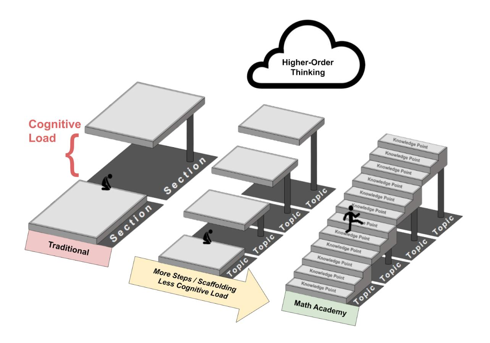
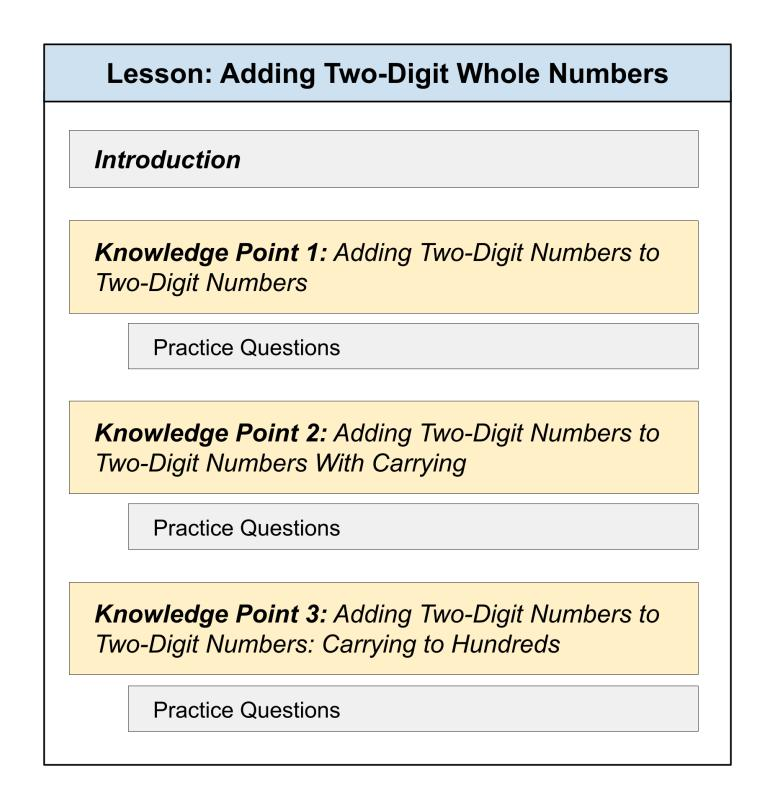
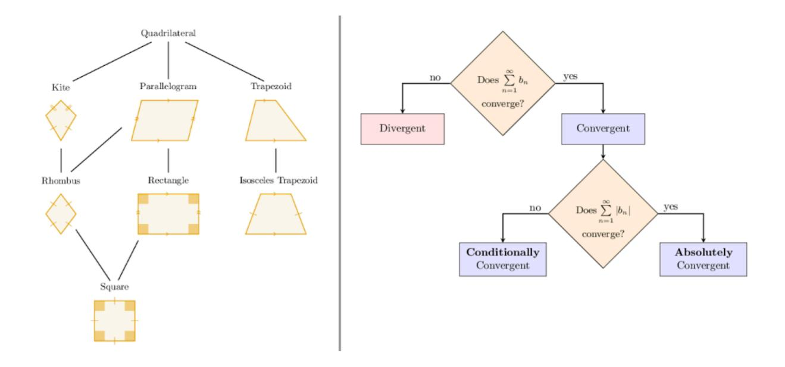
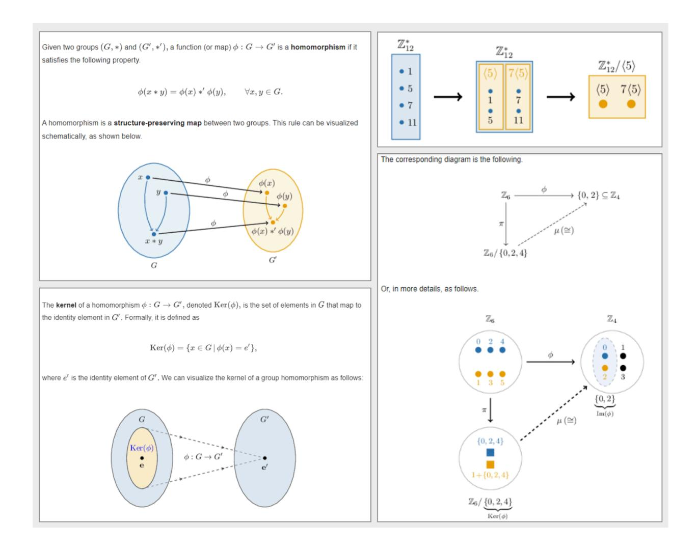

## Chapter 14. Minimizing Cognitive Load

Summary: When the cognitive load of a learning task exceeds a student's working memory capacity, the student experiences cognitive overload and is not able to complete the task. Math Academy avoids cognitive overload by finely scaffolding content with numerous small steps: each lesson is broken up into several "knowledge points" of increasing difficulty, each containing a worked example and requiring the student to demonstrate mastery on practice problems before proceeding to the next knowledge point. Our content is about 10x more finely scaffolded than what you'd find elsewhere. This makes learning accessible to many students whose working memories would otherwise be overwhelmed. Scaffolding is gradually removed as students progress, ensuring sustained learning without dependence on supports.

## The Learning Staircase

Learning is like climbing a staircase. Each step is a learning task - the higher the step, the more advanced the topic is. At the top of the staircase is higher-order thinking such as critical thinking and problem solving. However, different students have different stair-climbing abilities, and many students never make it to the top because they get stuck at individual stairs that are too tall for them to climb.

Math Academy's solution is to split individual stairs into even smaller stairs so that all students can climb them. The smaller we make the individual stairs, the more students can climb all the way to the top.

For instance, a typical calculus textbook might consist of 100 steps (10 chapters × 10 sections in each chapter). But in our calculus course, we have about 1000 steps (~300 topics × 3-4 knowledge **points** or stages of increasing difficulty per topic). In other words, our content is about 10x more finely scaffolded than what you'd find elsewhere.

In technical terms, we are minimizing cognitive load. Cognitive load refers to the amount of working memory that is required to complete a task. Working memory consists of limited-capacity, limited-duration short-term memory storage along with capabilities for organizing, manipulating, and generally "working" with the information stored in short-term memory.

In the staircase analogy, the height of each step represents cognitive load. Different students have different working memory capacities, and if the cognitive load of a learning task exceeds a student's working memory capacity, then the student will not be able to complete the task due to cognitive overload.

Cognitive overload has massive negative ramifications for students: not only has working memory capacity been shown to predict performance in mathematical problem solving (Swanson & Beebe-Frankenberger, 2004), but perhaps shockingly, it has also been shown to be a better predictor than IQ when predicting a young student's future academic success (Alloway & Alloway, 2010). By minimizing the cognitive load and avoiding cognitive overload, we make learning accessible to many students for whom it would otherwise be insurmountable.

Math Academy maintains this high level of scaffolding even when teaching higher-order thinking. In our multi-part problems, students explore challenging, complex problem contexts one part at a time, and each part leverages an individual skill that they have previously learned in an earlier topic. This way, we fully "split up the staircase" as students climb from practicing individual skills in isolation to combining skills in novel higher-order problem contexts.

## Micro-Scaffolding

Even within individual knowledge points, we take additional measures to minimize cognitive load. Each knowledge point starts with a demonstration or worked example, which has been shown by numerous studies (see Sweller, 2006 for a review) to reduce cognitive load and help students develop a baseline mental framework or schema when their level of understanding is initially low.

After the worked example, students solve problems that are similar to the worked example, only progressing onto the next knowledge point once they have demonstrated mastery of the previous one. This way, we avoid asking students to solve problems that overload their working memory capacity.

In the explanations of worked examples and practice questions, we leverage subgoal labeling by grouping steps into meaningful units. This minimizes the number of chunks of information that students need to store in their working memory, thereby reducing cognitive load. Additionally, subgoal labeling has been shown to help students grasp the structure of the problem, thereby enabling the learning to transfer to novel problems in the same category (Catrambone, 1995).

We also leverage dual-coding theory by including visualizations and diagrams when possible to help students develop mental images. In addition to helping students make connections that they can use to recall information and consolidate information into chunks, this also helps students avoid cognitive overload by distributing cognitive load more evenly between two subsystems within the working memory system: the phonological loop, which stores verbal information, and the visuo-spatial sketchpad, which stores visual imagery (Baddeley, 1983).

It's worth noting that unlike most other educational programs, Math Academy makes heavy use of visualizations and diagrams throughout the entire math curriculum - not just in elementary mathematics, but all the way through university-level subjects.

For instance, just as we use flowcharts to help students classify shapes in elementary mathematics, we also use flowcharts to help students classify series in Calculus:

The visualization doesn't stop at Calculus. It continues all the way through more advanced university-level courses like Multivariable Calculus - even Abstract Algebra, an upper-level math-major course about the "structure" of abstract mathematical objects, whose textbooks and lectures are usually associated with dense, dry, image-less strings of symbols.

## Sample Images – Multivariable Calculus

#### Sample Images - Abstract Algebra

## The Expertise Reversal Effect

While it's important to use scaffolding to minimize cognitive load when students are learning new material, it's also important to gradually strip away the scaffolding as they become comfortable with that material so that the scaffolding does not become a crutch. This phenomenon is known as the expertise reversal effect: the instructional techniques that promote the most learning in beginners, promote the least learning in experts, and vice versa.

On Math Academy, after a student completes an initial lesson on a topic, we gradually strip away scaffolding during later reviews. While we scaffold lessons by having students solve questions that are similar to worked examples (one worked example at a time), we mix up review

problems so that it is not obvious which worked example is the best reference. This encourages students to solve review problems without referring to the worked examples - and while they can go back to the lesson and dig up a similar example for reference if they get really stuck on a review problem, even students who do this must reason about the structure of their problem to match it to helpful reference material.

We also continually quiz our students on the material that they have learned - and during quizzes, no scaffolding is provided. Quizzes are quick and frequent, but each quiz covers a wide variety of previously learned material. Additionally, quizzes are timed, and students are unable to refer back to lessons for reference.

## **Key Papers**

**Note:** "Importance" blurbs may include pieces of direct quotes referenced earlier in this chapter. If citing this chapter, cite from the body (above).

• Swanson, H. L., & Beebe-Frankenberger, M. (2004). The relationship between working memory and mathematical problem solving in children at risk and not at risk for serious math difficulties. *Journal of educational psychology*, 96(3), 471.

Alloway, T. P., & Alloway, R. G. (2010). Investigating the predictive roles of working memory and IQ in academic attainment. Journal of experimental child psychology, 106(1), 20-29.

Importance: Cognitive overload has massive negative ramifications for students: not only has working memory capacity been shown to predict performance in mathematical problem solving, but perhaps shockingly, it has also been shown to be a better predictor than IQ when predicting a young student's future academic success.
