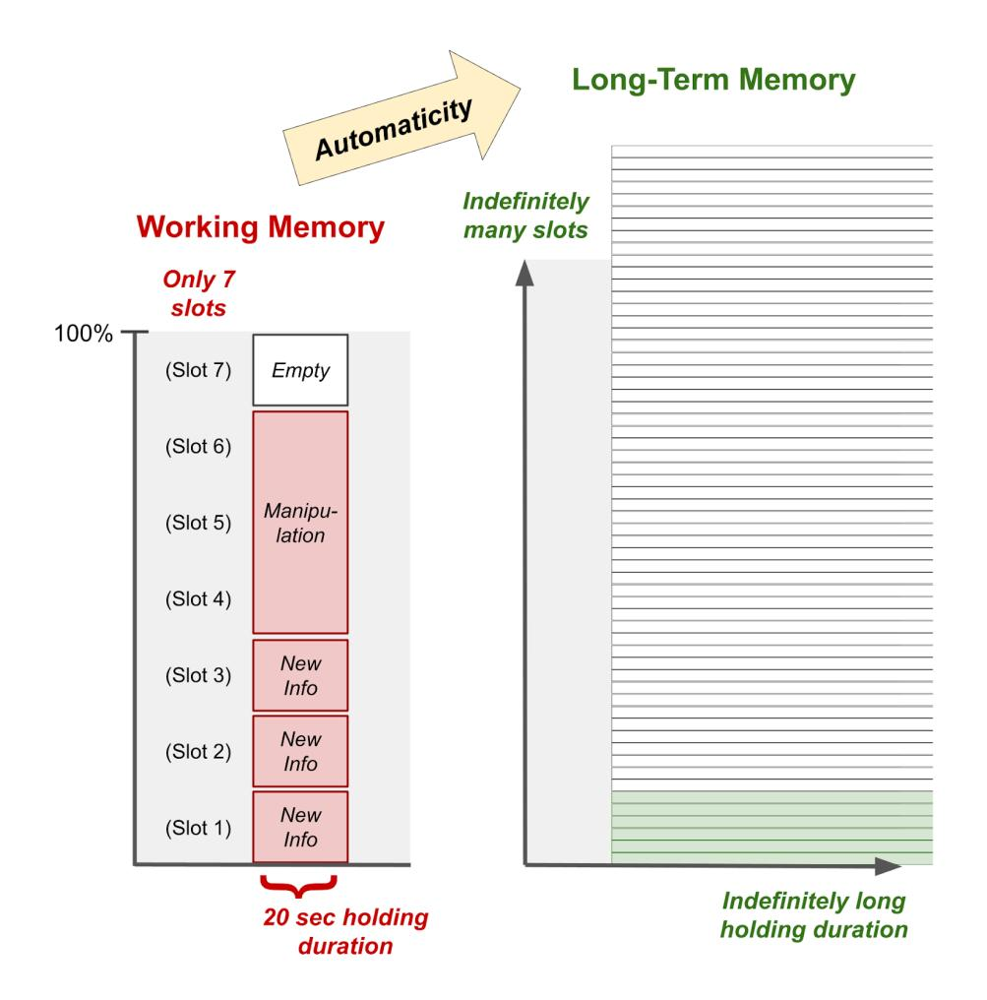

## Chapter 15. Developing Automaticity

Summary: Automaticity is the ability to perform low-level skills without conscious effort. Analogous to a basketball player effortlessly dribbling while strategizing, automaticity allows individuals to avoid spending limited cognitive resources on low-level tasks and instead devote those cognitive resources to higher-order reasoning. In this way, automaticity is the gateway to expertise, creativity, and general academic success. However, insufficient automaticity, particularly in basic skills, inflates the cognitive load of tasks, making it exceedingly difficult for students to learn and perform.

## Importance of Automaticity

#### Automaticity Frees Up Working Memory

An essential yet often-overlooked part of minimizing cognitive load is developing automaticity on basic skills - that is, the ability to execute low-level skills without having to devote conscious effort towards them. Automaticity is necessary because it frees up limited working memory to execute multiple lower-level skills in parallel and perform higher-level reasoning about the lower-level skills.

As a familiar example, think about all the skills that a basketball player has to execute in parallel: they have to run around, dribble the basketball, and think about strategic plays, all at the same time. If they had to consciously think about the mechanics of running and dribbling, they would not be able to do both at the same time, and they would not have enough brainspace to think about strategy.

This extends to academics as well. As described by Hattie & Yates (2013, pp.53-58):

"You cannot comprehend a 'big picture' if your mind's energies are hijacked by low-level processing. Continuity is broken. The goal shifts from understanding the total context to understanding the immediate word before you. ... If you read connected text (such as sentences) at any pace under 60 wpm, then understanding what you read becomes almost impossible.

Many [students] arrive at school with a lack of automaticity within their basic sound-symbol functioning. With a minimal level of phonics training, they may be able to fully identify letters, verbalise sound symbol relationships, and read isolated words through sheer effort. But, if the pace

of processing is not brought up to speed, through intensive self-directed practice, reading for understanding will remain beyond grasp.

A well-replicated finding is that students who present with difficulties in mathematics by the end of the junior primary years show deficits in their ability to access number facts with automaticity. Such deficits stymie further development in this area, often with additional adverse consequences such as students experiencing lack of confidence, lack of enjoyment, and feelings of helplessness."

#### Working Memory is Limited, but Long-Term Memory is Not

Unfortunately, working memory has such limited capacity that most people can only hold a handful of pieces of new information simultaneously in their heads (spanning about 7 digits, or more generally 4 chunks of coherently grouped items), and only for about 20 seconds as the memory degrades from decay or interference (Miller, 1956; Cowan, 2001; Brown, 1958; Ricker, Vergauwe, & Cowan, 2016). And that assumes they aren't needing to perform any mental manipulation of those items - if they do, then fewer items can be held due to competition for limited processing resources (Wright, 1981). This severe limitation of the working memory when processing novel information is known as the narrow limits of change principle (Sweller, Ayres, & Kalyuga, 2011).

An intuitive analogy by which to understand the limits of working memory is to think about how your hands place a constraint on your ability to hold and manipulate physical objects. You can probably hold your phone, wallet, keys, pencil, notebook, and water bottle all at the same time - but you can't hold much more than that, and if you want to perform any activities like sending a text, writing in your notebook, or uncapping your water bottle, you probably need to put down several items.

In the same way, your working memory only has about 7 slots for new information, and once those slots are filled, if you want to hold more information or manipulate the information that you are already holding, you have to clear out some slots to make room.

(Note that while this "slots" analogy describes the function of working memory capacity, the underlying mechanism is more nuanced: the actual limitation is not a fixed number of neural storage units, but rather the ability to sustain relevant neural activity while suppressing interference from irrelevant neural activity. At a biological level, hitting a working memory capacity limit does not entail exhausting one's ability to maintain more neural activity in the energy sense, but rather exhausting one's ability to maintain focus and attention, that is, appropriate concentration or allocation of one's neural activity.)

In particular, you can't solve a problem if you can't fit all its pieces in your working memory. This means that if a student doesn't achieve automaticity on lower-level skills, it doesn't even matter how well the teacher scaffolds a new skill - they won't be able to do it. And even for tasks within a student's cognitive capacity, it has been shown that a heavy cognitive load drastically increases the likelihood of errors (Ayres, 2001).

When you develop automaticity on a skill or piece of information, however, you can use it without it occupying a slot in your working memory. Instead, the skill is stored in your long-term memory, where indefinitely many things can be held for indefinitely long without requiring cognitive effort.

As Anderson (1987) summarizes, automaticity can effectively turn long-term memory into an extension of short-term memory:

"Chase and Ericsson (1982) showed that experience in a domain can increase capacity for that domain. Their analysis implied that what was happening is that storage of new information in long-term memory, became so reliable that long-term became an effective extension of short-term memory."

For emphasis, we quote Chase and Ericsson (1982) directly:

"The major theoretical point we wanted to make here is that one important component of skilled performance is the rapid access to a sizable set of knowledge structures that have been stored in directly retrievable locations in long-term memory. We have argued that these ingredients produce an effective increase in the working memory capacity for that knowledge base."

#### | Expertise Requires Automaticity

Automaticity is the mental capacity that differentiates experts from beginners, a phenomenon that has been thoroughly studied in various contexts including the game of chess. As summarized by Ross (2006):

"...[A] typical grandmaster has access to roughly 50,000 to 100,000 chunks of chess information [Gobet & Simon, 1998]. A grandmaster can retrieve any of these chunks from memory simply by looking at a chess position, in the same way that most native English speakers can recite the poem 'Mary had a little lamb' after hearing just the first few words."

#### As elaborated by Gobet & Simon (1998):

....[S]kill in playing chess depends both on (a) recognizing familiar chunks in chess positions while playing games, and (b) exploring possible moves and evaluating their consequences. ... Expert memory, in turn includes slowly acquired structures in long-term memory (retrieval structures, templates) that augment short-term memory with slots (variable places) that can be filled rapidly with information about the current position."

Indeed, as Benjamin Bloom noted (1986) while identifying automaticity as a key theme in his own research on talent development, automaticity was described as the "hands and feet of genius" as early as the 19th century:

"Our talent development studies support the 1899 research of Bryan and Harter who were concerned with the development of automaticity in expert Morse Code telegraphers. They most eloquently described the benefits of automaticity as an outcome of the learning process.

The learner must come to do with one stroke of attention what now requires half a dozen, and presently in one still more inclusive stroke, what now requires thirty-six. He must systematize the work to be done and must acquire a system of automatic habits corresponding to the system of tasks. When he has done this he is master of the situation in his [occupational or professional]

field. ... Finally, his whole array of habits is swiftly obedient to serve in the solution of new problems. Automatism is not genius, but it is the hands and feet of genius."

It's important to realize that automaticity goes beyond simple familiarity. If you truly "know" something, then you should be able to access and leverage that information both quickly and accurately. If you can't, then you're just "familiar" with it. And when learning hierarchical bodies of knowledge - whether it be math, chess, a sport, or an instrument - it's important to truly know things, not just be familiar with them. Why? Because you can't build on familiarity. That's what the term "shaky foundations" refers to. You can only build on a solid foundation of knowledge.

To help students develop automaticity (and, consequently, expertise in mathematics), Math Academy requires students to practice each skill until they have reached a sufficient level of mastery. Students start at their edge of knowledge (not their edge of "familiarity") and are not pushed forward along learning paths until they have mastered the prerequisite skills. Additionally, to help consolidate skills into long-term memory after mastery, skills are continually reviewed into the future through a systematic method called spaced repetition (which is described later in this document).

## Case Study: Computing Exponents With vs Without Automaticity on Multiplication and Addition Facts

To convey the importance of automaticity, it helps to walk through a case study in which we observe a problem being solved by students who have different levels of automaticity in their underlying skills. As we will see, a student's overall learning experience can vary drastically depending on their level of automaticity.

Suppose that we have three different students - Otto, Rica, and Finn - whose names are chosen to represent their respective levels of automaticity.

- Otto has developed *full automaticity* on multiplication facts and procedures.
- Rica doesn't know her multiplication facts she recalculates them from scratch. She is able to carry out multiplication procedures, but she isn't fully comfortable with them and has to proceed slowly, writing every single step down.

• Finn, likewise, doesn't know his multiplication facts – but he doesn't know his addition facts either, so he uses *finger-counting* for everything. He is not at all comfortable with multiplication procedures.

These students are each given a lesson on cubes of numbers. After an explanation of what it means to cube a number, and a demonstration with a worked example, they're each given a problem to practice on their own: compute 43. Let's observe the thought processes (both reasoning and emotions) as each of these students solves the problem.

**Otto** is so comfortable with his multiplication and addition facts that he solves the problem in 10 seconds in his head. He feels it was easy, is excited to try another, and can't wait for harder problems like cubing negative numbers, decimal numbers, and fractions.

•  $4^3 = 4 \times 4 \times 4$ . I know  $4 \times 4 = 16$ , easy, and then  $16 \times 4 = ...$  well that's  $10 \times 4 = 40$  and  $6 \times 4 = 24$ , together making 40 + 24 = 64. Done, easy! What's next?

**Rica** solves the problem in 2 minutes, but her answer is not correct. She takes another 2 minutes to correct the mistake but gets tired and wants to take a break before moving on to the next problem. She's not looking forward to harder problems.

- $4^3 = 4 \times 4 \times 4$ . What's  $4 \times 4$ ? I don't know, let's compute it.
  - $\circ$  4 × 4 is the same as 4 + 4 + 4 + 4, which is ... well, 4 + 4 = 8, plus 4 is 12, plus 4 is 16.
- Where was I? Oh right,  $4 \times 4 = 16$  and then  $16 \times 4 = ...$  ugh, gotta go through that multiplication procedure.
  - Put the 16 on top, then  $\times$  4 on bottom, and now we carry out the procedure. First  $4 \times 6 = 6 + 6 + 6 + 6$ , count that up to get 6 + 6 = 12, plus 6 is 18, plus 6 is 22. Write down 2, carry another 2. Then  $4 \times 1 = 4$ , add the carried 2, write down 6.
- Done. Result is 62. Oh wait, the teacher says that's close but not quite right. Fine, let's try this again.
- (Rica repeats the entire procedure above and this time gets a result of 64.)
- Great, teacher says that 64 is right. I know there are more problems to do but that one was kind of hard and I'm tired. Teacher, can I take a break and do the next one later?

Finn takes 10 minutes to solve the problem, but his answer is not correct. He tries again for another 10 minutes but makes a different mistake. The teacher has to sit with him for another 10 minutes to carry him through the problem. By the time Finn is done with the problem, it has almost been a full class period. He is totally exhausted and overwhelmed and dreads doing the rest of the homework.

- $4^3 = 4 \times 4 \times 4$ . What's  $4 \times 4$ ? I don't know, let's compute it.
  - $\circ$  4 × 4 is the same as 4 + 4 + 4 + 4, which is ... ugh, gotta count all this up. This is annoying.
    - Start at 4, then 4 more is 5, 6, 7, 8.
    - Start at 8, then 4 more is 9, 10, 11, 12.
    - Start at 12, then 4 more is 12, 13, 14, 15.
  - Phew, that took a while, but now I have 4 + 4 + 4 + 4 = 15. Why was I doing that, again? Oh right, I was really doing  $4 \times 4 = 15$ .
- Wait, we're not even done yet. I did  $4 \times 4 = 15$ , but that was because I wanted to do  $4 \times 4 \times 4$ . Okay so now I need to do 15 × 4. Ew, that's going to be even harder. I don't like this. But fine, let's do it.
  - $\circ$  15 × 4 is the same as 15 + 15 + 15 + 15, and those are big numbers so I need to line it up on paper.
    - Put 15 at the top, then another 15 below, then another 15, then another 15.
    - *Let's add the right column:* 
      - Start at 5, then 5 more is 6, 7, 8, 9, 10.
      - Start at 10, then 5 more is 10, 11, 12, 13, 14.
      - Start at 14, then 5 more is 15, 16, 17, 18, 19.
    - Write down 9, carry the 1, then add down the left column: start at 1, then 1 more is 2, then 3, then 4, then 5. Write down the 5, we have 59.
- Answer is 59. Glad that's over. That took forever. Oh wait, the teacher says that's wrong. Noooo... do I have to do this whole thing over again?! This is way too much work.

- (Finn repeats the entire procedure above and this time gets a result of 66, which is still incorrect. He is getting very noticeably frustrated and his teacher sits down with him to go through his work. They find and fix several errors together and arrive at the correct result of 64.)
- I can't do any more of this today. I'm too tired. I hate math, and my teacher gives me way too much work. And the next problem looks harder, and there are even more on the homework! This is terrible. Class is almost over so I'm just going to zone out until the bell rings.

This case study demonstrates that the more automaticity a student has on their lower-level skills,

- the easier they will find it to acquire new higher-level skills,
- the more quickly and independently they will be able to execute those skills,
- the better they will feel about the learning process as a whole, and
- the more excited they will be to continue learning more advanced material.

Students who develop automaticity will feel empowered, while students who do not will feel overwhelmed and defeated.

## Automaticity, Creativity, and Higher-Level Thinking

## Automaticity is Necessary for Creativity

The relationship between automaticity and creativity is commonly misunderstood. Some people think that automaticity and creativity are opposite and competing forces: supposedly, because automaticity requires repeated practice, it turns students into mindless robots, whereas to leverage the power of human creativity, one needs to break free from that robotic mindset. This line of reasoning might sound alluring - and even convenient, since students often don't enjoy the repeated practice that's required to develop automaticity - but there's one problem: it's completely false.

In reality, automaticity is a necessary component of creativity. The whole purpose of automaticity is to reduce the amount of bandwidth that the brain must allocate to robotic tasks, thereby freeing up cognitive resources to engage in higher-level thinking. If a student does not develop automaticity, then they will have to consciously think about every low-level action that they perform, which will exhaust their cognitive capacity and leave no room for high-level creative thinking.

As a concrete example, consider what is typically considered one of the most creative activities: writing. Effective writing requires a frictionless pipeline from ideas in one's mind to words on paper. If a writer had to consciously think about spelling, grammar, word definitions, transitions between sentences, when to make a new paragraph, etc, they would become bogged down in low-level robotic tasks and would have no mental bandwidth to think about high-level creative details like vivid imagery, logical cohesiveness, and emotions evoked by various phrases and ideas.

Indeed, the importance of automaticity is documented by researchers in the field of writing education (Kellogg & Whiteford, 2009):

"Serious, effective composition is at once a severe test of memory, language, and thinking ability ... it depends on the author's ability to manage the burdensome demands made on working memory by the task of written composition.

[T]he necessary coordination and control cannot succeed without reducing the relative demands that planning, generation, and reviewing make on working memory. The writer cannot flexibly and adaptively coordinate planning, generating, and reviewing when the needs of any single process consume too many available resources. The writer cannot be mindful of the whole while struggling with the parts."

What's more, this view is supported by an overwhelming amount of research over at least the past half-century:

"Empirical support for the importance of working memory resources, especially executive attention, in the development of advanced writing skills is strong. First, a measurement of overall working memory capacity in college students correlates with their writing performance (Ransdell & Levy, 1996). Vanderberg and Swanson (2007) extended such findings by discovering that it is individual differences in central executive capacity that reliably accounts for variability in writing skills among 10th graders in high school. Controlled executive attention, rather than the storage of representations, is most critical in explaining individual differences in skill. Converging experimental results show that distracting executive attention with a concurrent task of remembering six digits disrupts both the quality and fluency of text composition (Ransdell, Levy, & Kellogg, 2002).

The advancement of writing skills from beginner to advanced levels depends on the availability of adequate working memory resources and the capacity to allocate them appropriately to planning, sentence generation, and reviewing. McCutchen (1996) reviewed a large body of evidence in support of this view. For example, children's fluency in generating written text is limited until they master the mechanical skills of handwriting and spelling (Graham, Berninger, Abbott, & Whitaker,

1997). Learning the mechanics of writing to the point that they are automatic during primary school years is necessary to free the components of working memory for planning, generating, and reviewing. Mastery of handwriting and spelling is also a necessary condition for writers to begin to develop the control of cognition, emotion, and behavior that is needed to sustain the production of texts as adolescents (Graham & Harris, 2000).

Revision is constrained or even nonexistent in developing writers because of working memory limitations. Revision requires detecting a problem, diagnosing its cause, and finding an appropriate way to correct it (Flower et al., 1986). If revision fails because of working memory limitations, as opposed to knowledge of what revision entails, then providing cues to detect problems in the text should benefit revision, because writers can then devote resources solely to diagnosis and solution. Cuing in fact does improve the revision of even college students (Hacker, Plumb, Butterfield, Quathamer, & Heineken, 1994).

As Beal (1996) observed, very young writers have trouble even seeing the literal meaning of their texts. The beginning author focuses on his or her thoughts not on how the text itself reads. Maintaining the author's ideas in working memory requires much, if not all, of the available storage and processing capacity of working memory in during childhood and early adolescence. This prevents the student from reading the text carefully and maintaining a clear representation of what it actually says that is independent of what the author intended to say."

#### | Automaticity is Necessary for Higher-Level Thinking

The same reasoning applies to mathematics. In order to operate at higher levels of mathematical thinking and abstract thought, it's necessary to have developed automaticity at the lower levels. Consider the following realization from a skeptic-turned-convert principal (Brown, Roediger, & McDaniel, 2014, pp.44-45):

"What about Principal Roger Chamberlain's initial concerns about practice quizzing at Columbia Middle School – that it might be nothing more than a glorified path to rote learning? When we asked this question after the study was completed, he paused for a moment to gather his thoughts.

'What I've really gained a comfort level with is this: for kids to be able to evaluate, synthesize, and apply a concept in different settings, they're going to be much more efficient at getting there when they have the base of knowledge and the retention, so they're not wasting time trying to go back and figure out what that word might mean or what that concept was about. It allows them to go to a higher level."

To put it bluntly, according to Lehtinen et al. (2017):

"Fluency in basic arithmetic tasks and number combination skills has proved to be crucial for later mathematical learning and weaknesses in automatization of these skills is characteristic of mathematically disabled children."

Allen-Lyall (2018) elaborates further:

"Internalized facts allow for efficient mental computations that make easier multi-step problem solving or recognizing and making connections between mathematical concepts, such as multiplication and division, ratio comparison, fraction equivalencies, or exploration of object relationships in the world of geometry (Chapin & Johnson, 2006; National Research Council, 2005).

When one internalizes multiplication facts, less brainpower is required to perform tasks that require more complex or successive arithmetic manipulations (Geary, 1999; Geary, Saults, Liu, & Hoard, 2000). Flexible thinking and conceptual leaps between mathematical concepts are possible when products are not computed using successive addition or determined by visual inspection of tables or charts (Royer, 2003). The relationship between factors and products becomes a point of departure into more challenging mathematics. Beginning every new mathematical step forward with a return to multiplication as repeated addition or reliance upon visual assistance may interrupt intuitive mathematical thinking (Goswami, 2008).

Fluid mental computations are thwarted by the needs of working memory necessarily allocated to ascertaining the product of two factors or, conversely, the factors of a particular product. Memorizing facts reduces cognitive load, allowing for working memory to better allocate resources when processing number relationships required by more complex mathematics (Goswami, 2008; LeFevre, DeStefano, Coleman & Shanahan, 2005)."

#### Automaticity is a Gatekeeper to Mathematical Literacy and Academic Success

In a broader scope, Allen-Lyall (2018) also explains how automaticity on math facts is a gatekeeper to mathematical literacy, which in turn impacts future academic and career prospects:

Extending beyond successful school mathematics performance, broader options for college study. and employment opportunity become increasingly likely when one feels confident in one's mathematical thinking and is able to demonstrate solid achievement (Atweh & Clarkson, 2001; Marsh & Hau, 2004; Valero, 2004; Williams & Williams, 2010).

For myriad reasons, facts acquisition becomes an educational gatekeeper to true mathematical literacy. Consequently, helping children to be successful with this seemingly small element of early mathematics learning truly matters in a world rife with challenges requiring the mathematical communication of ideas between and within fields (D'Ambrosio & D'Ambrosio, 1994; Thomas, 2001)."

As other researchers have discovered, the impact on academic achievement begins immediately: students who are slow on their basic math facts begin falling behind their faster peers as soon as multi-digit arithmetic (Joy Cumming & Elkins, 2010).

"Profiles of children based on latency performance on the fact bundles were clustered. The slowest cluster reported use of counting strategies on many bundles; the fastest cluster reported use of retrieval or efficient-thinking strategies. Cluster group was the best predictor of performance on multidigit tasks. Addition fact accuracy contributed only for tasks without carrying, and grade level was not significant. Analysis by error type showed most errors on the multidigit sums were

due to fact inaccuracy, not algorithmic errors. The implication is that the cognitive demands caused by inefficient solutions of basic facts made the multidigit sums inaccessible."

In retrospect, beliefs that paint a false dichotomy between automaticity and creativity are not only factually incorrect, but amusingly ironic. Such beliefs suggest that de-emphasizing repetition promotes creativity as a skill for life success - when in reality, it causes students to perpetually spend mental bandwidth on low-level tasks that they could have (through repetition) learned to do automatically, thereby limiting their capacity for higher-level and creative mathematical thinking, as well as their future academic and career prospects.

## Neuroscience of Automaticity

At a physical level in the brain, automaticity involves developing strategic neural connections that reduce the amount of effort that the brain has to expend to activate patterns of neurons.

Researchers have observed this in functional magnetic resonance imaging (fMRI) brain scans of participants performing tasks with and without automaticity (Shamloo & Helie, 2016). When a participant is at wakeful rest, not focusing on a task that demands their attention, there is a baseline level of activity in a network of connected regions known as the default mode network (DMN). The DMN represents background thinking processes, and people who have developed automaticity can perform tasks without disrupting those processes:

"The DMN is a network of connected regions that is active when participants are not engaged in an external task and inhibited when focusing on an attentionally demanding task ... at the automatic stage (unlike early stages of categorization), participants do not need to disrupt their background thinking process after stimulus presentation: Participants can continue day dreaming, and nonetheless perform the task well."

When an external task requires lots of focus, it inhibits the DMN: brain activity in the DMN is reduced because the brain has to redirect lots of effort towards supporting activity in task-specific regions. But when the brain develops automaticity on the task, it increases connectivity between the DMN and task-specific regions, and performing the task does not inhibit the DMN as much:

....[S]ome DMN regions are deactivated in initial training but not after automaticity has developed. There is also a significant decrease in DMN deactivation after extensive practice.

The results show increased functional connectivity with both DMN and non-DMN regions after the development of automaticity, and a decrease in functional connectivity between the medial prefrontal cortex and ventromedial orbitofrontal cortex. Together, these results further support the hypothesis of a strategy shift in automatic categorization and bridge the cognitive and

neuroscientific conceptions of automaticity in showing that the reduced need for cognitive resources in automatic processing is accompanied by a disinhibition of the DMN and stronger functional connectivity between DMN and task-related brain regions."

In other words, automaticity is achieved by the formation of neural connections that promote more efficient neural processing, and the end result is that those connections reduce the amount of effort that the brain has to expend to do the task, thereby freeing up the brain to simultaneously allocate more effort to background thinking processes.

## **Key Papers**

**Note:** "Importance" blurbs may include pieces of direct quotes referenced earlier in this chapter. If citing this chapter, cite from the body (above).

 Miller, G. A. (1956). The magical number seven, plus or minus two: Some limits on our capacity for processing information. Psychological review, 63(2), 81.

Cowan, N. (2001). The magical number 4 in short-term memory: A reconsideration of mental storage capacity. Behavioral and brain sciences, 24(1), 87-114.

Importance: Human working memory has such limited capacity that most people can only hold a handful of pieces of new information simultaneously in their heads: about 7 digits, or more generally 4 chunks of coherently grouped items.

• Ayres, P. L. (2001). Systematic mathematical errors and cognitive load. Contemporary Educational Psychology, 26(2), 227-248.

Importance: Even for tasks within a student's cognitive capacity, a heavy cognitive load drastically increases the likelihood of errors.

Ross, P. E. (2006). The expert mind. Scientific American, 295(2), 64-71.

Importance: A typical grandmaster has access to roughly 50,000 to 100,000 chunks of chess information. A grandmaster can retrieve any of these chunks from memory simply by looking at a chess position, in the same way that most native English speakers can recite the poem "Mary had a little lamb" after hearing just the first few words.

• Gobet, F., & Simon, H. A. (1998). Expert chess memory: Revisiting the chunking hypothesis. *Memory, 6*(3), 225-255.

Importance: Skill in playing chess depends both on (a) recognizing familiar chunks in chess positions while playing games, and (b) exploring possible moves and evaluating their consequences. Expert memory, in turn includes slowly acquired structures in long-term memory (retrieval structures, templates) that augment short-term memory with slots (variable places) that can be filled rapidly with information about the current position.

• Bloom, B. S. (1986). Automaticity: "The Hands and Feet of Genius." Educational leadership, 43(5), 70-77.

Importance: Automaticity was a key theme in Benjamin Bloom's research on talent development and was described as the "hands and feet of genius" as early as the 19th century.

• Kellogg, R. T., & Whiteford, A. P. (2009). Training advanced writing skills: The case for deliberate practice. *Educational Psychologist*, 44(4), 250-266.

**Importance**: In the field of writing, the importance of automaticity is supported by an overwhelming amount of research over at least the past half-century. Serious, effective composition places burdensome demands on working memory. In order to free the components of working memory for planning, generating, and reviewing, students must learn the mechanics of writing to the point that they are automatic during primary school years. The writer cannot be mindful of the whole while struggling with the parts.

• Allen-Lyall, B. (2018). Helping students to automatize multiplication facts: A pilot study. International Electronic Journal of Elementary Education, 10(4), 391-396.

**Importance**: Facts acquisition is an educational gatekeeper to true mathematical literacy. Internalized facts allow for efficient mental computations that make easier multi-step problem solving or recognizing and making connections between mathematical concepts. Memorizing facts reduces cognitive load, allowing for working memory to better allocate resources when performing tasks that require more complex or successive manipulations.

• Joy Cumming, J., & Elkins, J. (1999). Lack of automaticity in the basic addition facts as a characteristic of arithmetic learning problems and instructional needs. Mathematical Cognition, 5(2), 149-180.

Importance: The impact of automaticity on academic achievement begins immediately: students who are slow on their basic math facts begin falling behind their faster peers as soon as multi-digit arithmetic.

• Shamloo, F., & Helie, S. (2016). Changes in default mode network as automaticity develops in a categorization task. *Behavioural Brain Research*, 313, 324-333.

**Importance:** Automaticity is achieved by the formation of neural connections that promote more efficient neural processing, and the end result is that those connections reduce the amount of effort that the brain has to expend to do the task, thereby freeing up the brain to simultaneously allocate more effort to background thinking processes.
