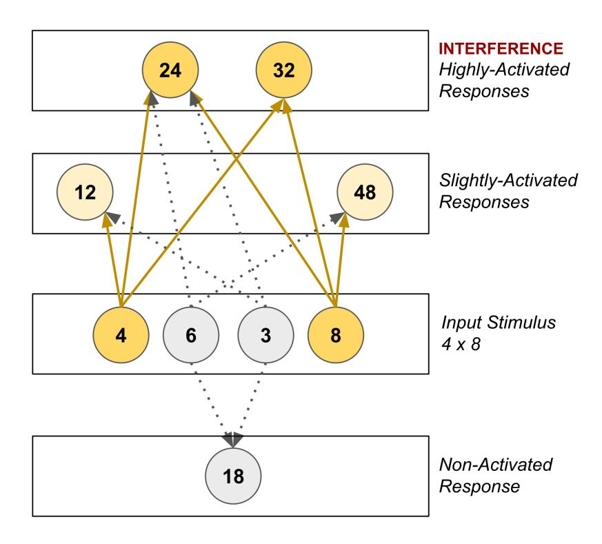

## Chapter 17. Non-Interference

Summary: Associative interference occurs when related knowledge interferes with recall. It is more likely to occur when highly related pieces of knowledge are learned simultaneously or in close succession. However, Math Academy mitigates the effects of interference by teaching dissimilar concepts simultaneously and spacing out related pieces of knowledge over time. This reduces confusion, enhances recall, and facilitates efficient, simultaneous learning of multiple topics, promoting smooth, rapid progress in courses while maintaining varied and engaging learning experiences.

#### Associative Interference

Associative interference describes the phenomenon that conceptually related pieces of knowledge can interfere with each other's recall. For instance, it is easy to mistake a leopard for a cheetah.

The same happens in math. Multiple studies have shown that well over half, and potentially as high as 90%, of multiplication mistakes are caused by interference (see Campbell, 1987 for a summary). For instance, when recalling $4 \times 8$, related facts like $4 \times 6 = 24$ and $3 \times 8 = 24$ interfere with the spreading activation during the recall process and increase the likelihood of the error $4 \times 8 = 24$. (This phenomenon occurs throughout math; multiplication facts are just a convenient setting for academic studies.)

#### Non-Interference

While it is not possible for a teacher to change the structure of knowledge to make different pieces of information less related, further research in interference theory has revealed a factor that can be controlled by a teacher to reduce the impact of interference: time spacing. In a study by Underwood & Ekstrand (1967):

> "2 groups learned A-B for 32 trials, learned A-C to one perfect recitation 3 days later, and recalled A-C after 24 hr. 2 other groups learned both lists in immediate succession followed by 24-hr. recall of A-C. 1 group from each schedule had 6 A-B pairs retained in A-C. The results showed that the 3-day separation of A-B and A-C markedly reduced proactive inhibition ..."

In other words, interference is more likely to occur when highly related pieces of knowledge are learned simultaneously or in close succession, but by spacing out these related pieces of knowledge over time, a teacher can mitigate the effects of interference. We call this strategy non-interference.

Unfortunately, traditional classrooms ignore the benefits of non-interference and instead operate in a way that exacerbates the problem. The typical math curriculum is divided into units of related material and taught in subsequent lessons. This promotes confusion, impedes recall, and places a severe bottleneck on how many topics can be successfully taught simultaneously, thereby creating lots of friction and massively slowing down the learning process.

Math Academy, however, practices non-interference by teaching new concepts alongside dissimilar material. Students are allowed to choose from an array of diverse, non-overlapping learning tasks. As they complete tasks, their knowledge graphs are updated and the system chooses new topics to guide them most efficiently through the course. By utilizing non-interference, Math Academy reduces confusion, improves recall, and successfully teaches many topics simultaneously, thereby enabling students to make smooth, fast progress through their courses.

What's more, non-interference also helps keep Math Academy's learning tasks varied and exciting for students. Learning can feel like a grind when you are made to focus on the same types of concepts and problems for a long time, just like exercising can feel like a grind if the entire workout consists of a single exercise (especially if it's one of your least favorite exercises). So, just like a personal trainer packs a wide variety of exercises into each workout to maintain motivation, Math Academy packs a wide variety of topics into each learning session to keep things exciting.

## **Key Papers**

**Note:** "Importance" blurbs may include pieces of direct quotes referenced earlier in this chapter. If citing this chapter, cite from the body (above).

- Campbell, J. I. (1987). The role of associative interference in learning and retrieving arithmetic facts. Cognitive processes in mathematics, 107-122.

Importance: Multiple studies have shown that well over half, and potentially as high as 90%, of multiplication mistakes are caused by interference. (For instance, when recalling $4 \times 8$, related facts like $4 \times 6 = 24$ and $3 \times 8 = 24$ interfere and increase the likelihood of the error $4 \times 8 = 24$.)

- Underwood, B. J., & Ekstrand, B. R. (1967). Studies of distributed practice: XXIV. Differentiation and proactive inhibition. Journal of Experimental Psychology, 74(4p1), 574.

Importance: Interference is more likely to occur when highly related pieces of knowledge are learned simultaneously or in close succession. By spacing out these related pieces of knowledge over time, a teacher can mitigate the effects of interference.
