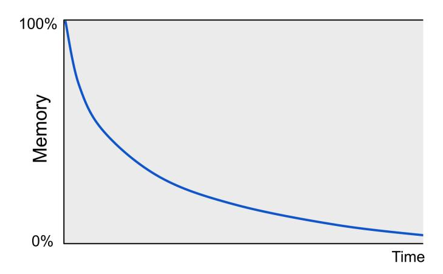
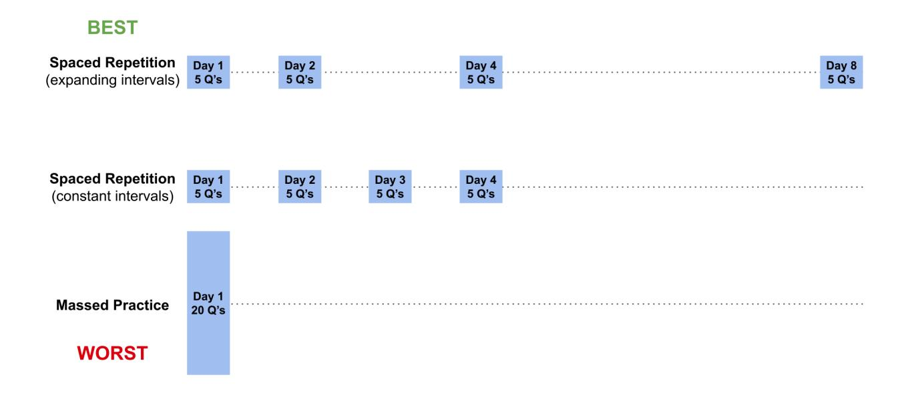
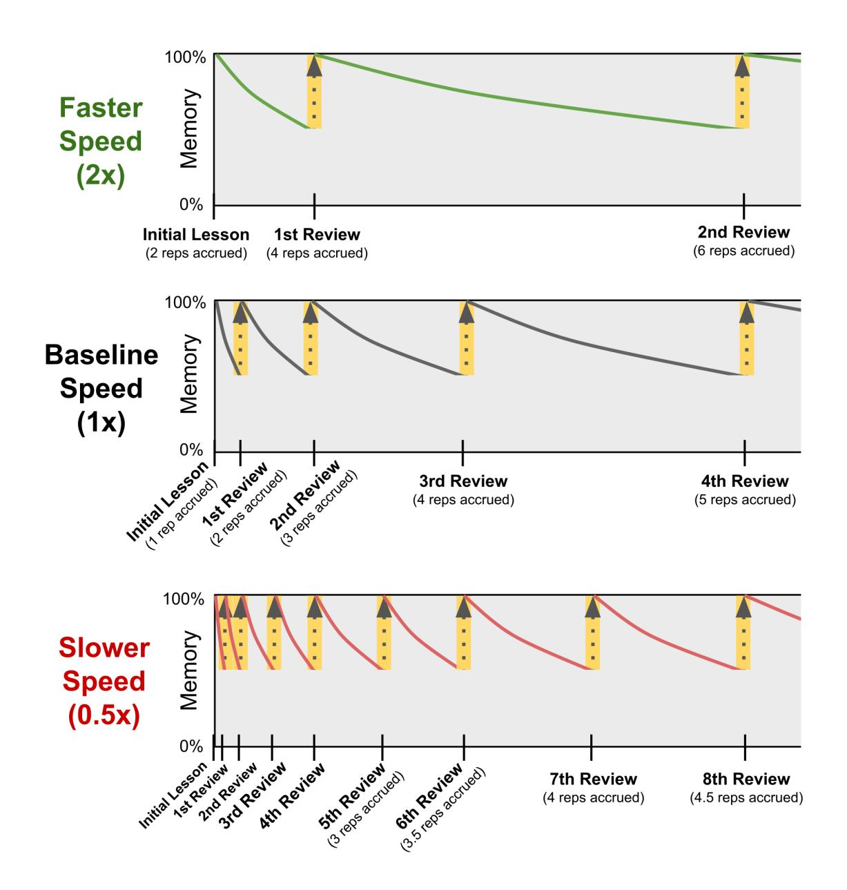
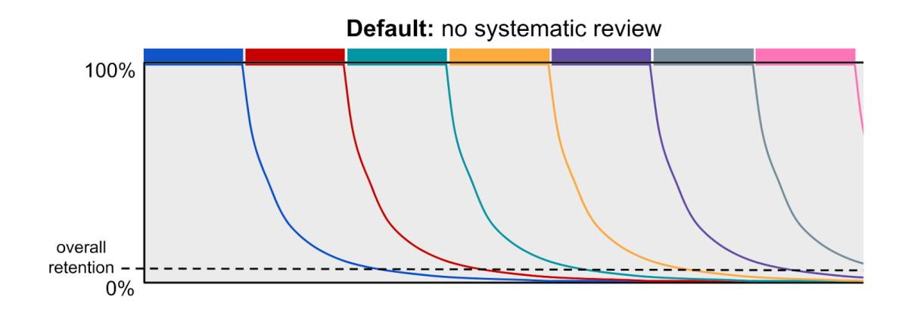

## Chapter 18. Spaced Repetition (Distributed Practice)

Summary: When reviews are spaced out or distributed over multiple sessions (as opposed to being crammed or massed into a single session), memory is not only restored, but also further consolidated into long-term storage, which slows its decay. This is known as the spacing effect. A profound consequence of the spacing effect is that the more reviews are completed (with appropriate spacing), the longer the memory will be retained, and the longer one can wait until the next review is needed. This observation gives rise to a systematic method for reviewing previously-learned material called spaced repetition (or distributed practice). A repetition is a successful review at the appropriate time. Spaced repetition is complicated in hierarchical bodies of knowledge, like mathematics, because repetitions on advanced topics should "trickle down" to update the repetition schedules of simpler topics that are implicitly practiced (while being discounted appropriately since these repetitions are often too early to count for full credit towards the next repetition). However, Math Academy has developed a proprietary model of Fractional Implicit Repetition (FIRe) that not only accounts for implicit "trickle-down" repetitions but also minimizes the number of reviews by choosing reviews whose implicit repetitions "knock out" other due reviews (like dominos), and calibrates the speed of the spaced repetition process to each individual student on each individual topic (student ability and topic difficulty are competing factors).

## Retaining Knowledge Indefinitely

## The Spacing Effect

Learning new topics is only half of the puzzle. The other half is remembering what you've learned. In order to retain knowledge, you must periodically review it - otherwise, in the absence of review, it will decay.

A common way to visualize memory decay is through a forgetting curve, first studied by psychologist Hermann Ebbinghaus in the late 19th century:

Ebbinghaus (1885) discovered that when reviews are spaced out or distributed over multiple sessions (as opposed to being crammed or massed into a single session), memory is not only restored, but also further consolidated into long-term storage, which slows its decay. This is now known as the spacing effect.

#### | Spaced Repetition

A profound consequence of the spacing effect is that the more reviews are completed (with appropriate spacing), the longer the memory will be retained, and the longer one can wait until the next review is needed. This observation gives rise to a systematic method for reviewing previously-learned material called spaced repetition (or distributed practice). A repetition is a successful review at the appropriate time.

Here is an example that illustrates the process and power of spaced repetition. Suppose you learn a new word. Initially, you might only remember that word for a day. But if you quiz yourself on its meaning tomorrow, then you might remember it until the end of the week. And if you quiz yourself again at the end of the week, then you might remember for several weeks. If you stick to this spaced repetition schedule, then you'll eventually be able to go many years between repetitions (Bahrick et al., 1993).

| January |    |    |    |    |    |    |
|---------|----|----|----|----|----|----|
| 1       | 2  | 3  | 4  | 5  | 6  | 7  |
| 8       | 9  | 10 | 11 | 12 | 13 | 14 |
| 15      | 16 | 17 | 18 | 19 | 20 | 21 |
| 22      | 23 | 24 | 25 | 26 | 27 | 28 |
| 29      | 30 | 31 |    |    |    |    |

| February |    |    |    |    |    |    |
|----------|----|----|----|----|----|----|
|          |    |    | 1  | 2  | 3  | 4  |
| 5        | 6  | 7  | 8  | 9  | 10 | 11 |
| 12       | 13 | 14 | 15 | 16 | 17 | 18 |
| 19       | 20 | 21 | 22 | 23 | 24 | 25 |
| 26       | 27 | 28 |    |    |    |    |

| March |    |    |    |    |    |    |
|-------|----|----|----|----|----|----|
|       |    |    | 1  | 2  | 3  | 4  |
| 5     | 6  | 7  | 8  | 9  | 10 | 11 |
| 12    | 13 | 14 | 15 | 16 | 17 | 18 |
| 19    | 20 | 21 | 22 | 23 | 24 | 25 |
| 26    | 27 | 28 |    |    |    |    |

The main challenge of spaced repetition is choosing the optimal amount of time between repetitions. If you wait too long, you will forget the word and move backwards in your spaced repetition schedule. But if you perform the next repetition too early, your memory won't strengthen as much and you won't move forward as quickly.

#### Building Intuition About Spaced Repetition

As Qadir & Imran (2018) describe, spaced repetition can be understood intuitively by way of analogy to muscle-building:

....[M]assed learning can give temporary fluency, just like a body builder can pump muscles..." temporarily by cramming exercises. However, growth only occurs with a spaced exercise routine (in which exercise and rest follow each other cyclically). Similarly, long-term learning also requires spaced practice and does not result from cramming."

As Brown, Roediger, & McDaniel (2014, pp.9-10, 81-82, 100-101) elaborate:

"It's widely believed by teachers, trainers, and coaches that the most effective way to master a new skill is to give it dogged, single-minded focus, practicing over and over until you've got it down.

Our faith in this runs deep, because most of us see fast gains during the learning phase of massed practice. What's apparent from the research is that gains achieved during massed practice are transitory and melt away quickly.

Massed practice gives us the warm sensation of mastery because we're looping information through short- term memory without having to reconstruct the learning from long-term memory. But just as with rereading as a study strategy, the fluency gained through massed practice is transitory, and our sense of mastery is illusory. It's the effortful process of reconstructing the knowledge that triggers reconsolidation and deeper learning.

When you recall learning from short- term memory, as in rapid- fire practice, little mental effort is required, and little long-term benefit accrues. But when you recall it after some time has elapsed and your grasp of it has become a little rusty, you have to make an effort to reconstruct it. This effortful retrieval both strengthens the memory but also makes the learning pliable again, leading to its reconsolidation. Reconsolidation helps update your memories with new information and connect them to more recent learning."

The process of reconsolidation can be likened (pp.73-74) to the process of composing an essay through many iterations:

"An apt analogy for how the brain consolidates new learning may be the experience of composing an essay. The first draft is rangy, imprecise. You discover what you want to say by trying to write it. After a couple of revisions you have sharpened the piece and cut away some of the extraneous points. You put it aside to let it ferment. When you pick it up again a day or two later, what you want to say has become clearer in your mind. Perhaps you now perceive that there are three main points you are making. You connect them to examples and supporting information familiar to your audience. You rearrange and draw together the elements of your argument to make it more effective and elegant.

Similarly, the process of learning something often starts out feeling disorganized and unwieldy; the most important aspects are not always salient. Consolidation helps organize and solidify learning, and, notably, so does retrieval after a lapse of some time, because the act of retrieving a memory from long- term storage can both strengthen the memory traces and at the same time make them modifiable again, enabling them, for example, to connect to more recent learning. This process is called reconsolidation. This is how [spaced] retrieval practice modifies and strengthens learning."

## | Consensus Among Researchers

It's worth noting that the spacing effect is still an active area of research. As Hartwig, Rohrer, & Dedrick (2022) describe, there may be other factors at play besides reconsolidation - but while the exact mechanism(s) underlying the spacing effect may still be debated, the result and utility of the spacing effect is fully agreed upon by researchers:

"Researchers have proposed numerous theoretical explanations for the spacing effect (for reviews, see Benjamin & Tullis, 2010; Delaney et al., 2010; Dempster, 1989). According to various theories, the spacing effect may derive from mechanisms such as encoding variability (i.e., contextual variation provides richer encoding when two learning episodes are spaced apart), deficient processing (i.e., processing of material during a second learning episode is diminished if close in time to the first episode), consolidation (i.e., a second learning episode benefits from any memory consolidation that occurs in the interim), or study-phase retrieval (i.e., spacing promotes effortful retrieval during a second learning episode). However, no single mechanism has accounted for the entire body of spacing-related findings, and it is possible that a combination of mechanisms may best explain the effect (Delaney et al., 2010).

Regardless of mechanism, spacing effects are robust - occurring across various materials, procedures, and learner characteristics (Dunlosky et al., 2013). Most important for the present study, spacing effects have been demonstrated in numerous classroom-based randomized studies (e.g., Seabrook et al., 2005; Sobel et al., 2011; for a review, see Dunlosky et al., 2013). Moreover, classroom studies have found spacing effects with math learning (Barzagar Nazari & Ebersbach, 2019; Hopkins et al., 2016; Lyle et al., 2020; Schutte et al., 2015). In short, considerable data show that spaced math practice improves scores on delayed tests. ... [T]he literature is clear that practice should be spaced across many class sessions if students are to retain the information long-term (Rawson et al., 2013; Rawson et al., 2018)."

#### As Rohrer (2009) states:

....[T]he spacing effect is arguably one of the largest and most robust findings in learning research, and it appears to have few constraints."

Indeed, according to researcher Kang (2016), hundreds of studies have demonstrated that spaced repetition produces superior long-term retention. As a memorable example, he describes one of the earliest spaced repetition studies, whose findings have been backed up by 254 follow-up studies over the past century:

"In one early study, to illustrate a specific instance, college students were asked to learn the Athenian Oath (Gordon, 1925). One group of students heard the oath read 6 times in a row; another group heard the oath 3 times on 1 day and 3 more times 3 days later.

On the immediate test, the group that received massed repetition recalled slightly more than the group that received spaced repetition. But on the delayed test 4 weeks later, the spaced group clearly outperformed the massed group.

While massed practice might appear [slightly] more effective than spaced practice in the short term, spaced practice produces durable long-term learning."

The benefits of spacing are so pronounced and conclusive that they have even attracted attention from the field of advertising, where the spacing effect has been reproduced in numerous studies of consumer memory of brands (Schmidt & Eisend, 2015).

## Spaced Repetition is Underused

Unfortunately, as with mastery learning, spaced repetition deviates from traditional convention in education and consequently remains rarely used in classrooms. As Kang (2016) laments:

"Despite over a century of research findings demonstrating the spacing effect, however, it does not have widespread application in the classroom. The spacing effect is 'a case study in the failure to apply the results of psychological research' (Dempster, 1988, p. 627).

When deciding on what instructional techniques to use (and when to use them), many teachers default to familiar methods (e.g., how they themselves were taught; Lortie, 1975) or rely on their intuitions, both less than ideal: Our intuitions about learning can sometimes be plain wrong, and it would be a waste to overlook the growing evidence base regarding the effectiveness of various teaching or learning strategies.

The second major hurdle is conventional instructional practice, which typically favors massed practice. Teaching materials and aids (e.g., textbooks, worksheets) are usually organized in a modular way, which makes massed practice convenient. After presenting a new topic in class, teachers commonly give students practice with the topic via a homework assignment. But aside from that block of practice shortly after the introduction of a topic, no further practice usually follows, until a review session prior to a major exam."

Perhaps shockingly, Cepeda et al. (2009) observed that even many instructional design and educational psychology textbooks have little to no coverage of spaced repetition as a learning strategy:

"Failure to consider distributed practice research is evident in instructional design and educational psychology texts, many of which fail even to mention the distributed practice effect (e.g., Bransford, Brown, & Cocking, 2000; Bruning, Schraw, Norby, & Ronning, 2004; Craig, 1996; Gardner, 1991; Morrison, Ross, & Kemp, 2001; Piskurich, Beckschi, & Hall, 2000).

Those texts that mention the distributed practice effect often devote a paragraph or less to the topic (e.g., Glaser, 2000; Jensen, 1998; Ormrod, 1998; Rothwell & Kazanas, 1998; Schunk, 2000; Smith & Ragan, 1999) and offer widely divergent suggestions – many incorrect – about how long the lag between study sessions ought to be (cf. Gagné, Briggs, & Wager, 1992; Glaser, 2000; Jensen, 1998; Morrison et al., 2001; Ormrod, 2003; Rothwell & Kazanas, 1998; Schunk, 2000; Smith & Ragan, 1999)."

Typically, students learn a topic during class, practice it on the homework, and then forget about it until it's time to study for a test. After the test, students are rarely required to practice the topic again, unless it just happens that some new topic requires them to remember the old one. The end result is that students end up forgetting most of what they learn - and as Rohrer (2009) notes, the forgetting can be so severe that it can appear as though they never learned those things in the first place:

"The effects of forgetting are often neglected by learning theorists, but acquisition has little utility unless material is retained. Indeed, although poor performance on standard achievement tests is often attributed to the absence of acquisition, forgetting may often be the culprit.

For example, in the 1996 National Assessment of Educational Progress, 50% of U.S. eighth graders were unable to correctly multiply -5 and -7, even though the question was presented in a multiple-choice format (Reese, Miller, Mazzeo, & Dosse, 1997). If any of these erring students knew the product previously, which seems likely, their error was likely due to forgetting."

Often, students don't even realize how quickly they forget in the absence of spaced review. For instance, Emeny, Hartwig, & Rohrer (2021) found that students who engaged in spaced practice could predict their own future test scores fairly accurately, while students who engaged in massed practice were severely overconfident in their predictions:

"Following spaced practice, students predicted their future test scores very accurately, whereas massed practice yielded gross overconfidence. The overconfidence after massed practice might be due to the fluency or success with which students can solve a set of similar problems by merely repeating the same procedure over and over, giving the impression that students have mastered the content. In turn, overconfidence may lead students and their teachers to believe that further practice is unnecessary when, in fact, the gains will not be retained across time.

Though massed practice produced overconfidence, we note that predictions following massed practice were only slightly greater than predictions following spaced practice. Thus, massed practice did not elevate predictions to an unrealistically high level but instead failed to help students recognize their low level of mastery."

Another factor keeping spaced repetition out of STEM classrooms in particular is that, to our best knowledge, the current literature on mathematical models for determining optimal repetition spacing is limited to the setting of independent flashcard-like tasks. STEM subjects, in contrast, are highly connected bodies of knowledge. This introduces significant modeling complexities: for instance, repetitions on advanced topics should "trickle down" to update the repetition schedules of simpler topics that are implicitly practiced (while being discounted appropriately since these repetitions are often too early to count for full credit towards the next repetition).

To overcome this hurdle, Math Academy has developed a proprietary model of Fractional Implicit Repetition (FIRe) that not only accounts for implicit "trickle-down" repetitions but also

• minimizes the number of reviews by choosing reviews whose implicit repetitions "knock out" other due reviews (like dominos), and

• calibrates the spaced repetition process to each individual student on each individual topic (student ability and topic difficulty are competing factors - high student ability speeds up the overall student-topic learning speed, while high topic difficulty slows it down).

Our highly sophisticated spaced repetition model is the product of years of research, practice, and development since 2019, and it continues to be refined as we gain more data on student learning outcomes.

## Spaced Repetition Improves Generalization

People usually think of spaced repetition as a process to remember isolated pieces of information. But in a highly connected body of complex skills, like math, spaced repetition can also promote generalized learning that can more easily transfer across different contexts.

To start off with some loose intuition, think about what happens when you reread a book or rewatch a movie that you haven't seen in a while. Often, you see things that you didn't notice before. You come in with a different mental state compared to the last time you watched, and you come out with some fresh perspectives and a more comprehensive understanding of the work.

Indeed, a review by Smith & Scarf (2017) recounted multiple studies demonstrating that "spacing not only benefits the learning and retention of specific items but improves the generalization of learning":

"Hagman (1980) had participants learn and practice electrical testing on the same equipment or different equipment, with practice massed all in 1 day or spaced on 3 consecutive days. On a transfer test after a 2-week delay, spaced practice on different equipment resulted in better transfer than spaced practice on the same equipment. Spaced practice on the same equipment resulted in better performance on the transfer test than massed practice on the same or different equipment. Moreover, massed practice on the same or different equipment resulted in equivalent performance on the transfer test, indicating that spacing was necessary for training variations to promote generalization.

Similarly, Moulton et al. (2006) compared massed and spaced groups who practiced microsurgical skills on PVC-artery models and arteries from a turkey thigh, and tested to what extent their skills transferred to a live rat 1 month after training. Moulton et al. (2006) found that the spaced group performed significantly better on a variety of outcome measures than the massed group.

Studies with children have investigated the impact of spacing on generalization using a greater range of spacing intervals relative to the adult literature. For example, Vlach and Sandhofer (2012) investigated the impact of spacing on the generalization of simple and complex science concepts in 5- to 7-year-olds. The children in their study completed 4 lessons on biomes, with each lesson involving a different context (desert, grasslands, artic, ocean or swamp), and a post-test 1 week after the last lesson. The massed group completed all four lessons in 1 day, the intermediate group completed 2 lessons per day for 2 days, and the Spaced Group completed 1 lesson per day for 4 days. For simple generalization, the spaced group showed significantly greater improvement from the pre- to post-test than the massed group, and the intermediate group's improvement was not significantly different when compared to the massed or spaced groups. In contrast, for complex generalization, the spaced group's improvement was significantly better than both the massed and intermediate groups. In fact, the data suggest that the spaced group is the only group to show an improvement in their gain scores as the questions moved from simple to complex, though unfortunately this trend was not tested for statistical significance. Spacing therefore may provide a greater benefit for more complex generalizations.

Gluckman et al. (2014) replicated Vlach and Sandhofer's (2012) findings, but in the post-test they included questions on the children's memory for facts and concepts talked about during the lessons (e.g., what is a biome?), in addition to generalization questions. The spaced group showed significantly greater improvement than the massed group for simple and complex generalization auestions and for memory auestions. The reported means displayed the same pattern as above. with spacing benefiting complex generalizations more than simple generalizations."

In a follow-up study, Vlach, Sandhofer, & Bjork (2014) also found that higher-fidelity spaced repetition with expanding intervals promoted even better generalization than spaced repetition with constant intervals, suggesting that optimizing the spaced repetition process can lead to significant gains in generalization:

....[W]e examined whether an expanding learning schedule would promote generalization to a greater degree than would an equally spaced learning schedule ... [A]t the 24-hour delayed generalization test, we observed a significant difference between the two conditions: Children in the expanding learning condition significantly outperformed children in the equal spacing condition.

These findings suggest that the benefits of expanding schedules are not constrained to memory tasks, but that these learning schedules can promote multiple types of learning, such as the acquisition and generalization of information."

## Repetition Compression

A common criticism of spaced repetition is that it requires an overwhelming number of reviews. While this can be true if spaced repetition is used to learn unrelated flashcards, there is something special about the subject of mathematics that allows Math Academy to avoid this issue.

Unlike independent flashcards, mathematics is a hierarchical and highly connected body of knowledge. Whenever a student solves an advanced mathematical problem, there are many simpler mathematical skills that they practice implicitly. In other words, in mathematics, advanced skills tend to **encompass** many simpler skills.

As a result, whenever a student has due reviews, Math Academy is able to compress them into a much smaller set of learning tasks that implicitly covers (i.e. provides repetitions on) all of the due reviews. We call this process **repetition compression**.

To illustrate, consider the following multiplication problem, in which we multiply the two-digit number 39 by the one-digit number 6:

$$egin{array}{c} 5 \\ 3 \ 9 \\ imes 6 \\ \hline 2 \ 3 \ 4 \\ \end{array}$$

In order to perform the multiplication above, we have to multiply one-digit numbers and add a one-digit number to a two-digit number:

- First, we multiply  $6 \times 9 = 54$ . We carry the 5 and write the 4 at the bottom.
- Then, we multiply  $6 \times 3 = 18$  and add 18 + 5 = 23. We write 23 at the bottom.

In other words, Multiplying a Two-Digit Number by a One-Digit Number encompasses Multiplying One-Digit Numbers and Adding a One-Digit Number to a Two-Digit Number.

We can visualize this using an **encompassing graph** as shown below. The encompassing graph is similar to a prerequisite graph, except the arrows indicate that a simpler topic is encompassed by a more advanced topic. (Encompassed topics are usually prerequisites, but prerequisites are often not fully encompassed.)

Now, suppose that a student is due for reviews on all three of these topics. Because of the encompassings, the only review that they will actually have to do is Multiplying a Two-Digit Number by a One-Digit Number. When they complete this review, it will implicitly provide repetitions on the topics that it encompasses because the student has effectively practiced those skills as well.

In general, the more encompassings there are, the fewer explicit reviews are actually required. And mathematics has lots of encompassings!

(Note that repetition compression extends beyond knocking out currently due reviews: once no more due reviews remain, repetition compression chooses tasks to minimize future explicit review as well by fending off upcoming reviews. It also climbs the knowledge graph evenly to maintain a broad spread of choices for future optimization.)

## Calibrating to Individual Students and Topics

As discussed in chapter 7, the speed at which students learn (and remember what they've learned) varies from student to student. It has been shown that some students learn faster and remember longer, while other students learn slower and forget more quickly (e.g., Kyllonen & Tirre, 1988; Zerr et al., 2018; McDermott & Zerr, 2019). Similarly, learning speed also varies across topics: easier topics are learned faster and remembered longer, while harder topics take longer to learn and are forgotten more quickly.

So, for each student, each topic has a learning speed that depends on the student's ability and the topic's difficulty. Math Academy computes these student-topic learning speeds and uses them to adjust the speed of the spaced review process.

- For instance, if a student does a review on a topic for which their learning speed is 2x, then that review counts as being worth 2 spaced repetitions.
- Likewise, if a student does a review on a topic for which their learning speed is 0.5x, then that review counts as being worth 0.5 spaced repetitions.

Student-topic learning speeds are also considered within the fractional implicit repetition algorithm. Whenever a topic's spaced repetition process is being slowed down (i.e. whenever the student-topic learning speed is less than 1), we also shut down all incoming implicit repetition

credit and instead force **explicit reviews**. The topic does not receive any implicit repetition credit that would normally "trickle down" from more advanced topics that encompass it.

We do this because, in practice, weaker students often have trouble absorbing implicit repetitions on difficult topics – they have a harder time generalizing that "what I learned earlier is a special case (or component) of what I'm learning now." The decision of whether or not to force explicit reviews is based on the student-topic learning speed because when a topic's spaced repetition process is being slowed down, it indicates that the topic is considered rather difficult relative to the student's ability.

Lastly, it's important to realize that while there are a number of factors that could affect a student's learning speed, such as their aptitude, forgetting rate, level of interest/motivation, or how tired or distracted they typically are while working on learning tasks – these factors are ultimately only as relevant as their effects on the student's observed performance, which is what we use when adapting to each student's individual learning curve.

## Spaced Repetition vs Spiraling

Some curricula adopt a **spiral approach** where material is naturally revisited and further built upon in later textbook chapters and/or grades. Spiraling is clearly an improvement over the default mode of instruction, which includes little to no systematic review – and it allows teachers to make use of the spacing effect to some extent while teaching manually at a group level without the assistance of technology. However, spiraling is still nowhere near the level of granularity, precision, and individualization that is required to capture the maximum benefit of true spaced repetition.

Note that while spiraling is sometimes conflated with discovery learning (both are widely attributed to psychologist Jerome Bruner in the 1960s), these are really two separate ideas, the latter of which we do not intend to endorse. There are plenty of spiral curricula (e.g., *Saxon Math*) that leverage direct instruction instead of discovery learning. The discussion here shall be concerned purely with the extent to which spiraling leverages the spacing effect, not the method by which instruction is delivered.

To understand the difference between spiraling and spaced repetition, it helps to visualize the corresponding forgetting curves. We start with the default mode of instruction, in which large groups of related material are covered all at once and are not systematically revisited in the

future. Under this mode of instruction, students quickly forget what they learn, and their overall retention is extremely low.

By periodically revisiting content, a spiral curriculum periodically restores forgotten knowledge and leverages the spacing effect to slow the decay of that knowledge. This raises students' overall retention of what they have learned. To illustrate, a forgetting curve for a spiral curriculum with two spirals is shown below:

Spaced repetition takes this line of thought to its fullest extent by fully optimizing the review process. It precisely calibrates the spacing of reviews so as to maintain a consistently high level of retention and slow down the decay (i.e. stretch out the decay curves) as quickly as possible. Review spacing continually adapts to student performance, expanding in response to good performance and shrinking in response to poor performance. By optimizing the review process to the fullest extent, spaced repetition further raises students' retention of what they have learned.

However, while spaced repetition is more optimal, it requires an inhuman amount of work from the instructor. Taken to its fullest extent, spaced repetition requires the instructor to keep track of a repetition schedule for every topic for every student and continually update that schedule based on the student's performance - and each time a student learns (or reviews) an advanced topic, they're implicitly reviewing many simpler topics, all of whose repetition schedules need to be adjusted as a result.

In this view, spiraling can be characterized as "the best an instructor can do" manually while teaching at a group level without the assistance of technology. Spaced repetition is the optimal solution to maximizing retention, but it is infeasible to perform spaced repetition manually, so spiraling is the next-best option that an instructor can actually perform without the assistance of technology.

## **Key Papers**

**Note:** "Importance" blurbs may include pieces of direct quotes referenced earlier in this chapter. If citing this chapter, cite from the body (above).

• Ebbinghaus, H. (1885). Memory: A contribution to experimental psychology, trans. HA Ruger & CE Bussenius. Teachers College, Columbia University.

**Importance**: When reviews are spaced out or distributed over multiple sessions (as opposed to being crammed or massed into a single session), memory is not only restored, but also further consolidated, which slows its decay. This is now known as the spacing effect.

• Kang, S. H. (2016). Spaced repetition promotes efficient and effective learning: Policy implications for instruction. Policy Insights from the Behavioral and Brain Sciences, 3(1), 12-19.

Hartwig, M. K., Rohrer, D., & Dedrick, R. F. (2022). Scheduling math practice: Students' underappreciation of spacing and interleaving. Journal of Experimental Psychology: Applied, 28(1), 100.

Rohrer, D. (2009). Research commentary: The effects of spacing and mixing practice problems. *Journal for Research in Mathematics Education*, 40(1), 4-17.

Emeny, W. G., Hartwig, M. K., & Rohrer, D. (2021). Spaced mathematics practice improves test scores and reduces overconfidence. Applied Cognitive Psychology, 35(4), 1082-1089.

Importance: Hundreds of studies have demonstrated that spaced repetition produces superior long-term learning. However, spaced repetition deviates from traditional convention in education and consequently remains rarely used in classrooms. As a result, severe forgetting sets in quickly, and students and teachers are often overconfident about how well students will perform on tests.

 Bahrick, H. P., Bahrick, L. E., Bahrick, A. S., & Bahrick, P. E. (1993). Maintenance of foreign language vocabulary and the spacing effect. Psychological Science, 4(5), 316-321.

**Importance**: Using spaced repetition, memory can be retained up to at least (and likely longer than) 5 years, the

longest delay period tested in the study.

• Smith, C. D., & Scarf, D. (2017). Spacing repetitions over long timescales: a review and a reconsolidation explanation. Frontiers in Psychology, 8, 962.

Vlach, H. A., Sandhofer, C. M., & Bjork, R. A. (2014). Equal spacing and expanding schedules in children's categorization and generalization. Journal of experimental child psychology, 123, 129-137.

**Importance**: Multiple studies have demonstrated that spacing not only benefits the learning and retention of specific items but improves the generalization of learning. In a follow-up study, Vlach and colleagues also found that higher-fidelity spaced repetition with expanding intervals promoted even better generalization than spaced repetition with constant intervals, suggesting that optimizing the spaced repetition process can lead to significant gains in generalization.

• Kyllonen, P. C., & Tirre, W. C. (1988). Individual differences in associative learning and forgetting. Intelligence, 12(4), 393-421.

Zerr, C. L., Berg, J. J., Nelson, S. M., Fishell, A. K., Savalia, N. K., & McDermott, K. B. (2018). Learning efficiency: Identifying individual differences in learning rate and retention in healthy adults. Psychological science, 29(9), 1436-1450.

McDermott, K. B., & Zerr, C. L. (2019). Individual differences in learning efficiency. Current Directions in Psychological Science, 28(6), 607-613.

Importance: Stronger students learn faster and remember longer, while weaker students learn slower and forget more quickly. (This implies that spaced repetition schedules should be calibrated to the strengths of individual students.)

### Additional Resources

- Carpenter, S. K., & Agarwal, P. K. (2019). How to use spaced retrieval practice to boost learning. Iowa State University.
- Rohrer, D., & Hartwig, M. K. (2023). Spaced and Interleaved Mathematics Practice. In C. Overson, C. M. Hakala, L. L. Kordonowy, & V. A. Benassi (Eds.), In Their Own Words: What Scholars and Teachers Want You to Know About Why and How to Apply the Science of Learning in Your Academic Setting (pp. 111-21). Society for the Teaching of Psychology.
- Pashler, H., Rohrer, D., & Cepeda, N. J. (2006). Temporal spacing and learning. APS Observer, 19.
