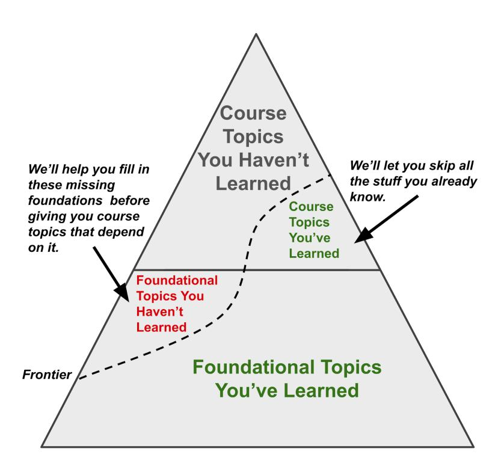

## Chapter 21. Targeted Remediation

Summary: Math Academy provides automated, precise support to help students strengthen weaknesses on specific topics or component skills that are personal sources of struggle. The bar for success is never lowered; rather, students are given additional practice that helps them clear the bar fully and independently on their next attempt.

## High-Granularity, High-Integrity Remediation

In the academic literature, the term targeted remediation usually describes identifying individual students in need of broad remedial intervention such as tutoring, remedial courses, academic advisor meetings, etc.

But in the context of Math Academy, targeted remediation refers to fully automated support mechanisms that are targeted to individual students on individual topics, and often even more precisely to the individual component skills that are causing a student to struggle on a topic.

Math Academy's targeted remediation is different from the concept of adaptive feedback in intelligent tutoring systems, which the *Handbook of Learning Analytics* describes as providing hints to the learner or recommendations for the instructional designer to better match a task to students' abilities (Pardo et al., 2017, pp. 166):

> "A large portion of the studies related to adaptive feedback have been developed through ... systems that provide a set of learning tasks to students in specific knowledge domains. ... the system commonly offers various types of task-level feedback, such as next-step hints (e.g., Peddycord, Hicks, & Barnes, 2014); correctness hints, also known as flag feedback (Barker-Plummer, Cox, & Dale, 2011); positive or encouraging hints (Stefanescu, Rus, & Graesser, 2014); recommendations on next steps or tasks [not for the students, but for the instructional designer to better match the task to students' abilities] (Ben-Naim, Bain, & Marcus, 2009); or various combinations of the above."

Unlike the forms of adaptive feedback described above, which effectively lower the bar for success on the learning task, Math Academy's targeted remediation mechanisms keep the bar where it's at. Instead, we focus on actions that are most likely to strengthen a student's area of weakness and empower them to clear the bar fully and independently on their next attempt.

To our best knowledge, targeted remediation at Math Academy's level of granularity (individual students on individual topics) and integrity (maintaining the bar for success) has not been studied in academic literature.

As stated by the handbook (Pardo et al., 2017, pp. 168):

> "A dearth of research explores how students interact with and are transformed by algorithm-produced feedback. Furthermore, the relationship between the type of interventions that can be derived from data analysis and adequate forms of feedback remains inadequately explored."

This may be for reasons of academic infeasibility: the expense (both time and money) to develop an automated learning system is large and increases proportionally with the granularity of the curriculum, making it a rather industrial endeavor.

#### Corrective Remediation

When students struggle, we follow up with corrective remedial support that is targeted to their specific point of struggle.

- If they struggle during a task, we give more questions, that is, more chances to learn and demonstrate their learning.
- If they fail a lesson, we give them a break and enable them to make progress learning unrelated topics before asking them to re-attempt the failed lesson. Usually, all it takes to rebound is a bit of rest and a fresh pair of eyes. On average, students pass their first attempt 95% of the time, and within two attempts 99% of the time, without any further intervention.
- However, if we detect that they get stuck again in the same place in a lesson, without making any additional forward progress, we give them remedial reviews to help them strengthen their foundations in the areas most relevant to their point of struggle.
- Whenever they miss a question on a quiz, we immediately follow up with a remedial review on the corresponding topic.

One challenge in properly targeting remedial reviews is that often, the key prerequisite concepts or skills required to solve a particular problem lie several steps back in the hierarchy of mathematical knowledge. However, when developing our content and building our knowledge graph, we explicitly keep track of the key prerequisites that are used in each part of each lesson. This allows us to pinpoint the exact topics that are necessary for successful remediation.

As a concrete example, suppose that while re-attempting the lesson Exponents with Rational Bases, a student

- manages to pass Part 1: Expressing a Product Using an Exponent, e.g. expressing $4 \times 4 \times 4$ as 43, but
- gets stuck again at Part 2: Evaluating an Exponential Expression, e.g. computing $(-4)^3 = (-4) \times (-4) \times (-4)$.

In this situation, the student has demonstrated that they understand the concept of an exponent, but they are struggling to use multiplication to compute the result.

Although multiplication occurs several steps back in the sequence of prerequisites, we have linked Part 2: Evaluating an Exponential Expression to the key prerequisite topic Multiplying Negative Numbers, which allows us to automatically trigger a targeted remedial review on Multiplying Negative Numbers.

#### Preventative Remediation

We also attempt to predict struggle beforehand and leverage preventative remediation to avoid the struggle entirely. Conveniently, this happens naturally when we tailor the spaced repetition process to individual student-topic learning speeds.

The initial starting value of a student-topic learning speed is a prediction of how difficult that topic is going to be for the given student. The prediction is primarily based on learning speeds of other related topics, so if the predicted learning speed is low (i.e. we predict that the student is going to struggle on the topic), then it is low because one or more of the other related topics has a low learning speed.

Those other related topics with low learning speed are the predicted points of failure in the student's predicted struggle, and we are already performing preventative remediation on them by slowing down their spaced repetition processes and forcing explicit reviews. In other words, "post"-remediation of earlier topics naturally functions as "pre"-remediation for later topics.

#### Foundational Remediation

Math Academy's diagnostics are tailored to specific courses, but in addition to assessing knowledge of course content, they also assess knowledge of lower-grade foundations that students need to know in order to succeed in the course (i.e. they are prerequisites for the course).

For instance, students need to know plenty of arithmetic in order to solve problems in algebra. So, the foundations of algebra include those necessary topics from arithmetic. Likewise, the foundations of calculus include plenty of algebra and also some geometry, and the foundations of most university-level courses (such as multivariable calculus) include plenty of single-variable calculus and precalculus.

It is common for incoming students to lack some foundational knowledge that is necessary to succeed in their chosen course. While this could spell doom in a traditional classroom, Math Academy is able to estimate a student's knowledge frontier even if it is below their course, and help them fill in any missing foundational knowledge while simultaneously allowing them to learn course topics that don't rely on that missing foundational knowledge.

Math Academy also optimizes the timing of when to have students begin shoring up their missing foundations. Students are generally more excited to work on topics in the course that they are enrolled in than they are to shore up missing foundations, and students tend to be more productive and consistent when they're excited about what they're doing. So, we allow students to start out completing the topics in their enrolled course that don't depend on their missing foundations. This helps students build up some momentum, make some progress towards their primary goal, and get into a habit of frequent learning. Once a student reaches the point where they need to shore up missing foundations in order to continue making progress in their enrolled course, they have built up plenty of momentum that will help carry them through the process of foundational remediation and make them far less likely to get discouraged and quit.

#### Content Remediation

As a mastery learning system, Math Academy holds its students accountable for learning, and in return, our students hold us accountable for providing material that is properly scaffolded and easy to learn from. If there is ever a topic that more than a tiny percentage of students struggle with, then we see it as an indication that we need to not only remediate the students, but also remediate our own content.

We take content remediation extremely seriously. Math Academy is like a tutor whose livelihood depends on the actual learning outcomes of its students, unlike many other learning platforms (and even many human teachers) that let students move on to more advanced content despite poor performance on prerequisite content. If a student can't succeed in mastering the material that we ask them to learn, then we are out of a job.

To help us remediate our content, we have developed learning analytics tools that allow us to analyze the performance of any piece of content, at any level of granularity: not just individual topics, but also each individual knowledge point within a topic, and each individual question within a knowledge point.

If the pass rate for any lesson is unacceptably low, we can pinpoint the exact knowledge point(s) within that topic where students are getting stuck, as well as any particular questions within that knowledge point that are causing issues.

By continually refining our content and algorithms over the course of many years, we have reached the point that our students pass lessons 95% of the time on the first try and 99% of the time within two tries. As we continue refining our content into the future, these pass rates will continue to increase.

It's worth emphasizing that when we refine and remediate our own content, we do not lower standards. The way we raise pass rates is by introducing more scaffolding into lessons to further reduce cognitive load. Sometimes this means improving the way a concept or worked example is explained; other times it means adding an intermediate knowledge point to a lesson, or occasionally even splitting an entire topic into two or more different topics that more specifically address different contexts of the original topic.
