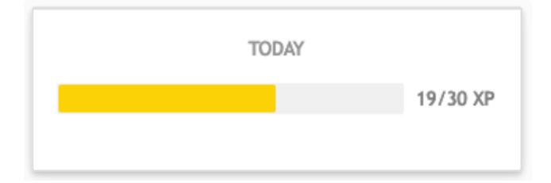
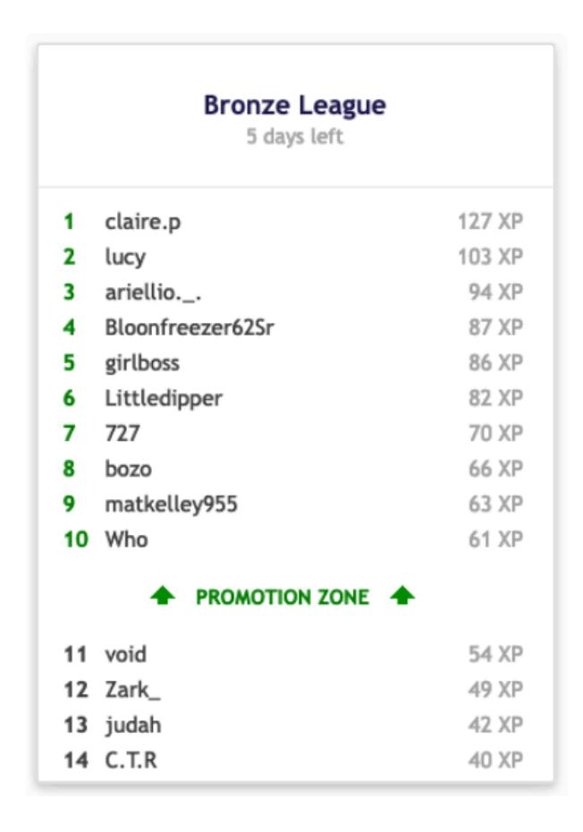
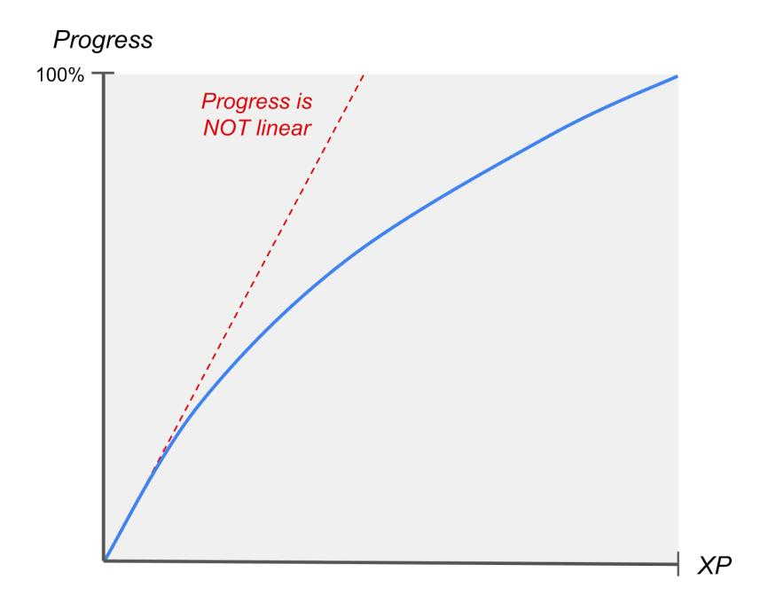

## Chapter 22. Gamification

Summary: Gamification, integrating game-like elements into learning environments, proves effective in increasing student learning, engagement, and enjoyment. Math Academy utilizes eXperience Points (XP) to gamify learning, incentivizing both quantity and quality of work. XP awards bonus points for stellar performance and introduces penalties for poor efforts, preventing exploitation by adversarial students. Math Academy also remedies loopholes that are typically found (and exploited) in traditional classrooms.

## Importance of Gamification

### Increasing Learning, Engagement, and Enjoyment

A common theme across many of the cognitive learning strategies described in this document has been that they produce more learning by increasing cognitive activation, which students find less enjoyable because it's more mentally taxing. Furthering the inconvenience, students often mistakenly interpret extra cognitive effort as an indication that they are not learning as well, when in fact the opposite is true.

Thankfully, the strategy of gamification behaves differently. Numerous studies have shown that when game-like elements (such as points and leaderboards) are integrated into student learning environments in ways that are

1. aligned with the goals of a course, the motivations of the students, and the context of the educational setting, and
2. robust to "hacking" or "gaming the system" (i.e. behaviors that attempt to bypass learning by exploiting loopholes in the rules of the game),

students typically not only learn more and engage more with the content, but also enjoy it more (Bai, Hew, & Huang, 2020; Looyestyn et al., 2017; Lei et al., 2022).

This applies not only to young students, but also to university-level students and even postgraduate students in technically challenging courses. As the authors of a gamification study at Delft University of Technology describe (Iosup & Epema, 2014):

> Over the past three years, we have applied gamification to undergraduate and graduate courses in a leading technical university in the Netherlands and in Europe. Ours is one of the first long-running attempts to show that gamification can be used to teach technically challenging courses.
>
> The two gamification-based courses, the first-year B.Sc. course Computer Organization and an M.Sc.-level course on the emerging technology of Cloud Computing, have been cumulatively followed by over 450 students and passed by over 75% of them, at the first attempt.
>
> We find that gamification is correlated with an increase in the percentage of passing students, and in the participation in voluntary activities and challenging assignments. Gamification seems to also foster interaction in the classroom and trigger students to pay more attention to the design of the course. We also observe very positive student assessments and volunteered testimonials, and a Teacher of the Year award.

### Increasing Learning Efficiency

Clearly, gamification is a potent strategy for maintaining student motivation and helping students feel good about hard work. (Any readers with experience in high-performance athletics will know the wonders that a bit of gamification can do for maintaining morale while working hard at practice, usually in the form of tracking personal progress or engaging in friendly competition with teammates.)

But even more importantly, gamification also functions as a lever by which to incentivize high-quality work. Because adaptive learning systems like Math Academy speed up or slow down based on student performance, a student's learning efficiency depends highly on the quality of their work:

- a student who performs well can make a lot of progress in a course by doing a relatively small amount of work, while
- a student who performs poorly will have to do significantly more work to make the same amount of progress.

In effect, for a student to make educational progress in an adaptive learning system like Math Academy, they have to put forth a sufficient amount of high-quality work.

## Incentivizing Quantity and Quality of Work

### XP-Time Equivalence

To incentivize both quantity and quality of work, Math Academy uses experience Points (XP) to implement a gamified reward system. Students earn XP upon successful completion of learning tasks, and XP is calibrated so that 1 XP represents 1 minute of fully focused, fully productive work for an average serious (but imperfect) student.

XP makes it easy for parents and teachers to set reasonable learning goals as a daily target number of XP, and it gives the system a lever by which to incentivize student behavior that is beneficial to learning.

### Incentivizing Quantity of Work

For instance, to incentivize students to put forth a sufficient quantity of work, we implemented (optional) competitive weekly leaderboards where students are grouped into smaller leagues with other students of similar competitive ability. If a student earns enough XP to end the week near the top of their league, they promote to a higher league. But if they end the week near the bottom of their league, they demote to a lower league.

### Incentivizing Quality of Work

Likewise, to incentivize students to maintain high quality of work, we scale XP awards so that there is a large reward for doing a stellar job (as opposed to just "good enough"), and students must clear a bar in order to earn any XP. This stands in contrast to traditional aggregate-percentage grades, which provide minimal reward for going above and beyond while simultaneously often allowing students to "get by" with poor performance.

XP allows us to implement a "carrot and stick" approach to incentivizing student effort: we award

- bonus XP for perfect performance; awarding bonus points for high performance has been shown to increase performance (Egram, 1979),
- full XP for nearly perfect performance,
- most XP for otherwise passable performance,
- a little XP for nearly passable performance,
- zero XP for poor performance, and
- a negative XP penalty for blowing off a task.

## Closing Loopholes

Most students use Math Academy properly and therefore rarely (if ever) see XP penalties. However, we have experienced on numerous occasions that in the absence of a penalty system, adversarial students will complete tasks that they feel are easy and then submit random guesses to intentionally fail out of tasks that require more effort. This tanks their performance, causing their adaptive learning schedule to slow down or even begin falling backwards, which drastically slows or even prevents progress towards their educational goals.

We call these students "XP hackers." They engage in this behavior because they are trying to minimize their effort per XP. Without XP penalties, the XP hacker strategy can be exploited indefinitely and students can rack up XP without making progress.

As Baker et al. (2006) noted, a way to prevent adversarial students from gaming the system is to tweak the rules in a way that "change[s] the incentive to game - whereas gaming might previously have been seen as a way to avoid work, it now leads to extra work." In our case, this means taking away some XP whenever a student blows off a task (and even more XP if they continue blowing off tasks). By introducing a penalty, we tweak the game so that the way to minimize effort per XP is to give a legitimate effort on every task.

In order to trigger and calibrate XP penalties appropriately, we interpret penalties as conveying how frustrated a teacher, tutor, or guardian sitting next to the student would become. After implementing XP penalties, we found that many adversarial students' rates of passing learning tasks jumped from under 50% to over 90%, while students who used the system properly and truly gave their best effort rarely (if ever) experienced penalties.

Math Academy also remedies loopholes that are typically found (and exploited) in traditional classrooms. For instance, the most obvious enabler of cheating in traditional classrooms is giving all students the same homework and assessments. But Math Academy customizes its learning path to each individual student, so it's unusual for classmates to have the opportunity to work on the same topic at the same time, and even if they do, then they are served different questions, since we have a large bank of questions for each topic. Our assessments are also fully individualized and even randomized, meaning that there is absolutely no edge that a student can gain from seeing a classmate's quiz. And if a student fails a task and has to re-attempt it, we change up the questions and even wait for a delay period before allowing the re-attempt (in the meantime, the student is able to continue making progress along other learning paths).

## Progress vs XP

It's important to realize that a student's progress (percent of topics completed) in a course is highly correlated with, but fundamentally different from, the amount of XP that they have earned in the course. The only time a student's progress percent increases is when they complete a lesson. As a student gets further into their course (and math in general), more review is required to maintain their growing knowledge base. As a result, students make progress faster at the beginning of a course than they do at the end of a course.

Progress is nonlinear. Students make progress very quickly at the beginning of a course because they can focus primarily on learning new topics (i.e. lessons) as opposed to maintaining existing knowledge (i.e. reviews). But the more they learn, the more there is to review, so progress slows down. That said, we have a hard rule to ensure that on average, students have the opportunity to work on a lesson at least ~25% of the time or so at a minimum.

At surface level, it might seem like it would be more straightforward to measure progress in terms of XP completed relative to the total estimated XP in the course. However, this would create issues because the amount of XP in a course can change significantly in response to changes in student performance (because the spaced repetition process speeds up when students are doing well and slows down when students are struggling). If progress were measured in terms of XP, then a student could run into a situation where they are completing lessons but their progress is going down because their overall performance is decreasing, which would be far more counterintuitive and confusing.

It is also worth noting that progress naturally slows down at the end of a course, when a student only has a handful of topics remaining. Often, when we give a student a new lesson, we are actually knocking out one or more due reviews with that lesson. The more lessons are on the student's "knowledge frontier," the more likely it is that we can find a new lesson to knock out some due reviews. The flipside is that when a student only has a handful of lessons left in a course, it severely restricts our ability to carry out this sort of optimization. To be clear, the system is not moving slowly in an absolute sense, just "less fast" relative to the normal turbo-boosted behavior, because it is unable to take advantage of a strategy that it normally uses to turbo-boost the rate at which students can make progress.

While this constraint can be circumvented by allowing the system to receive topics from the next course (that knock out some currently due reviews) once they are in the last handful of topics of a course, that would lead to confusion, and in the big picture it would just be a micro-optimization that has negligible impact on total XP per course.

## Key Papers

**Note:** "Importance" blurbs may include pieces of direct quotes referenced earlier in this chapter. If citing this chapter, cite from the body (above).

Bai, S., Hew, K. F., & Huang, B. (2020). Does gamification improve student learning outcome? Evidence from a meta-analysis and synthesis of qualitative data in educational contexts. Educational Research Review, 30, 100322.

Looyestyn, J., Kernot, J., Boshoff, K., Ryan, J., Edney, S., & Maher, C. (2017). Does gamification increase engagement with online programs? A systematic review. PloS One, 12(3), e0173403.

Lei, H., Wang, C., Chiu, M. M., & Chen, S. (2022). Do educational games affect students' achievement emotions? Evidence from a meta-analysis. Journal of Computer Assisted Learning, 38(4), 946-959.

Importance: When game-like elements are properly integrated into student learning environments, students typically not only learn and engage more with the content, but also enjoy it more.

- Iosup, A., & Epema, D. (2014, March). An experience report on using gamification in technical higher education. In Proceedings of the 45th ACM technical symposium on Computer science education (pp. 27-32).

**Importance**: The benefits of gamification apply not only to young students, but also to university-level students and even postgraduate students in technically challenging courses. In addition to increasing learning and engagement, the authors note that gamification "seems to also foster interaction in the classroom and trigger students to pay more attention to the design of the course. We also observe very positive student assessments and volunteered testimonials, and a Teacher of the Year award."
