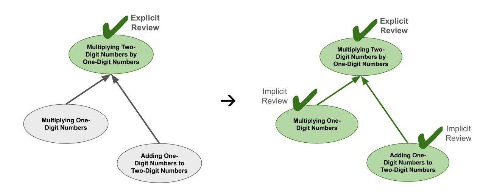
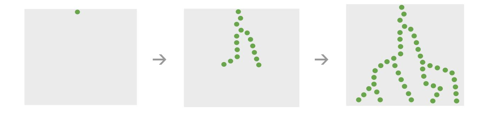

# Chapter 29. Technical Deep Dive on Spaced Repetition

**Note:** this chapter elaborates on concepts introduced in chapter 18.

Summary: Math Academy employs Fractional Implicit Repetition (FIRe), a novel spaced repetition algorithm, to calculate student learning profiles. FIRe generalizes spaced repetition to hierarchical knowledge, allowing repetitions on advanced topics to implicitly trickle down to simpler topics. The algorithm handles partial encompassings and extends repetition flows through fractional encompassings, optimizing credit distribution. The speed of the spaced repetition process is calibrated to each individual student on each individual topic, where student ability and topic difficulty are competing factors.

## Fractional Implicit Repetition (FIRe)

To calculate student spaced repetition profiles, Math Academy uses a novel spaced repetition algorithm called Fractional Implicit Repetition (FIRe). FIRe generalizes spaced repetition to hierarchical bodies of knowledge where

- 1. repetitions on advanced topics "trickle down" implicitly to simpler topics through encompassing relationships, and
- 2. simpler topics receiving lots of implicit repetitions discount the repetitions appropriately (since they are often too early to count for full credit towards the next repetition).

### | Concrete Example

As a concrete example, recall that Multiplying a Two-Digit Number by a One-Digit Number encompasses Multiplying One-Digit Numbers and Adding a One-Digit Number to a Two-Digit Number.

If you pass a review on Multiplying a Two-Digit Number by a One-Digit Number, then the repetition will also flow backward to reward Multiplying One-Digit Numbers and Adding a One-Digit Number to a Two-Digit Number because you've just shown evidence that you still know how to perform these skills.



On the other hand, if you fail a repetition on Adding a One-Digit Number to a Two-Digit Number, then the failed repetition will also flow forward to penalize Multiplying a Two-Digit Number by a One-Digit Number. If you can't add a one-digit number to a two-digit number, then there's no way you're able to multiply a two-digit number by a one-digit number. The same thing happens if you fail a repetition on Multiplying One-Digit Numbers.


### | Visualizing Repetition Flow

Note that repetition flows can extend many layers deep - not just to directly encompassed topics, but also to "second-order" topics that are encompassed by the encompassed topics, and then to third-order topics that are encompassed by second-order topics, and so on.

Visually, credit travels downwards through the knowledge graph like lightning bolts.



Penalties travel upwards through the knowledge graph like growing trees.


### | Partial Encompassings

FIRe also naturally handles cases of partial encompassings, in which only some part of a simpler topic is practiced implicitly in an advanced topic. This occurs more frequently in higher-level math.

For instance, in calculus, advanced integration techniques like integration by parts require you to calculate integrals of a variety of mathematical functions such as polynomials, exponentials,

and trigonometric functions. But some of those functions might only appear in a portion of the integration by parts problems. So, if you complete a repetition on integration by parts, you should only receive a fraction of a repetition towards each partially-encompassed topic.

In the diagram below, we label encompassings with numerical weights that represent what fraction of each simpler topic is practiced during the more advanced topic. You can loosely interpret each weight as representing the probability that a random problem from the advanced topic encompasses a random problem from the simpler topic.


FIRe extends repetition flows many layers deep through fractional encompassings as well. The end result is that repetitions

- 1. travel unhindered along a "trunk" of full encompassings, and
- 2. fade off along partial encompassings branching outwards from the trunk.


## Setting Encompassing Weights

### Direct and Key Prerequisites are Sufficient

Because encompassing weights are set by a domain expert, it is not feasible to set an explicit weight between every pair of topics in the graph. We have thousands of topics, so the full pairwise weight matrix would contain tens of millions of entries. How do we set all those weights?

It turns out that it is not actually necessary to explicitly set every weight in the matrix. It suffices to set only the weights for topic pairs where

- 1. the weight has a nontrivial value,
- 2. the weight cannot otherwise be inferred using repetition flow, and
- 3. the distance between the topics in the prerequisite graph is low,

and assume that all other weights not computed implicitly during repetition flow are zero. The reasoning behind these conditions is as follows:

- 1. The magnitude of the weight represents the magnitude of the implicit repetition credit. In order for an implicit repetition to make an impact on staving off explicit reviews, it has to be associated with a nontrivial amount of credit.
- 2. If repetition flow can infer a weight, then nothing will change if the weight is set explicitly (unless the explicitly-set weight is being used to correct a value that would otherwise be inferred by repetition flow).
- 3. If two topics are far apart in the prerequisite graph, then their weight will not make much of an impact on staving off reviews, even if it is a full encompassing. In that case, by the time the student reaches the more advanced topic, they will already have done most of their explicit reviews on the simpler topic.

Conveniently, the weights that satisfy the above conditions tend to be those along direct and key prerequisite edges, the number of which scales linearly with the number of topics.

Note that it is not unusual to find direct and key prerequisite edges with a weight as low as zero. This can happen when a topic requires some amount of conceptual familiarity with the prerequisite, but does not require the student to actually have mastered the prerequisite to the point of being able to solve problems in the prerequisite topic.

#### Non-Ancestor Encompassings and Mastery Floors

To comply with course standards, it is sometimes necessary to have equivalent topics spread out across multiple courses, with the equivalent topics in higher courses covering a more advanced treatment of the same skills taught in lower courses. However, the simpler equivalent topics are usually not required as prerequisites for the more advanced equivalent topics.

For instance, courses on algebra-based statistics and calculus-based statistics would have many equivalent topics that cover the same skills. Although the calculus-based statistics course would provide more advanced treatments of these skills, the corresponding equivalent topics in the algebra-based statistics course would not be prerequisites.

Even though simple equivalent topics would not be ancestors of advanced equivalent topics via direct or key prerequisite paths, we can still set full-encompassing edge weights between them so that a student who completes an advanced topic will implicitly receive credit for any simpler equivalent topics as well. These are called **non-ancestor encompassings**.

Non-ancestor encompassings, along with course-based mastery floors (lower-course topics that are automatically considered mastered by any student taking the course), can also be useful for assigning credit to leaf topics in lower-level courses. The mastery floor of a course consists of the lower-course topics that

- are "far back" enough that it is safe to automatically consider them mastered, or
- lie "below" the simplest topics that could be assessed on the course's diagnostic.

Intuitively, the top of the mastery floor marks the dividing line regarding whether it is at all feasible for a student to take a course.

## Student-Topic Learning Speeds

#### | Ratio of Student Ability and Topic Difficulty

Student ability and topic difficulty are competing factors - high student ability speeds up the overall student-topic learning speed, while high topic difficulty slows it down. So, to compute a student-topic learning speed, we compute

- 1. the speedup due to student ability,
- 2. the slowdown due to topic difficulty, and then
- 3. their ratio.

$$student\text{-topic learning speed} = \frac{speedup\ due\ to\ student\ ability}{slowdown\ due\ to\ topic\ difficulty}$$

| Student-Topic Learning Speed vs Student Ability and Topic Difficulty |          | Student Ability |          |          |  |
|----------------------------------------------------------------------|----------|-----------------|----------|----------|--|
|                                                                      |          | Strong          | Moderate | Weak     |  |
| Topic Difficulty                                                     | Easy     | fastest         | faster   | baseline |  |
|                                                                      | Moderate | faster          | baseline | slower   |  |
|                                                                      | Hard     | baseline        | slower   | slowest  |  |

### | Measuring Student Ability at the Level of Individual Topics

**Student ability** is measured at the granular level of individual topics - we keep track of accuracy across answers, giving more weight to recent answers, and also propagating

- correct answers down to simpler encompassed topics and
- incorrect answers up to more advanced topics that encompass the answered topic.

To choose the initial starting value for a topic's accuracy, we make a prediction based on the accuracy values of the topic's local neighborhood consisting of its direct prerequisites, key prerequisites, encompassings, and same-module topics.


### | Measuring Topic Difficulty

**Topic difficulty** is measured by computing the topic's accuracy across all instances when one of its questions was answered by a serious student on an assessment.

In theory, if student abilities could be measured on each topic with perfect fidelity, then topic difficulties would no longer be needed and student-topic learning speeds could be based entirely on student abilities. But in practice, there are two reasons why it is helpful to rely on topic

#### difficulty as well:

- 1. It improves the initial prediction. Although we already have information about the particular student's learning speed on other topics, the topic difficulty provides information about the particular topic's learning speed for other students. This is an independent, information-rich signal.
- 2. It naturally acts as a correction factor. When topic difficulty is high, it decreases the learning speed - which is desirable given that high topic difficulty is caused by low assessment performance, which is in turn (largely) caused by students not getting enough review. Similarly, when topic difficulty is low, it increases the learning speed - which is desirable given that low topic difficulty is caused by extremely high assessment performance, which indicates that students might not need as much review as they are receiving.

## High-Level Structure

At a high level, the structure of Math Academy's spaced repetition model can be summarized as follows:

```
repNum \rightarrow max (0, repNum + speed \cdot decay^{failed} \cdot rawDelta)
memory \rightarrow \max(0, memory + rawDelta)(0.5)^{days/interval}
```

• repNum = how many successful rounds of spaced repetition the student has accumulated on a particular topic.

In following definitions, a "repetition" is a successful review at the appropriate time.

- days = how many days it's been since the previous repetition.
- interval = the ideal number of days to be spaced between repetition repNum and repetition repNum+1.
- memory = how well the student is expected to remember now that it's been some time since the previous repetition. Memory decays over time and the next repetition becomes

due when the memory becomes sufficiently low.

- speed = the learning speed for the student on this particular topic, based on how well the student is performing. Governs how quickly the student moves forwards or backwards through the spaced repetition process.
- *failed* = 1 if repetition was failed and 0 if it was passed.
- rawDelta = how much raw spaced repetition credit the student earned during the repetition, ignoring speed and decay. rawDelta is positive if the repetition was passed and negative if failed.

The higher the quality of work in a passed repetition, or the worse the quality of work in a failed repetition, the larger the magnitude of rawDelta.

The magnitude of rawDelta is also discounted if the repetition was completed early relative to the desired interval, i.e., if memory is sufficiently high.

Note that successful work (positive credit) on an advanced topic is also counted towards any simpler topics that are implicitly practiced as component skills, and unsuccessful work (negative credit) on a simpler topic is also counted towards any more advanced topics of which that simpler topic is a component skill.

• decay = the speed at which the student moves backwards in the spaced repetition process, relative to their forwards speed, if they fail a repetition.

decay is a positive quantity that starts at 1 and grows larger as the repetition becomes more overdue relative to its ideal interval, i.e., as memory becomes severely low.

decay was introduced to model severe knowledge decay like the notorious "summer slide," where topics learned shortly before the end of the previous school year may be forgotten so severely over summer vacation that they need to be reviewed more frequently or even completely re-taught at the start of the following year.

#### High-Level Structure of Math Academy's Spaced Repetition Model

repNum = how many successful rounds of spaced repetition the student has accumulated on a particular topic.

A "repetition" is a successful review at the appropriate time.

speed = the learning speed for the student on this particular topic, based on how well the student is performing.

Governs how quickly the student moves forwards or backwards through the spaced repetition process.

failed = 1 if repetition was failed and 0 if it was passed.

decay = the speed at which the student moves backwards in the spaced repetition process, relative to their forwards speed, if they fail a repetition.

decay is a positive quantity that starts at 1 and grows larger as the repetition becomes more overdue relative to its ideal interval, i.e., as memory becomes severely low.

decay was introduced to model severe knowledge decay like the notorious "summer slide," where topics learned shortly before the end of the previous school year may be forgotten so severely over summer vacation that they need to be reviewed more frequently or even completely re-taught at the start of the following year.

$$repNum \rightarrow max \left(0, repNum + speed \cdot decay^{failed} \cdot rawDelta\right)$$
 $memory \rightarrow max \left(0, memory + rawDelta\right) (0.5)^{days/interval}$ 

memory = how well the student is expected to remember now that it's been some time since the previous repetition.

Memory decays over time and the next repetition becomes due when the memory becomes sufficiently low.

Memory is also used to discount a repetition when it is too early to count for full credit.

rawDelta = how much raw spaced repetition credit the student earned during the repetition, ignoring speed and decay, rawDelta is positive if the repetition was passed and negative if failed.

The higher the quality of work in a passed repetition, or the worse the quality of work in a failed repetition, the larger the magnitude of rawDelta.

The magnitude of rawDelta is also discounted if the repetition was completed early relative to the desired interval, i.e., if memory is sufficiently high.

Note that successful work (positive credit) on an advanced topic is also counted towards any simpler topics that are implicitly practiced as component skills, and unsuccessful work (negative credit) on a simpler topic is also counted towards any more advanced topics of which that simpler topic is a component skill.

days = how many days it's been since the previous repetition.

interval = the ideal number of days to be spaced between repetition repNum and repetition repNum+1.
