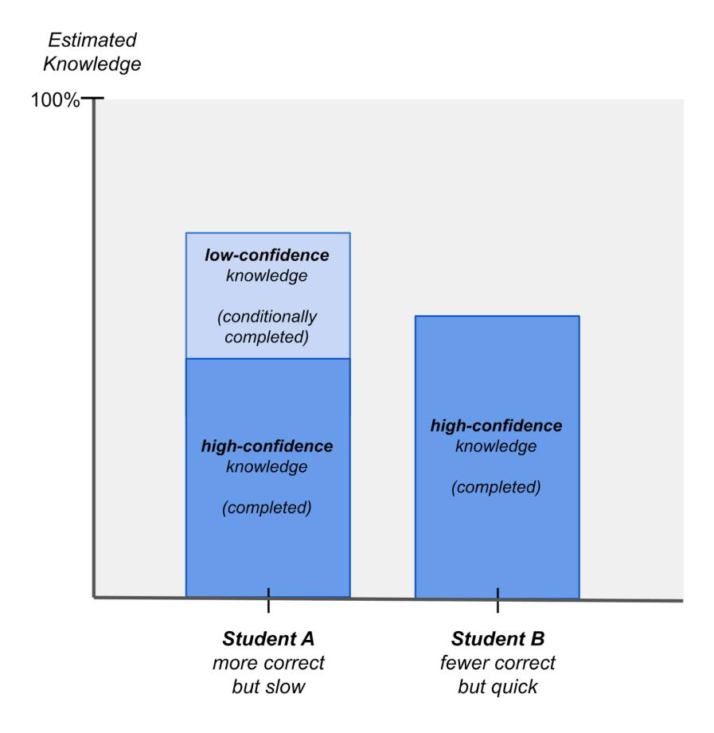

# Chapter 30. Technical Deep Dive on Diagnostic Exams

**Note:** this chapter elaborates on concepts introduced in chapter 4 and chapter 20.

Summary: Math Academy uses adaptive diagnostics to infer each incoming student's knowledge profile. The novel diagnostic assessment algorithm leverages causal relationships and correlation-based inference in the knowledge graph to efficiently gauge a student's knowledge frontier to a sufficient level of detail while minimizing the number of questions on the diagnostic. It measures knowledge confidence and handles conflicting information, adapting its diagnosis to nuanced scenarios like prerequisite-postrequisite and accuracy-time conflicts. Conditional completion is employed for areas where knowledge was inferred with low confidence, allowing the system to continue fine-tuning a student's placement as it collects more data about their performance.

## Minimizing the Number of Questions

Without any clever algorithms, it would take a massive number of diagnostic questions to infer a student's knowledge frontier. Courses often contain up to several hundred topics, plus twice as many foundational topics - which means that if we started at the bottom and asked you a diagnostic question for every topic up until the point that you could no longer answer them correctly, we'd end up asking you 500+ questions in total.

However, Math Academy is able to cut down this number of diagnostic questions by an order of magnitude using a novel diagnostic question selection algorithm. Our diagnostics generally take only 20-40 questions for lower-grade courses (like Prealgebra) and 40-60 questions for higher-grade courses (like Calculus).

We're able to achieve this level of diagnostic efficiency for two reasons:

1. In addition to leveraging strict "causal" relationships, i.e. encompassings, we also leverage looser forms of correlation-based inference. (At the time of writing, the correlation-based inference includes propagating positive diagnostic credit to prerequisites, negative diagnostic credit to post-requisites, and, if the topic is a "leaf topic" in some module, then also propagating positive diagnostic credit to other leaf topics within the same module.)

2. We compress the knowledge graph beforehand into the smallest number of topics that fully "covers" a course and its foundations at a desired level of granularity. (At the time of writing, a topic is considered "covered" if it has both a progeny and an ancestor in the compressed diagnostic graph, that are each within 3 prerequisite edges of the topic.)

As a result, our diagnostic assessment algorithm is highly leveraged on both accuracy and precision. While a perfect-accuracy, perfect-precision diagnostic could require up to a thousand questions, we are able to reduce this by an order of magnitude by giving up a negligible amount of accuracy and precision.

(Of course, highly leveraged algorithms have a higher risk of being thrown off by false input but we mitigate this risk by detecting and re-assessing questions that we suspect may have been incorrectly assessed.)

## Knowledge Confidence and Conditional Completion

### Theory

During diagnostics, Math Academy also measures knowledge confidence, i.e., our confidence in our classification of whether the student knows or does not know a topic. Most diagnostics complete with fairly high confidence across the student's entire knowledge profile, but occasionally, there can be areas of low confidence. These do not arise from a lack of diagnostic coverage, but rather, from conflicting evidence in a student's responses.

#### There Are Two Main Types of Conflicts

1. Prerequisite-Postrequisite Conflict: a student answers a more advanced topic correctly but a simpler question incorrectly, which may indicate a gap in the student's knowledge.
2. Accuracy-Time Conflict: a student submits a correct answer but takes an excessively long time to solve the problem, which may indicate that they have not yet mastered the corresponding topic.

To handle these conflicts, we carefully weight positive and negative evidence against each other to form a highly nuanced diagnosis of student knowledge that adapts appropriately to future observations, just like a tutor would.

In particular, if the evidence balances out to "just barely" place a student out of some topics, the system will consider those topics conditionally completed: the student will initially be given tasks under the assumption that they know those topics, but if the student struggles, then the system will immediately begin "falling backwards" along the appropriate learning paths.

#### Example

As an example, suppose

- student A answers many questions correctly on their diagnostic but takes excessively long on most questions, while
- student B answers fewer questions correctly but supplies correct answers quickly and confidently.

Then

- student A will have a higher amount of overall knowledge, a significant portion of which is low-confidence (and may be quickly pruned back if they struggle), while
- student B will have less overall knowledge but may have more high-confidence knowledge.

#### Implementation

To achieve this behavior, we weight diagnostic evidence using a plus-minus balance at each topic.

- The **sign** (positive or non-positive) represents the prediction of whether the student knows the topic.
- The **magnitude** of the balance represents the degree of confidence in the prediction.

Each answer is associated with a weight that represents its contribution to the plus-minus balance of the corresponding topic. By default, an answer's weight is equal to one. However, if a student submits a correct answer but takes an excessively long time relative to the expected time for a student who has mastered the topic, the answer weight is diminished. The answer still gives the student positive credit, but the slower the student is to solve the problem (beyond a reasonable time threshold), the smaller the amount of credit.

Once the weight of an answer is determined, it propagates throughout the knowledge graph updating plus-minus balances of topics as appropriate:

- A correct answer increases the plus-minus balances of the answered topic and its prerequisites (and their prerequisites, and so on), while
- an incorrect answer decreases the plus-minus balances of the answered topic and its post-requisites (and their post-requisites, and so on).

After all diagnostic questions have been processed, any topics with positive plus-minus weights are credited with a number of repetitions equal to their plus-minus balance.

## Conservative vs. Aggressive Edge of Mastery

There have been times when a student completed a course, took a placement diagnostic for the same course, and was surprised that the placement told them their knowledge frontier was lower in the course. But this is actually an expected result, especially for students who are weaker.

Just because a student successfully completes all the homework for a course, doesn't mean that they're going to ace a comprehensive final exam over the course. This is especially true for the placement exam, which is even harder than a normal exam: unlike a normal exam,

- a placement exam has to cover every topic (including all of the hardest topics), and
- it has to cover the most advanced question type from each of those topics (we can't place a student out of a topic if they only know how to do the simpler cases).

Additionally, although we often talk about a student's "edge of mastery" as though it were a single line across the student's knowledge profile, a student really has a "zone of mastery" that is bounded below by a conservative edge of mastery and above by an aggressive edge of mastery. A placement exam measures the conservative edge of mastery, while mastery-based learning with layering operates on the aggressive edge of mastery.

When a student successfully completes a lesson, they've mastered the topic well enough to continue layering on top of what they've learned, but they probably haven't reached the point of automaticity with the topic yet. By way of analogy, whenever a gymnast learns a new skill at practice, it takes some more time and practice before they are ready to showcase that skill in competition, but that doesn't stop them from continuing to work on more advanced skills during practice in the meantime.

## Supplemental Diagnostics

As topics are added and connectivity is revised in the knowledge graph, the knowledge profile inferred from a student's initial placement diagnostic can get a little out of date. When this happens, we assign tiny diagnostics called supplemental diagnostics to bring the student's knowledge profile back up to date.

The topics on a supplemental diagnostic are those that were not directly assessed on the original diagnostic and have plus-minus balances of zero when considering all the assessment answers since (and including) the original diagnostic. The same form of highly efficient inference is used on supplemental diagnostics, which means supplemental diagnostics are generally quite small, consisting of at most a handful of questions.

## Selecting Good Diagnostic Questions

There's a lot of nuance that goes into selecting a good diagnostic question for a given topic.

- On one hand, diagnostic questions can't be too easy. Each diagnostic question should be difficult enough that if a student were to answer it correctly, then an expert tutor or teacher would infer that they have fully mastered the corresponding topic.
- Additionally, a diagnostic question should exercise all of the prerequisites of the corresponding topic. Otherwise, if there's a prerequisite that the question doesn't exercise, then a student who doesn't know the prerequisite could still answer the question correctly and erroneously receive credit for the prerequisite.
- That said, a diagnostic question should generally not be the most difficult question in its corresponding topic. The more complicated a question, the higher the likelihood that a student might make a silly mistake.

So, each diagnostic question should be chosen as the simplest question that

1. would convince an expert tutor or teacher that the student has mastered the corresponding topic, and
2. exercises all of the topic's prerequisites.
